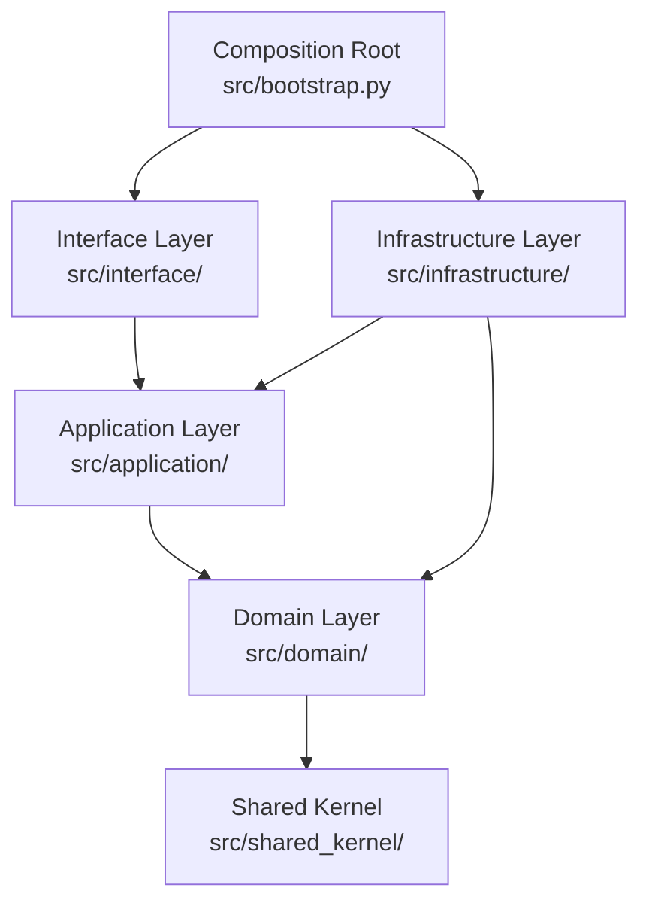

# Architecture
*Updated: 2026-04-08T00:00:08Z*

Tom uses hexagonal (ports and adapters) architecture with strict layer isolation enforced by H-07.

## Layer Structure

## Import Rules (H-07)

| Layer | May Import |
|-------|-----------|
| domain | stdlib, shared_kernel only |
| application | domain, shared_kernel |
| infrastructure | domain, application, shared_kernel, external libs |
| interface | all inner layers (domain, application, infrastructure, shared_kernel) |
| composition root | all layers |

## Key Directories

- `src/domain/` — entities, value objects, domain services, repository interfaces (ports)
- `src/application/` — use cases, command/query handlers
- `src/infrastructure/` — file-based adapters, external integrations
- `src/interface/` — CLI commands (argparse)
- `src/agents/` — agent bounded context (domain/application/infrastructure sub-structure): validation, canonical extraction, vendor adapter (Claude Code)
- `src/configuration/` — configuration aggregates and domain events
- `src/context_monitoring/` — context-fill monitoring and events
- `src/session_management/` — session lifecycle
- `src/transcript/` — transcript ingestion and parsing
- `src/version/` — version domain and query handlers
- `src/work_tracking/` — worktracker entity management
- `src/shared_kernel/` — shared primitives, exceptions, base types

## One Class Per File (H-10)

Each Python file contains exactly one public class. File names match class names (snake_case).

## Related Lode Files

- [rules.md](rules.md) — H-07 and other architecture HARD rules
- [../practices.md](../practices.md) — layer rules summary
