# ORCHESTRATION_PLAN.md

> **Document ID:** PROJ-018-ORCH-PLAN
> **Project:** PROJ-018-pm-pmm-skill
> **Workflow ID:** `pm-pmm-impl-20260228-001`
> **Status:** COMPLETE (overnight autonomous execution — 2026-03-01)
> **Version:** 2.0
> **Created:** 2026-02-28
> **Last Updated:** 2026-02-28
> **GitHub Issue:** [#123](https://github.com/geekatron/jerry/issues/123)

---

## Document Sections

| Section | Purpose |
|---------|---------|
| [Executive Summary](#1-executive-summary) | Workflow purpose, current state, pattern |
| [Workflow Architecture](#2-workflow-architecture) | Pipeline diagrams (ASCII + Mermaid) |
| [Phase Definitions](#3-phase-definitions) | Per-phase agents, inputs, outputs, statuses |
| [Sync Barrier Protocol](#4-sync-barrier-protocol) | Cross-pollination rules and quality gates |
| [Agent Registry](#5-agent-registry) | All agents with pipeline/phase/artifact assignments |
| [Adversarial Strategy Mapping](#6-adversarial-strategy-mapping) | C3 quality gate configuration per phase |
| [Negative Prompt Constraints (NPT-013)](#7-negative-prompt-constraints-npt-013) | XML-tagged prohibitions with consequence chains |
| [Constraint Enforcement (YAML)](#71-machine-readable-enforcement) | CONSTRAINTS.yaml verification plan |
| [Barrier Commit Protocol](#72-barrier-commit-protocol) | Git commit per barrier for overnight monitoring |
| [Worktracker Entities](#8-worktracker-entities) | Initiative, Epics, Features, Stories, Tasks |
| [State Management](#9-state-management) | State files, artifact paths, checkpoints |
| [Execution Constraints](#10-execution-constraints) | HARD rules and soft constraints |
| [Success Criteria](#11-success-criteria) | Phase-level and workflow-level exit criteria |
| [Risk Mitigations](#12-risk-mitigations) | Identified risks and responses |
| [Resumption Context](#13-resumption-context) | Current state and next actions |

---

## 1. Executive Summary

Build the `/pm-pmm` skill for Jerry: a decision-focused product management and product marketing capability powered by 5 specialized agents, organized around Cagan's Value Risk and Business Viability Risk, grounded in 18 validated industry frameworks. The skill produces 15 primary artifact types across discovery and delivery modes.

This orchestration coordinates three cross-pollinated pipelines:

1. **Engineering Pipeline** (`/eng-team`): Secure design, implementation, and code review of the skill infrastructure (SKILL.md, 5 agent definitions, 5 governance YAMLs, 15 templates, routing registration)
2. **Security Pipeline** (`/red-team`): Threat modeling of agent definitions, prompt injection surface analysis, and security review of the skill's interaction model
3. **Quality Pipeline** (`/adversary`): C3-level adversarial quality gates at every phase boundary, using >= 0.95 threshold with bounded iterations (max 5 per artifact)

Work items are tracked via `/worktracker` with full Initiative > Epic > Feature > Story > Task hierarchy.

**Current State:** COMPLETE — All 4 phases and 4 barriers finished. Deployment HELD for human review.

**Execution Mode:** Overnight autonomous. Commits per barrier. Token limit → pause 5 min → resume.

**Orchestration Pattern:** Cross-Pollinated Triple Pipeline (Engineering × Security × Quality)

**Constraint Enforcement:** `CONSTRAINTS.yaml` (machine-readable) + XML-tagged constraints (LLM-readable) — dual enforcement ensures both deterministic validation and LLM behavioral compliance.

### 1.1 Workflow Identification

| Field | Value | Source |
|-------|-------|--------|
| Workflow ID | `pm-pmm-impl-20260228-001` | user |
| ID Format | `pm-pmm-impl-YYYYMMDD-NNN` | semantic-date-seq |
| Base Path | `projects/PROJ-018-pm-pmm-skill/orchestration/pm-pmm-impl-20260228-001/` | Dynamic |
| GitHub Issue | [#123](https://github.com/geekatron/jerry/issues/123) | user |
| Negative Prompting Source | [#122](https://github.com/geekatron/jerry/issues/122) (NPT-013 template) | user |

**Artifact Output Locations:**
- Engineering Pipeline: `orchestration/pm-pmm-impl-20260228-001/eng/`
- Security Pipeline: `orchestration/pm-pmm-impl-20260228-001/sec/`
- Quality Pipeline: `orchestration/pm-pmm-impl-20260228-001/quality/`
- Cross-pollination: `orchestration/pm-pmm-impl-20260228-001/cross-pollination/`
- Final Skill Output: `skills/pm-pmm/` (deployed after all gates pass)

---

## 2. Workflow Architecture

### 2.1 Pipeline Diagram (ASCII)

```
    ENGINEERING PIPELINE              SECURITY PIPELINE              QUALITY PIPELINE
    ===================              =================              ================

┌─────────────────────────┐    ┌─────────────────────────┐    ┌─────────────────────────┐
│ PHASE 1: RESEARCH &     │    │ PHASE 1: THREAT         │    │ PHASE 1: QUALITY        │
│ TEMPLATE DESIGN         │    │ MODELING                │    │ FRAMEWORK SETUP         │
│ ─────────────────────── │    │ ─────────────────────── │    │ ─────────────────────── │
│ • eng-architect          │    │ • red-lead              │    │ • adv-selector          │
│ • eng-lead               │    │ • red-recon             │    │ • adv-scorer            │
│ Input: Issue #123 spec   │    │ Input: Issue #123 spec  │    │ Input: quality-enforce  │
│ Output: architecture.md  │    │ Output: threat-model.md │    │ Output: qa-strategy.md  │
│         templates/       │    │         attack-surf.md  │    │                         │
│         frontmatter.md   │    │                         │    │                         │
│ STATUS: PENDING          │    │ STATUS: PENDING         │    │ STATUS: PENDING         │
└────────────┬────────────┘    └────────────┬────────────┘    └────────────┬────────────┘
             │                              │                              │
             ▼                              ▼                              ▼
╔══════════════════════════════════════════════════════════════════════════════════════════╗
║                                   SYNC BARRIER 1                                        ║
║  ┌────────────────────────────────────────────────────────────────────────────────────┐  ║
║  │ eng→sec: architecture.md + template-schemas → threat model validation              │  ║
║  │ sec→eng: threat-model.md + attack-surf.md → security requirements for agents       │  ║
║  │ quality→eng: qa-strategy.md → quality dimensions per artifact type                 │  ║
║  │ quality→sec: qa-strategy.md → security review quality criteria                     │  ║
║  │ ⚡ /adversary C3 gate: ALL Phase 1 artifacts must score >= 0.95                    │  ║
║  │ 📦 GIT COMMIT: barrier-1 artifacts committed for monitoring                       │  ║
║  └────────────────────────────────────────────────────────────────────────────────────┘  ║
║  STATUS: PENDING                                                                         ║
╚══════════════════════════════════════════════════════════════════════════════════════════╝
             │                              │                              │
             ▼                              ▼                              ▼
┌─────────────────────────┐    ┌─────────────────────────┐    ┌─────────────────────────┐
│ PHASE 2: TIER 1 CORE    │    │ PHASE 2: AGENT SEC      │    │ PHASE 2: CREATOR-CRITIC │
│ AGENT IMPLEMENTATION    │    │ REVIEW                  │    │ GATE                    │
│ ─────────────────────── │    │ ─────────────────────── │    │ ─────────────────────── │
│ • eng-architect          │    │ • red-vuln              │    │ • adv-executor          │
│ • eng-lead               │    │ • red-social            │    │ • adv-scorer            │
│ • eng-security           │    │ • red-exploit           │    │                         │
│ Output:                  │    │ Output:                 │    │ Output:                 │
│   pm-product-strategist  │    │   agent-sec-review.md   │    │   adv-phase2-report.md  │
│   pm-customer-insight    │    │   prompt-injection.md   │    │                         │
│   pm-market-strategist   │    │                         │    │                         │
│   + governance YAMLs     │    │                         │    │                         │
│   + SKILL.md             │    │                         │    │                         │
│ STATUS: PENDING          │    │ STATUS: PENDING         │    │ STATUS: PENDING         │
└────────────┬────────────┘    └────────────┬────────────┘    └────────────┬────────────┘
             │                              │                              │
             ▼                              ▼                              ▼
╔══════════════════════════════════════════════════════════════════════════════════════════╗
║                                   SYNC BARRIER 2                                        ║
║  ┌────────────────────────────────────────────────────────────────────────────────────┐  ║
║  │ eng→sec: agent .md + .governance.yaml files → security validation                  │  ║
║  │ sec→eng: agent-sec-review.md → remediation requirements                            │  ║
║  │ quality→eng: adv-phase2-report.md → quality findings for revision                  │  ║
║  │ quality→sec: adv-phase2-report.md → security findings for re-review                │  ║
║  │ ⚡ /adversary C3 gate: ALL Phase 2 artifacts must score >= 0.95                    │  ║
║  │ 📦 GIT COMMIT: barrier-2 artifacts committed for monitoring                       │  ║
║  └────────────────────────────────────────────────────────────────────────────────────┘  ║
║  STATUS: PENDING                                                                         ║
╚══════════════════════════════════════════════════════════════════════════════════════════╝
             │                              │                              │
             ▼                              ▼                              ▼
┌─────────────────────────┐    ┌─────────────────────────┐    ┌─────────────────────────┐
│ PHASE 3: TIER 2 SPEC    │    │ PHASE 3: INTEGRATION    │    │ PHASE 3: CREATOR-CRITIC │
│ AGENT IMPLEMENTATION    │    │ SECURITY REVIEW         │    │ GATE                    │
│ ─────────────────────── │    │ ─────────────────────── │    │ ─────────────────────── │
│ • eng-architect          │    │ • red-lead              │    │ • adv-executor          │
│ • eng-lead               │    │ • red-vuln              │    │ • adv-scorer            │
│ Output:                  │    │ Output:                 │    │ Output:                 │
│   pm-business-analyst    │    │   integration-sec.md    │    │   adv-phase3-report.md  │
│   pm-competitive-analyst │    │   cross-agent-risk.md   │    │                         │
│   + governance YAMLs     │    │                         │    │                         │
│ STATUS: PENDING          │    │ STATUS: PENDING         │    │ STATUS: PENDING         │
└────────────┬────────────┘    └────────────┬────────────┘    └────────────┬────────────┘
             │                              │                              │
             ▼                              ▼                              ▼
╔══════════════════════════════════════════════════════════════════════════════════════════╗
║                                   SYNC BARRIER 3                                        ║
║  ┌────────────────────────────────────────────────────────────────────────────────────┐  ║
║  │ eng→sec: Tier 2 agents + cross-agent interaction model → security validation       │  ║
║  │ sec→eng: integration-sec.md → remediation for integration risks                    │  ║
║  │ quality→eng: adv-phase3-report.md → quality findings for revision                  │  ║
║  │ ⚡ /adversary C3 gate: ALL Phase 3 artifacts must score >= 0.95                    │  ║
║  │ 📦 GIT COMMIT: barrier-3 artifacts committed for monitoring                       │  ║
║  └────────────────────────────────────────────────────────────────────────────────────┘  ║
║  STATUS: PENDING                                                                         ║
╚══════════════════════════════════════════════════════════════════════════════════════════╝
             │                              │                              │
             ▼                              ▼                              ▼
┌─────────────────────────┐    ┌─────────────────────────┐    ┌─────────────────────────┐
│ PHASE 4: INTEGRATION    │    │ PHASE 4: FINAL SEC      │    │ PHASE 4: FINAL QUALITY  │
│ & VERIFICATION          │    │ ASSESSMENT              │    │ TOURNAMENT              │
│ ─────────────────────── │    │ ─────────────────────── │    │ ─────────────────────── │
│ • eng-architect          │    │ • red-lead              │    │ • adv-selector          │
│ • eng-lead               │    │ • red-reporter          │    │ • adv-executor          │
│ • eng-reviewer           │    │ Output:                 │    │ • adv-scorer            │
│ Output:                  │    │   final-sec-report.md   │    │ Output:                 │
│   org-configs.md         │    │   remediation-plan.md   │    │   tournament-report.md  │
│   workflow-patterns.md   │    │                         │    │   final-quality.md      │
│   trigger-map-update.md  │    │                         │    │                         │
│   e2e-verification.md    │    │                         │    │                         │
│ STATUS: PENDING          │    │ STATUS: PENDING         │    │ STATUS: PENDING         │
└────────────┬────────────┘    └────────────┬────────────┘    └────────────┬────────────┘
             │                              │                              │
             ▼                              ▼                              ▼
╔══════════════════════════════════════════════════════════════════════════════════════════╗
║                                   SYNC BARRIER 4 (FINAL)                                ║
║  ┌────────────────────────────────────────────────────────────────────────────────────┐  ║
║  │ ALL pipelines converge → Final synthesis                                           │  ║
║  │ ⚡ /adversary C3 TOURNAMENT: All 10 strategies applied to final deliverables       │  ║
║  │ 📦 GIT COMMIT: barrier-4 final artifacts committed for monitoring                 │  ║
║  │ ⚠️  DEPLOYMENT HELD: skills/pm-pmm/ deployment requires post-run human review     │  ║
║  └────────────────────────────────────────────────────────────────────────────────────┘  ║
║  STATUS: PENDING                                                                         ║
╚══════════════════════════════════════════════════════════════════════════════════════════╝
             │
             ▼
┌─────────────────────────────────────────────────────────────────────────────────────────┐
│                              DEPLOYMENT TO skills/pm-pmm/                                │
│                              (HELD — all gates passed, awaits post-run human review)      │
└─────────────────────────────────────────────────────────────────────────────────────────┘
```

### 2.2 Mermaid Workflow Diagram

```mermaid
flowchart TB
    subgraph ISSUE["📋 Source: GitHub Issue #123 - PM/PMM Skill"]
        I123["Issue #123: Build /pm-pmm skill<br/>5 agents, 15 templates, 18 frameworks<br/>Value Risk + Business Viability Risk"]
        I122["Issue #122: NPT-013 Negative Prompt Template<br/>Structured prohibitions with consequence chains"]
    end

    subgraph PHASE1["🔬 PHASE 1: Research & Foundation"]
        direction TB
        subgraph ENG_P1["Engineering Pipeline"]
            EA1["eng-architect<br/>├─ Validate research corpus (PS-001-E-001..E-005)<br/>├─ Architecture decision: 5-agent model confirmation<br/>├─ Frontmatter schema design<br/>└─ Template structure for 15 artifact types"]
            EL1["eng-lead<br/>├─ File organization plan (skills/pm-pmm/)<br/>├─ Dual-file architecture alignment (H-34)<br/>└─ Dependency mapping to existing skills"]
        end
        subgraph SEC_P1["Security Pipeline"]
            RL1["red-lead<br/>├─ Scope authorization for PM/PMM skill review<br/>├─ Rules of engagement definition<br/>└─ Engagement plan approval"]
            RR1["red-recon<br/>├─ Attack surface enumeration (5 agents, 15 templates)<br/>├─ Prompt injection surface analysis<br/>├─ Data input validation requirements<br/>└─ Cross-agent information flow risks"]
        end
        subgraph QA_P1["Quality Pipeline"]
            AS1["adv-selector<br/>├─ Map C3 criticality to strategy set<br/>├─ Select strategies: S-007, S-002, S-014,<br/>│  S-004, S-012, S-013<br/>└─ Configure quality dimensions per artifact type"]
            ASC1["adv-scorer<br/>├─ Calibrate scoring rubric for PM/PMM artifacts<br/>├─ Define dimension weights per artifact type<br/>└─ Set threshold: >= 0.95 for all deliverables"]
        end
    end

    subgraph B1["═══ SYNC BARRIER 1 ═══"]
        direction TB
        B1_ENG_SEC["eng→sec: architecture.md + template-schemas<br/>→ threat model validation targets"]
        B1_SEC_ENG["sec→eng: threat-model.md + attack-surface.md<br/>→ security requirements for agent guardrails"]
        B1_QA_ENG["quality→eng: qa-strategy.md<br/>→ quality dimensions per artifact type"]
        B1_QA_SEC["quality→sec: qa-strategy.md<br/>→ security review scoring criteria"]
        B1_ADV["⚡ /adversary C3 Gate<br/>ALL Phase 1 artifacts >= 0.95<br/>Max 5 iterations per artifact"]
        B1_COMMIT["📦 GIT COMMIT<br/>barrier-1 artifacts committed<br/>for overnight monitoring"]
    end

    subgraph PHASE2["🏗️ PHASE 2: Tier 1 Core Agent Implementation"]
        direction TB
        subgraph ENG_P2["Engineering Pipeline"]
            EA2["eng-architect<br/>├─ pm-product-strategist.md + .governance.yaml<br/>├─ pm-customer-insight.md + .governance.yaml<br/>├─ pm-market-strategist.md + .governance.yaml<br/>├─ SKILL.md (< 500 lines)<br/>├─ Discovery/delivery mode implementation<br/>├─ Framework operationalization per agent<br/>└─ Example outputs (discovery + delivery)"]
            EL2["eng-lead<br/>├─ Code review of agent definitions<br/>├─ H-34 schema validation<br/>├─ H-35 constitutional compliance check<br/>└─ Tool tier assignment verification"]
            ES2["eng-security<br/>├─ Agent guardrail validation<br/>├─ Input validation rules per agent<br/>├─ Output filtering rules<br/>└─ Forbidden actions enumeration"]
        end
        subgraph SEC_P2["Security Pipeline"]
            RV2["red-vuln<br/>├─ Agent definition vulnerability analysis<br/>├─ System prompt extraction risk assessment<br/>├─ Framework injection vector testing<br/>└─ Data input sanitization review"]
            RS2["red-social<br/>├─ Social engineering via PM/PMM agents<br/>├─ User data exfiltration risk through<br/>│  customer insight agent<br/>└─ Competitive data handling risks"]
            RE2["red-exploit<br/>├─ Prompt injection testing against<br/>│  agent system prompts<br/>├─ Mode switching bypass attempts<br/>└─ Cross-agent data leakage testing"]
        end
        subgraph QA_P2["Quality Pipeline"]
            AE2["adv-executor<br/>├─ S-007 Constitutional AI Critique on each agent<br/>├─ S-002 Devil's Advocate on SKILL.md<br/>├─ S-014 LLM-as-Judge scoring<br/>├─ S-004 Pre-Mortem on agent interactions<br/>├─ S-012 FMEA on discovery/delivery modes<br/>└─ S-013 Inversion on routing heuristics"]
            ASC2["adv-scorer<br/>├─ 6-dimension weighted composite per artifact<br/>├─ Completeness: framework coverage<br/>├─ Internal Consistency: agent boundaries<br/>├─ Methodological Rigor: framework application<br/>├─ Evidence Quality: citation accuracy<br/>├─ Actionability: example output quality<br/>└─ Traceability: AC mapping"]
        end
    end

    subgraph B2["═══ SYNC BARRIER 2 ═══"]
        direction TB
        B2_ENG_SEC["eng→sec: 3 agent .md + .governance.yaml<br/>→ security validation of definitions"]
        B2_SEC_ENG["sec→eng: agent-sec-review.md<br/>→ remediation requirements"]
        B2_QA_ENG["quality→eng: adv-phase2-report.md<br/>→ quality findings for revision"]
        B2_ADV["⚡ /adversary C3 Gate<br/>ALL Phase 2 artifacts >= 0.95<br/>Max 5 iterations per artifact"]
        B2_COMMIT["📦 GIT COMMIT<br/>barrier-2 artifacts committed<br/>for overnight monitoring"]
    end

    subgraph PHASE3["🔧 PHASE 3: Tier 2 Specialized Agent Implementation"]
        direction TB
        subgraph ENG_P3["Engineering Pipeline"]
            EA3["eng-architect<br/>├─ pm-business-analyst.md + .governance.yaml<br/>├─ pm-competitive-analyst.md + .governance.yaml<br/>├─ Cross-agent data flow validation<br/>├─ Artifact ownership matrix enforcement<br/>└─ Routing disambiguation rules"]
            EL3["eng-lead<br/>├─ Integration with Tier 1 agents<br/>├─ Cross-reference validation<br/>├─ Schema compliance check<br/>└─ End-to-end artifact chain test"]
        end
        subgraph SEC_P3["Security Pipeline"]
            RL3["red-lead<br/>├─ Integration security assessment<br/>├─ Cross-agent trust boundary analysis<br/>└─ Multi-agent orchestration risks"]
            RV3["red-vuln<br/>├─ Financial data handling in pm-business-analyst<br/>├─ Competitive intel data in pm-competitive-analyst<br/>└─ Cross-agent data leakage vectors"]
        end
        subgraph QA_P3["Quality Pipeline"]
            AE3["adv-executor<br/>├─ S-007 Constitutional compliance<br/>├─ S-002 Devil's Advocate<br/>├─ S-014 LLM-as-Judge<br/>├─ S-004 Pre-Mortem<br/>└─ S-012 FMEA"]
            ASC3["adv-scorer<br/>├─ 6-dimension scoring per artifact<br/>└─ Cross-agent consistency scoring"]
        end
    end

    subgraph B3["═══ SYNC BARRIER 3 ═══"]
        direction TB
        B3_XPOLL["Cross-pollination: all pipelines"]
        B3_ADV["⚡ /adversary C3 Gate >= 0.95"]
        B3_COMMIT["📦 GIT COMMIT<br/>barrier-3 artifacts committed<br/>for overnight monitoring"]
    end

    subgraph PHASE4["🚀 PHASE 4: Integration, Verification & Deployment"]
        direction TB
        subgraph ENG_P4["Engineering Pipeline"]
            EA4["eng-architect<br/>├─ Organizational configs (Solo/PM+PMM/Enterprise)<br/>├─ 5 workflow patterns with decision points<br/>├─ Jerry skill integration<br/>│  (/worktracker, /adversary, /problem-solving,<br/>│   /architecture, /nasa-se, /use-case)<br/>├─ Trigger map registration<br/>│  (mandatory-skill-usage.md, CLAUDE.md, AGENTS.md)<br/>└─ E2E verification: New Product Launch workflow"]
            EL4["eng-lead<br/>├─ Final code review<br/>├─ Integration test execution<br/>└─ Documentation completeness check"]
            ER4["eng-reviewer<br/>├─ AC-01 through AC-14 verification<br/>├─ Cross-reference integrity<br/>└─ Standards compliance audit"]
        end
        subgraph SEC_P4["Security Pipeline"]
            RL4["red-lead<br/>├─ Final security posture assessment<br/>├─ Residual risk acceptance<br/>└─ Security recommendations"]
            RR4["red-reporter<br/>├─ Final security report<br/>├─ Remediation plan<br/>└─ Risk register"]
        end
        subgraph QA_P4["Quality Pipeline"]
            AS4["adv-selector<br/>├─ C3 tournament: ALL 10 strategies"]
            AE4["adv-executor<br/>├─ Execute all 10 adversarial strategies<br/>│  S-001 Red Team Analysis<br/>│  S-002 Devil's Advocate<br/>│  S-003 Steelman Technique<br/>│  S-004 Pre-Mortem Analysis<br/>│  S-007 Constitutional AI Critique<br/>│  S-010 Self-Refine<br/>│  S-011 Chain-of-Verification<br/>│  S-012 FMEA<br/>│  S-013 Inversion Technique<br/>│  S-014 LLM-as-Judge<br/>└─ Tournament scoring"]
            ASC4["adv-scorer<br/>├─ Tournament composite score<br/>├─ Per-strategy findings<br/>└─ Final PASS/FAIL verdict"]
        end
    end

    subgraph B4["═══ SYNC BARRIER 4 (FINAL) ═══"]
        direction TB
        B4_SYNTH["Final synthesis across all pipelines"]
        B4_TOURN["⚡ C3 TOURNAMENT: All 10 strategies<br/>Composite >= 0.95 required"]
        B4_COMMIT["📦 GIT COMMIT<br/>barrier-4 final commit<br/>Deployment held for post-run review"]
    end

    subgraph DEPLOY["✅ DEPLOYMENT"]
        DEP["Deploy to skills/pm-pmm/<br/>├─ SKILL.md<br/>├─ agents/ (5 .md + 5 .governance.yaml)<br/>├─ templates/ (15 artifact templates)<br/>├─ Update CLAUDE.md<br/>├─ Update AGENTS.md<br/>└─ Update mandatory-skill-usage.md"]
    end

    I123 --> PHASE1
    I122 --> PHASE1
    PHASE1 --> B1
    B1 --> PHASE2
    PHASE2 --> B2
    B2 --> PHASE3
    PHASE3 --> B3
    B3 --> PHASE4
    PHASE4 --> B4
    B4 --> DEPLOY

    style B1 fill:#ff9800,stroke:#e65100,color:#000
    style B2 fill:#ff9800,stroke:#e65100,color:#000
    style B3 fill:#ff9800,stroke:#e65100,color:#000
    style B4 fill:#f44336,stroke:#b71c1c,color:#fff
    style DEPLOY fill:#4caf50,stroke:#1b5e20,color:#fff
    style B1_COMMIT fill:#2196f3,color:#fff
    style B2_COMMIT fill:#2196f3,color:#fff
    style B3_COMMIT fill:#2196f3,color:#fff
    style B4_COMMIT fill:#2196f3,color:#fff
```



### 2.3 Orchestration Pattern Classification

| Pattern | Applied | Description |
|---------|---------|-------------|
| Sequential | Yes | Phases execute in order within each pipeline |
| Concurrent | Yes | Three pipelines run in parallel within each phase |
| Barrier Sync | Yes | Cross-pollination at 4 sync barriers with quality gates |
| Hierarchical | Yes | Orchestrator delegates to /eng-team, /red-team, /adversary agents |
| Commit-Gated | Yes | Git commit at every barrier for overnight monitoring |
| Overnight Autonomous | Yes | Human gates disabled; quality gates automated; deployment held |

---

## 3. Phase Definitions

### 3.1 Engineering Pipeline Phases

| Phase | Name | Purpose | Agents | Input | Output | AC Coverage | Status |
|-------|------|---------|--------|-------|--------|-------------|--------|
| 1 | Research & Template Design | Validate research corpus, design architecture, create 15 templates, define frontmatter schema | eng-architect, eng-lead | Issue #123 spec, PS-001-E-001..E-005 | architecture.md, 15 templates, frontmatter-schema.md | AC-05, AC-06 | PENDING |
| 2 | Tier 1 Core Agent Impl | Build 3 core agents + SKILL.md with discovery/delivery modes | eng-architect, eng-lead, eng-security | Phase 1 outputs, security requirements | 3 agent .md + .governance.yaml, SKILL.md | AC-01, AC-02, AC-03, AC-04, AC-12, AC-14 | PENDING |
| 3 | Tier 2 Specialized Agent Impl | Build 2 specialized agents with cross-agent integration | eng-architect, eng-lead | Phase 2 outputs, Tier 1 agents | 2 agent .md + .governance.yaml | AC-02, AC-03, AC-04, AC-06, AC-12, AC-14 | PENDING |
| 4 | Integration & Verification | Org configs, workflows, skill integration, trigger map, E2E verification | eng-architect, eng-lead, eng-reviewer | All prior outputs | org-configs.md, workflow-patterns.md, trigger-map-update.md, e2e-verification.md | AC-07, AC-08, AC-09, AC-10, AC-11, AC-13 | PENDING |

### 3.2 Security Pipeline Phases

| Phase | Name | Purpose | Agents | Input | Output | Status |
|-------|------|---------|--------|-------|--------|--------|
| 1 | Threat Modeling | Attack surface enumeration, prompt injection analysis | red-lead, red-recon | Issue #123 spec | threat-model.md, attack-surface.md | PENDING |
| 2 | Agent Security Review | Vulnerability analysis of Tier 1 agents, prompt injection testing | red-vuln, red-social, red-exploit | Tier 1 agent definitions | agent-sec-review.md, prompt-injection.md | PENDING |
| 3 | Integration Security Review | Cross-agent trust boundaries, data flow risks | red-lead, red-vuln | All agent definitions | integration-sec.md, cross-agent-risk.md | PENDING |
| 4 | Final Security Assessment | Residual risk assessment, remediation plan | red-lead, red-reporter | All prior outputs | final-sec-report.md, remediation-plan.md | PENDING |

### 3.3 Quality Pipeline Phases

| Phase | Name | Purpose | Agents | Input | Output | Status |
|-------|------|---------|--------|-------|--------|--------|
| 1 | Quality Framework Setup | Strategy selection, scoring calibration, dimension weighting | adv-selector, adv-scorer | quality-enforcement.md | qa-strategy.md | PENDING |
| 2 | Creator-Critic Gate (Tier 1) | Adversarial review of Tier 1 agent definitions + SKILL.md | adv-executor, adv-scorer | Phase 2 eng outputs | adv-phase2-report.md | PENDING |
| 3 | Creator-Critic Gate (Tier 2) | Adversarial review of Tier 2 agent definitions | adv-executor, adv-scorer | Phase 3 eng outputs | adv-phase3-report.md | PENDING |
| 4 | Final Quality Tournament | All 10 strategies applied to final deliverables | adv-selector, adv-executor, adv-scorer | All final outputs | tournament-report.md, final-quality.md | PENDING |

---

## 4. Sync Barrier Protocol

### 4.1 Barrier Transition Rules

```
1. PRE-BARRIER CHECK
   □ All pipeline phase agents have completed execution
   □ All phase artifacts exist and are valid
   □ No blocking errors or unresolved issues

2. ADVERSARIAL QUALITY GATE (at every barrier)
   □ /adversary C3 strategies applied to ALL creator outputs
   □ Composite score >= 0.95 per artifact
   □ Maximum 5 iterations per artifact (circuit breaker)
   □ Multiple adversary strategies used (not single-strategy)
   □ Feedback addressed in subagent context (NOT main context)

3. CONSTRAINT VERIFICATION (CONSTRAINTS.yaml)
   □ Load CONSTRAINTS.yaml
   □ Evaluate all checks where applies_at includes current barrier
   □ Critical constraint failure → BLOCK barrier transition
   □ Major constraint failure → LOG warning, continue if score >= 0.90
   □ Write results to cross-pollination/barrier-{N}/constraint-check.md

4. CROSS-POLLINATION EXECUTION
   □ Extract key findings from source pipeline
   □ Transform into cross-pollination handoff artifact
   □ Validate handoff schema (handoff-v2.schema.json)
   □ Target pipeline acknowledges receipt

5. GIT COMMIT (overnight monitoring)
   □ Stage all barrier artifacts
   □ Commit with message: "feat(pm-pmm): barrier-{N} complete"
   □ Include quality scores and constraint check results in commit body

6. POST-BARRIER VERIFICATION
   □ All cross-pollination artifacts delivered
   □ Constraint checks passed (or warnings logged)
   □ Git commit created successfully
   □ Inputs incorporated into next phase context
   □ Barrier status updated to COMPLETE
```

### 4.2 Barrier Definitions

| Barrier | After Phase | eng→sec | sec→eng | quality→eng | quality→sec | Commit | Constraint Check | Status |
|---------|-------------|---------|---------|-------------|-------------|--------|------------------|--------|
| barrier-1 | Phase 1 | architecture + templates | threat-model + attack-surface | qa-strategy | qa-strategy | `barrier-1` | ORCH-C01..C10 | PENDING |
| barrier-2 | Phase 2 | 3 agent defs + SKILL.md | agent-sec-review + prompt-injection | adv-phase2-report | adv-phase2-report | `barrier-2` | ORCH-C01..C10 | PENDING |
| barrier-3 | Phase 3 | 2 agent defs + integration model | integration-sec + cross-agent-risk | adv-phase3-report | — | `barrier-3` | ORCH-C01..C10 | PENDING |
| barrier-4 | Phase 4 | Final deliverables | final-sec-report + remediation | tournament-report + final-quality | — | `barrier-4` | ORCH-C01..C10 | PENDING |

---

## 5. Agent Registry

### 5.1 Phase 1 Agents

| Agent ID | Pipeline | Skill | Role | Input Artifacts | Output Artifacts | Status |
|----------|----------|-------|------|-----------------|------------------|--------|
| eng-architect | Engineering | /eng-team | Architecture validation, template design, frontmatter schema | Issue #123 spec, research corpus | architecture.md, templates/, frontmatter-schema.md | PENDING |
| eng-lead | Engineering | /eng-team | File organization, dependency mapping, standards alignment | Issue #123 spec | file-org-plan.md | PENDING |
| red-lead | Security | /red-team | Scope authorization, engagement planning | Issue #123 spec | scope-auth.md, engagement-plan.md | PENDING |
| red-recon | Security | /red-team | Attack surface enumeration, prompt injection analysis | Issue #123 spec | threat-model.md, attack-surface.md | PENDING |
| adv-selector | Quality | /adversary | Strategy selection for C3 criticality | quality-enforcement.md | qa-strategy.md | PENDING |
| adv-scorer | Quality | /adversary | Scoring rubric calibration | quality-enforcement.md | scoring-config.md | PENDING |

### 5.2 Phase 2 Agents

| Agent ID | Pipeline | Skill | Role | Input Artifacts | Output Artifacts | Status |
|----------|----------|-------|------|-----------------|------------------|--------|
| eng-architect | Engineering | /eng-team | Agent definition authoring (Tier 1) | Phase 1 outputs | pm-product-strategist.md, pm-customer-insight.md, pm-market-strategist.md, SKILL.md | PENDING |
| eng-lead | Engineering | /eng-team | Code review, schema validation | Agent definitions | review-report.md | PENDING |
| eng-security | Engineering | /eng-team | Guardrail validation, input/output filtering | Agent definitions | guardrail-validation.md | PENDING |
| red-vuln | Security | /red-team | Agent definition vulnerability analysis | Agent definitions | agent-sec-review.md | PENDING |
| red-social | Security | /red-team | Social engineering risk via PM/PMM agents | Agent definitions | social-eng-risk.md | PENDING |
| red-exploit | Security | /red-team | Prompt injection testing against agents | Agent definitions | prompt-injection.md | PENDING |
| adv-executor | Quality | /adversary | Execute C3 strategies against all artifacts | Phase 2 eng + sec outputs | adv-phase2-report.md | PENDING |
| adv-scorer | Quality | /adversary | Score all Phase 2 artifacts | adv-executor output | phase2-scores.md | PENDING |

### 5.3 Phase 3 Agents

| Agent ID | Pipeline | Skill | Role | Input Artifacts | Output Artifacts | Status |
|----------|----------|-------|------|-----------------|------------------|--------|
| eng-architect | Engineering | /eng-team | Agent definition authoring (Tier 2) | Phase 2 outputs | pm-business-analyst.md, pm-competitive-analyst.md | PENDING |
| eng-lead | Engineering | /eng-team | Integration review, cross-reference validation | All agent definitions | integration-review.md | PENDING |
| red-lead | Security | /red-team | Integration security assessment | All agent definitions | integration-sec.md | PENDING |
| red-vuln | Security | /red-team | Tier 2 agent vulnerability analysis | Tier 2 agent definitions | cross-agent-risk.md | PENDING |
| adv-executor | Quality | /adversary | Execute C3 strategies against Tier 2 artifacts | Phase 3 eng + sec outputs | adv-phase3-report.md | PENDING |
| adv-scorer | Quality | /adversary | Score all Phase 3 artifacts | adv-executor output | phase3-scores.md | PENDING |

### 5.4 Phase 4 Agents

| Agent ID | Pipeline | Skill | Role | Input Artifacts | Output Artifacts | Status |
|----------|----------|-------|------|-----------------|------------------|--------|
| eng-architect | Engineering | /eng-team | Org configs, workflows, skill integration | All prior outputs | org-configs.md, workflow-patterns.md | PENDING |
| eng-lead | Engineering | /eng-team | Trigger map, E2E verification | All prior outputs | trigger-map-update.md, e2e-verification.md | PENDING |
| eng-reviewer | Engineering | /eng-team | AC-01..AC-14 verification audit | All deliverables | ac-verification.md | PENDING |
| red-lead | Security | /red-team | Final security posture assessment | All prior outputs | final-sec-report.md | PENDING |
| red-reporter | Security | /red-team | Security report and remediation plan | All security outputs | remediation-plan.md | PENDING |
| adv-selector | Quality | /adversary | Tournament strategy selection (all 10) | All final deliverables | tournament-config.md | PENDING |
| adv-executor | Quality | /adversary | Execute all 10 strategies | All final deliverables | tournament-report.md | PENDING |
| adv-scorer | Quality | /adversary | Tournament composite scoring | Tournament results | final-quality.md | PENDING |

---

## 6. Adversarial Strategy Mapping

### 6.1 Per-Phase Strategy Application

| Phase | Criticality | Strategies Applied | Min Iterations | Max Iterations | Threshold |
|-------|------------|-------------------|----------------|----------------|-----------|
| 1 | C3 | S-007, S-002, S-014, S-004, S-012, S-013 | 3 | 5 | >= 0.95 |
| 2 | C3 | S-007, S-002, S-014, S-004, S-012, S-013 | 3 | 5 | >= 0.95 |
| 3 | C3 | S-007, S-002, S-014, S-004, S-012, S-013 | 3 | 5 | >= 0.95 |
| 4 | C3 (Tournament) | ALL 10: S-001..S-014 (selected set) | 3 | 5 | >= 0.95 |

### 6.2 Per-Artifact Quality Dimensions

| Artifact Type | Completeness (0.20) | Internal Consistency (0.20) | Methodological Rigor (0.20) | Evidence Quality (0.15) | Actionability (0.15) | Traceability (0.10) |
|---------------|--------------------|-----------------------------|----------------------------|------------------------|---------------------|---------------------|
| SKILL.md | Skill standards coverage | Agent-to-SKILL alignment | H-25/H-26 compliance | — | Routing trigger clarity | AC traceability |
| Agent .md | Framework coverage | Mode consistency | H-34 schema compliance | Source citations | Example output quality | AC traceability |
| .governance.yaml | Field completeness | Cross-file consistency | Schema validation | — | Constitutional compliance | Source references |
| Templates | Section completeness | Template-to-framework alignment | Framework structure fidelity | — | User guidance quality | Framework sourcing |
| Architecture | Decision completeness | Internal consistency | Alternatives analysis rigor | Research corpus citations | Implementation clarity | Issue #123 traceability |

### 6.3 Adversary Execution Rules

Each adversary review MUST:
1. Run in a **background subagent** (NOT in main context window)
2. Use **multiple strategies** (NOT a single strategy per review)
3. Apply **different adv-executor instances** per strategy (NOT one agent for all)
4. Address **ALL feedback** before proceeding to next phase
5. Produce a **scored report** with per-dimension breakdown

---

## 7. Negative Prompt Constraints (NPT-013)

> Constraints for this orchestration workflow, following the NPT-013 High-Framing Prohibition
> with Consequence Chain pattern from [Issue #122](https://github.com/geekatron/jerry/issues/122).
>
> **Dual enforcement architecture:**
> - **XML tags below** → LLM behavioral compliance (the agent reads and follows these)
> - **`CONSTRAINTS.yaml`** → Machine-readable verification plan (deterministic checks at barriers)

### 7.1 Machine-Readable Enforcement

The `CONSTRAINTS.yaml` file in this directory is the **machine-readable enforcement plan** for all
10 constraints below. At each barrier transition, the orchestrator MUST:

1. Load `CONSTRAINTS.yaml`
2. Iterate all constraints where `applies_at` includes the current barrier
3. Execute each `verify.checks` entry
4. A failed **critical** constraint BLOCKS barrier transition
5. A failed **major** constraint logs a warning and continues if score >= 0.90
6. Results are appended to `cross-pollination/barrier-{N}/constraint-check.md`

**Why both XML and YAML?**

| Format | Consumer | Purpose | Parse Mechanism |
|--------|----------|---------|-----------------|
| XML tags (below) | LLM agent context | Behavioral compliance — the agent reads `<prohibition>`, `<consequence>`, `<instead>`, `<verify>` and follows them | LLM instruction-following |
| YAML (CONSTRAINTS.yaml) | Orchestrator logic | Deterministic verification — the orchestrator evaluates `verify.checks` at barrier transitions | Structured data parsing |

The XML tags give the LLM **four distinct parse targets** (per PROJ-014 research, T1 evidence: +7-8% compliance vs bare prohibitions). The YAML gives the orchestrator **falsifiable checks** that do not depend on LLM compliance.

### 7.2 Barrier Commit Protocol

At each barrier completion, a git commit is created for overnight monitoring:

```
Barrier 1 → git commit: "feat(pm-pmm): barrier-1 complete — research & foundation"
Barrier 2 → git commit: "feat(pm-pmm): barrier-2 complete — tier 1 core agents"
Barrier 3 → git commit: "feat(pm-pmm): barrier-3 complete — tier 2 specialized agents"
Barrier 4 → git commit: "feat(pm-pmm): barrier-4 complete — integration & verification"
```

Each commit includes:
- All phase artifacts from the completed barrier
- Adversarial quality reports and scores
- Cross-pollination handoff artifacts
- Constraint check results (`constraint-check.md`)

This allows the human to review progress by checking `git log` in the morning.

### 7.3 XML-Tagged Constraints (LLM Behavioral Compliance)

<!-- BEGIN NPT-013 CONSTRAINTS — DO NOT REMOVE XML TAGS -->
<!-- These XML tags are intentionally rendered as-is for LLM consumption -->
<!-- The LLM parses <prohibition>, <consequence>, <instead>, <verify> as behavioral targets -->
<!-- Machine verification uses CONSTRAINTS.yaml, not these XML tags -->

```xml
<constraint id="ORCH-C01" source="Issue #122 comment" severity="critical">
  <prohibition>
    NEVER collapse the Orchestration Plan diagram or omit details
    from the Orchestration Plan.
  </prohibition>
  <consequence>
    Collapsed or abbreviated diagrams hide pipeline dependencies, agent
    assignments, and sync barrier rules — downstream implementers operate
    on incomplete mental models, leading to missed quality gates, skipped
    cross-pollination steps, and agents producing artifacts without required
    upstream inputs. Every omitted detail is a decision deferred to the
    implementer without context.
  </consequence>
  <instead>
    Include both a full ASCII pipeline diagram showing all phases, agents,
    barriers, and statuses AND an extremely detailed Mermaid diagram with
    per-agent input/output, strategy mappings, and commit gates. The Mermaid
    diagram must NOT be absent of details.
  </instead>
  <verify>
    Before finalizing the plan: (1) count agents in diagram vs. agent
    registry — must match; (2) count barriers in diagram vs. barrier
    definitions — must match; (3) every cross-pollination arrow has a
    named artifact.
  </verify>
</constraint>

<constraint id="ORCH-C02" source="P-020, Issue #122 comment" severity="critical">
  <prohibition>
    NEVER start implementation work without the orchestration plan being
    in APPROVED status.
  </prohibition>
  <consequence>
    Proceeding without plan approval means the entire implementation
    direction is set without validating architecture decisions, agent
    decomposition, quality thresholds, or scope boundaries. Wrong-direction
    implementation at this scale (5 agents, 15 templates, 10+ governance
    files) wastes significant effort. For overnight runs: the plan must
    be approved BEFORE the session starts.
  </consequence>
  <instead>
    Verify ORCHESTRATION_PLAN.md status field shows APPROVED. For overnight
    autonomous execution, the human approves the plan before launching the
    session. The orchestrator checks status at startup.
  </instead>
  <verify>
    Check ORCHESTRATION_PLAN.md status field == "APPROVED" before starting
    Phase 1. If not APPROVED, halt and log.
  </verify>
</constraint>

<constraint id="ORCH-C03" source="quality-enforcement.md H-13" severity="critical">
  <prohibition>
    NEVER allow an upstream creator agent to proceed to the next phase
    without launching /adversary C3 background agents with quality
    score >= 0.95.
  </prohibition>
  <consequence>
    Unreviewed creator output flowing downstream propagates defects through
    all subsequent phases. Each undetected defect at phase N costs 3-5x
    more to fix at phase N+1. Without adversarial review, agent definitions
    may contain framework misapplication, routing ambiguity, constitutional
    violations, or incomplete guardrails.
  </consequence>
  <instead>
    After each creator agent completes: (1) launch /adversary C3 strategy
    set, (2) score with adv-scorer 6-dimension composite, (3) iterate
    until >= 0.95 or max 5 iterations, (4) only then allow downstream
    flow. If < 0.95 after max iterations: accept-with-caveats if >= 0.90,
    halt if < 0.90.
  </instead>
  <verify>
    Before barrier transition: confirm every artifact has adv-scorer
    report with composite >= 0.95 and PASS verdict. Check CONSTRAINTS.yaml
    C03-CHK-01 through C03-CHK-03.
  </verify>
</constraint>

<constraint id="ORCH-C04" source="Issue #122 comment" severity="critical">
  <prohibition>
    NEVER use an unbounded number of iterations in the creator-critic-
    revision cycle.
  </prohibition>
  <consequence>
    Unbounded iteration loops consume unlimited tokens, create context
    exhaustion risk, and can oscillate without convergence. AE-006
    graduated escalation cannot protect against iteration loops that
    spawn new subagent contexts on each cycle.
  </consequence>
  <instead>
    Bound iterations: max 5 for this C3 workflow. Track score deltas.
    Plateau detection: delta < 0.01 for 3 consecutive iterations →
    halt and log best result with critic findings. Never exceed ceiling.
  </instead>
  <verify>
    Before iteration N+1: check counter <= 5. Check deltas: if
    score_N - score_{N-1} < 0.01 AND score_{N-1} - score_{N-2} < 0.01
    AND score_{N-2} - score_{N-3} < 0.01 → trigger plateau breaker.
  </verify>
</constraint>

<constraint id="ORCH-C05" source="Issue #122 comment" severity="major">
  <prohibition>
    NEVER use one agent for all adversary strategies.
  </prohibition>
  <consequence>
    A single adversary agent executing all strategies develops anchoring
    bias from its first evaluation — subsequent strategies are colored by
    prior findings. Multi-strategy review requires genuinely independent
    perspectives; a single executor conflates them.
  </consequence>
  <instead>
    Launch separate adv-executor instances per strategy group via Task
    tool for fresh context (FC-M-001). Minimum groups: (a) constitutional
    (S-007), (b) dialectical (S-002, S-003), (c) analytical (S-012,
    S-013), (d) scoring (S-014).
  </instead>
  <verify>
    Confirm >= 3 distinct adv-executor Task invocations per phase. No
    single executor handles > 3 strategies. Check CONSTRAINTS.yaml
    C05-CHK-01, C05-CHK-02.
  </verify>
</constraint>

<constraint id="ORCH-C06" source="Issue #122 comment" severity="major">
  <prohibition>
    NEVER use /adversary only at the end of the orchestration pipeline.
  </prohibition>
  <consequence>
    End-only review discovers defects after all phases are complete and
    interdependent. Fixing Phase 1 architecture after Phase 4 integration
    requires cascading rework: 5 agents, 15 templates, SKILL.md,
    governance files, workflows. Late detection cost: 10-20x early.
  </consequence>
  <instead>
    Apply /adversary at EVERY sync barrier (1, 2, 3, 4). Progressive
    depth: Phases 1-3 use C3 strategy set; Phase 4 uses full tournament.
  </instead>
  <verify>
    Adversarial report exists at every barrier. Check CONSTRAINTS.yaml
    C06-CHK-01 file existence paths.
  </verify>
</constraint>

<constraint id="ORCH-C07" source="Issue #122 comment" severity="major">
  <prohibition>
    NEVER address adversarial feedback in the main context window.
  </prohibition>
  <consequence>
    Revision in main context consumes orchestrator coordination budget,
    creates context rot (AE-006), and prevents fresh-context review
    (FC-M-001). Main context becomes bottleneck limiting iterations.
  </consequence>
  <instead>
    Delegate revisions to background subagents via Task tool. Main
    context tracks only: artifact ID, iteration count, score, verdict.
  </instead>
  <verify>
    All revisions performed via Task invocations. Main context message
    count did not spike (max 5 messages per revision cycle).
  </verify>
</constraint>

<constraint id="ORCH-C08" source="Issue #122 comment" severity="major">
  <prohibition>
    NEVER leave adversarial feedback unaddressed.
  </prohibition>
  <consequence>
    Unaddressed findings are acknowledged defects shipped with the
    deliverable. Erodes quality gate credibility — if feedback is
    ignorable, the creator-critic cycle is performative.
  </consequence>
  <instead>
    For each finding: (a) revise deliverable, or (b) document falsifiable
    justification for non-applicability. Both reviewed by adv-scorer.
    No finding silently dropped.
  </instead>
  <verify>
    Finding count == addressed count. Any delta = unaddressed feedback.
    Check CONSTRAINTS.yaml C08-CHK-01.
  </verify>
</constraint>

<constraint id="ORCH-C09" source="P-003, H-01" severity="critical">
  <prohibition>
    NEVER overuse the main context window for implementation work.
  </prohibition>
  <consequence>
    Implementation in main context consumes coordination budget. Context
    fills with agent definitions, templates, revisions — leaving
    insufficient space for pipeline state, barriers, cross-pollination.
    AE-006 compaction risks losing orchestration state.
  </consequence>
  <instead>
    Delegate ALL content creation to background agents via Task. Main
    context orchestrates: phase transitions, barrier management, quality
    tracking, worktracker updates, git commits. Content creation
    exclusively in subagent contexts.
  </instead>
  <verify>
    Context fill below WARNING (0.70). All artifacts exist as files.
    Check CONSTRAINTS.yaml C09-CHK-01, C09-CHK-02.
  </verify>
</constraint>

<constraint id="ORCH-C10" source="Issue #122 comment" severity="major">
  <prohibition>
    NEVER allow low-quality creator outputs to flow downstream.
  </prohibition>
  <consequence>
    Low-quality outputs become inputs to next phase. Agents build on
    flawed foundation — outputs inherit and amplify defects. Error
    amplification ~1.3x per hop (Google DeepMind). By Phase 4,
    compounding makes final deliverable unsalvageable.
  </consequence>
  <instead>
    Enforce quality gate at every barrier. Below 0.95 after max
    iterations: accept-with-caveats if >= 0.90 (log caveats in handoff),
    halt if < 0.90. No FAIL verdict in barrier handoff.
  </instead>
  <verify>
    Every barrier handoff artifact has passing score. No FAIL verdict.
    Check CONSTRAINTS.yaml C10-CHK-01, C10-CHK-02.
  </verify>
</constraint>
```
<!-- END NPT-013 CONSTRAINTS -->

---

## 8. Worktracker Entities

### 8.1 Hierarchy

```
INITIATIVE: INIT-018 — PM/PMM Skill for Jerry
├── EPIC-018-001 — Research & Foundation
│   ├── FEAT-018-001 — Research Corpus Validation
│   │   ├── STORY-018-001 — Validate PS-001-E-001..E-005 currency
│   │   └── TASK-018-001 — Gap analysis on 18 frameworks
│   ├── FEAT-018-002 — Template Design
│   │   ├── STORY-018-002 — Design 15 artifact templates
│   │   └── STORY-018-003 — Define frontmatter schema
│   └── FEAT-018-003 — Architecture Decision
│       ├── STORY-018-004 — Confirm 5-agent model
│       └── STORY-018-005 — Design routing heuristics
│
├── EPIC-018-002 — Core Agent Implementation (Tier 1)
│   ├── FEAT-018-004 — pm-product-strategist Agent
│   │   ├── STORY-018-006 — Agent .md definition with frameworks
│   │   ├── STORY-018-007 — Governance YAML with schema validation
│   │   ├── STORY-018-008 — Discovery mode implementation
│   │   ├── STORY-018-009 — Delivery mode implementation
│   │   └── STORY-018-010 — Example outputs (both modes)
│   ├── FEAT-018-005 — pm-customer-insight Agent
│   │   ├── STORY-018-011..015 — (same pattern as FEAT-018-004)
│   ├── FEAT-018-006 — pm-market-strategist Agent
│   │   ├── STORY-018-016..020 — (same pattern as FEAT-018-004)
│   ├── FEAT-018-007 — SKILL.md Definition
│   │   ├── STORY-018-021 — Skill metadata and routing
│   │   └── STORY-018-022 — Progressive disclosure structure
│   └── EN-018-001 — Threat Modeling & Security Review (Tier 1)
│       ├── TASK-018-002 — Attack surface enumeration
│       ├── TASK-018-003 — Prompt injection surface analysis
│       └── TASK-018-004 — Agent guardrail validation
│
├── EPIC-018-003 — Specialized Agent Implementation (Tier 2)
│   ├── FEAT-018-008 — pm-business-analyst Agent
│   │   ├── STORY-018-023..027 — (same pattern as FEAT-018-004)
│   ├── FEAT-018-009 — pm-competitive-analyst Agent
│   │   ├── STORY-018-028..032 — (same pattern as FEAT-018-004)
│   └── EN-018-002 — Integration Security Review (Tier 2)
│       ├── TASK-018-005 — Cross-agent trust boundary analysis
│       └── TASK-018-006 — Data flow security validation
│
├── EPIC-018-004 — Integration & Verification
│   ├── FEAT-018-010 — Organizational Configurations
│   │   ├── STORY-018-033 — Solo PM config
│   │   ├── STORY-018-034 — PM+PMM config
│   │   └── STORY-018-035 — Enterprise config
│   ├── FEAT-018-011 — Workflow Patterns
│   │   ├── STORY-018-036 — New Product Launch workflow
│   │   ├── STORY-018-037 — Competitive Response workflow
│   │   ├── STORY-018-038 — Quarterly Planning Refresh workflow
│   │   ├── STORY-018-039 — Pricing Review workflow
│   │   └── STORY-018-040 — New Market Segment workflow
│   ├── FEAT-018-012 — Jerry Skill Integration
│   │   ├── STORY-018-041 — /worktracker integration
│   │   ├── STORY-018-042 — /adversary integration
│   │   ├── STORY-018-043 — /problem-solving integration
│   │   ├── STORY-018-044 — /architecture integration
│   │   ├── STORY-018-045 — /nasa-se integration
│   │   └── STORY-018-046 — /use-case integration
│   ├── FEAT-018-013 — Trigger Map Registration
│   │   ├── TASK-018-007 — Update mandatory-skill-usage.md
│   │   ├── TASK-018-008 — Update CLAUDE.md
│   │   └── TASK-018-009 — Update AGENTS.md
│   ├── FEAT-018-014 — E2E Verification
│   │   ├── STORY-018-047 — Execute Workflow 1 (New Product Launch)
│   │   └── STORY-018-048 — Verify all 14 acceptance criteria
│   └── EN-018-003 — Final Security Assessment
│       ├── TASK-018-010 — Final security posture assessment
│       └── TASK-018-011 — Remediation plan
│
└── EPIC-018-005 — Quality Assurance
    ├── FEAT-018-015 — Phase Quality Gates
    │   ├── TASK-018-012 — Phase 1 adversarial review (C3, >= 0.95)
    │   ├── TASK-018-013 — Phase 2 adversarial review (C3, >= 0.95)
    │   ├── TASK-018-014 — Phase 3 adversarial review (C3, >= 0.95)
    │   └── TASK-018-015 — Phase 4 tournament (C3, all 10 strategies)
    └── FEAT-018-016 — Barrier Commit & Constraint Checks
        ├── TASK-018-016 — Barrier 1 constraint check + git commit
        ├── TASK-018-017 — Barrier 2 constraint check + git commit
        ├── TASK-018-018 — Barrier 3 constraint check + git commit
        └── TASK-018-019 — Barrier 4 constraint check + git commit + deployment hold
```

### 8.2 Entity Summary

| Type | Count | Description |
|------|-------|-------------|
| Initiative | 1 | INIT-018: PM/PMM Skill for Jerry |
| Epic | 5 | Research, Tier 1, Tier 2, Integration, Quality |
| Feature | 16 | Spanning all 5 epics |
| Story | 48 | Implementation stories |
| Task | 19 | Infrastructure and quality gate tasks |
| Enabler | 3 | Security review enablers |
| **Total** | **92** | — |

---

## 9. State Management

### 9.1 State Files

| File | Purpose |
|------|---------|
| `ORCHESTRATION.yaml` | Machine-readable state (SSOT) |
| `ORCHESTRATION_WORKTRACKER.md` | Tactical execution documentation |
| `ORCHESTRATION_PLAN.md` | This file — strategic context |

### 9.2 Artifact Path Structure

```
projects/PROJ-018-pm-pmm-skill/orchestration/pm-pmm-impl-20260228-001/
├── eng/
│   ├── phase-1-research/
│   │   ├── architecture.md
│   │   ├── frontmatter-schema.md
│   │   └── templates/
│   │       ├── prd.md
│   │       ├── product-vision-strategy.md
│   │       ├── product-roadmap.md
│   │       ├── use-case-specs.md
│   │       ├── user-persona.md
│   │       ├── customer-journey-map.md
│   │       ├── voc-report.md
│   │       ├── business-case.md
│   │       ├── market-sizing.md
│   │       ├── competitive-analysis.md
│   │       ├── battle-card.md
│   │       ├── win-loss-analysis.md
│   │       ├── gtm-plan.md
│   │       ├── mrd.md
│   │       └── buyer-persona.md
│   ├── phase-2-tier1-agents/
│   │   ├── pm-product-strategist.md
│   │   ├── pm-product-strategist.governance.yaml
│   │   ├── pm-customer-insight.md
│   │   ├── pm-customer-insight.governance.yaml
│   │   ├── pm-market-strategist.md
│   │   ├── pm-market-strategist.governance.yaml
│   │   └── SKILL.md
│   ├── phase-3-tier2-agents/
│   │   ├── pm-business-analyst.md
│   │   ├── pm-business-analyst.governance.yaml
│   │   ├── pm-competitive-analyst.md
│   │   └── pm-competitive-analyst.governance.yaml
│   └── phase-4-integration/
│       ├── org-configs.md
│       ├── workflow-patterns.md
│       ├── trigger-map-update.md
│       └── e2e-verification.md
├── sec/
│   ├── phase-1-threat-model/
│   │   ├── threat-model.md
│   │   └── attack-surface.md
│   ├── phase-2-agent-review/
│   │   ├── agent-sec-review.md
│   │   └── prompt-injection.md
│   ├── phase-3-integration-review/
│   │   ├── integration-sec.md
│   │   └── cross-agent-risk.md
│   └── phase-4-final/
│       ├── final-sec-report.md
│       └── remediation-plan.md
├── quality/
│   ├── phase-1-setup/
│   │   └── qa-strategy.md
│   ├── phase-2-gate/
│   │   └── adv-phase2-report.md
│   ├── phase-3-gate/
│   │   └── adv-phase3-report.md
│   └── phase-4-tournament/
│       ├── tournament-report.md
│       └── final-quality.md
├── cross-pollination/
│   ├── barrier-1/
│   │   ├── eng-to-sec/handoff.md
│   │   ├── sec-to-eng/handoff.md
│   │   ├── quality-to-eng/handoff.md
│   │   └── quality-to-sec/handoff.md
│   ├── barrier-2/
│   │   ├── eng-to-sec/handoff.md
│   │   ├── sec-to-eng/handoff.md
│   │   ├── quality-to-eng/handoff.md
│   │   └── quality-to-sec/handoff.md
│   ├── barrier-3/
│   │   ├── eng-to-sec/handoff.md
│   │   ├── sec-to-eng/handoff.md
│   │   └── quality-to-eng/handoff.md
│   └── barrier-4/
│       └── final-synthesis.md
├── synthesis/
│   └── pm-pmm-impl-20260228-001-final.md
├── ORCHESTRATION_PLAN.md
├── ORCHESTRATION_WORKTRACKER.md
└── ORCHESTRATION.yaml
```

### 9.3 Checkpoint Strategy

| Trigger | When | Purpose |
|---------|------|---------|
| PHASE_COMPLETE | After each phase in each pipeline | Phase-level rollback |
| BARRIER_COMPLETE | After each sync barrier passes | Cross-pollination recovery |
| HUMAN_REVIEW | After each human approval | Decision checkpoint |
| QUALITY_GATE | After each adversarial review passes | Quality baseline |
| MANUAL | User-triggered | Debug and inspection |

---

## 10. Execution Constraints

### 10.1 Hard Constraints (Jerry Constitution)

| Constraint | ID | Enforcement |
|------------|----|----|
| Single agent nesting | P-003 | Orchestrator → Worker only |
| File persistence | P-002 | All state to filesystem |
| No deception | P-022 | Transparent reasoning |
| User authority | P-020 | Plan approved before overnight run |
| Quality gate | H-13 | >= 0.95 for all deliverables |
| Creator-critic cycle | H-14 | Min 3, max 5 iterations |
| Commit per barrier | ORCH-COMMIT | Git commit at every barrier for monitoring |
| Constraint enforcement | CONSTRAINTS.yaml | Machine-readable checks at every barrier |
| Overnight mode | ORCH-OVERNIGHT | Auto-proceed, pause on token limit |

### 10.1.1 Worktracker Entity Templates

> **WTI-007:** Entity files (EPIC, FEATURE, ENABLER, TASK, etc.) created during orchestration MUST use canonical templates from `.context/templates/worktracker/`. Read the appropriate template first, then populate. Do not create entity files from memory or by copying other instance files.

### 10.2 Soft Constraints

| Constraint | Value | Rationale |
|------------|-------|-----------|
| Max concurrent agents per phase | 3 | Resource management across 3 pipelines |
| Max barrier retries | 2 | Circuit breaker for barrier failures |
| Checkpoint frequency | PHASE + BARRIER + HUMAN | Maximum recovery granularity |
| Max adversary iterations per artifact | 5 | Bounded iteration (ORCH-C04) |
| Quality threshold | >= 0.95 | Higher than standard 0.92 per issue #122 constraints |

---

## 11. Success Criteria

### 11.1 Phase 1 Exit Criteria

| Criterion | Validation |
|-----------|------------|
| Research corpus validated and current | Gap analysis document exists with no critical gaps |
| 15 artifact templates designed | All 15 template files exist in eng/phase-1-research/templates/ |
| Frontmatter schema defined | frontmatter-schema.md exists and covers all required fields |
| Architecture confirmed | architecture.md documents 5-agent model with rationale |
| Threat model complete | threat-model.md and attack-surface.md exist |
| Quality strategy defined | qa-strategy.md exists with per-artifact dimension weights |
| Adversarial gate passed | All Phase 1 artifacts score >= 0.95 |
| Git commit created | barrier-1 commit exists in git log |
| Constraint checks passed | constraint-check.md exists with all checks PASS |

### 11.2 Phase 2 Exit Criteria

| Criterion | Validation |
|-----------|------------|
| 3 Tier 1 agent definitions complete | .md + .governance.yaml for each, schema-validated (H-34) |
| SKILL.md complete | Under 500 lines, progressive disclosure, routing triggers |
| Discovery/delivery modes implemented | Each agent has both modes with framework operationalization |
| Example outputs created | At minimum 1 example per mode per agent (6 total) |
| Constitutional compliance | P-003, P-020, P-022 in every agent (H-35) |
| Security review passed | agent-sec-review.md and prompt-injection.md exist |
| Adversarial gate passed | All Phase 2 artifacts score >= 0.95 |
| Git commit created | barrier-2 commit exists in git log |
| Constraint checks passed | constraint-check.md exists with all checks PASS |

### 11.3 Phase 3 Exit Criteria

| Criterion | Validation |
|-----------|------------|
| 2 Tier 2 agent definitions complete | .md + .governance.yaml for each, schema-validated |
| Cross-agent integration validated | Artifact ownership matrix enforced, no overlaps |
| Security integration review passed | integration-sec.md and cross-agent-risk.md exist |
| Adversarial gate passed | All Phase 3 artifacts score >= 0.95 |
| Git commit created | barrier-3 commit exists in git log |
| Constraint checks passed | constraint-check.md exists with all checks PASS |

### 11.4 Phase 4 Exit Criteria

| Criterion | Validation |
|-----------|------------|
| 3 org configs implemented | Solo PM, PM+PMM, Enterprise configs documented |
| 5 workflow patterns documented | All 5 named workflows with decision points |
| 6 skill integrations verified | /worktracker, /adversary, /problem-solving, /architecture, /nasa-se, /use-case |
| Trigger map registered | mandatory-skill-usage.md, CLAUDE.md, AGENTS.md updated |
| E2E verification passed | Workflow 1 executed successfully with artifacts from all 5 agents |
| AC-01..AC-14 verified | ac-verification.md shows all 14 ACs passed |
| Final security assessment passed | final-sec-report.md with acceptable residual risk |
| Tournament passed | All 10 strategies applied, composite >= 0.95 |
| Git commit created | barrier-4 final commit exists in git log |
| Constraint checks passed | constraint-check.md exists with all checks PASS |
| Deployment held | skills/pm-pmm/ NOT populated (awaits post-run human review) |

### 11.5 Workflow Completion Criteria

| Criterion | Validation |
|-----------|------------|
| All phases complete | All 12 phase statuses (4 × 3 pipelines) = COMPLETE |
| All barriers synced | All 4 barrier statuses = COMPLETE |
| All barrier commits created | 4 git commits in log |
| All constraint checks passed | 4 constraint-check.md files with PASS |
| Final synthesis created | synthesis/pm-pmm-impl-20260228-001-final.md exists |
| Deployment ready | All files ready for copy to skills/pm-pmm/ |

---

## 12. Risk Mitigations

| Risk | Likelihood | Impact | Mitigation |
|------|------------|--------|------------|
| Research corpus outdated | Medium | High | Phase 1 includes explicit currency validation with web search |
| Agent definitions too large | Medium | Medium | Enforce < 500 line SKILL.md, modular agent .md files |
| Routing collisions with existing skills | Medium | High | Phase 4 includes collision analysis with negative keywords |
| Quality gate plateau | Low | Medium | Plateau detection with 0.01 delta threshold, human escalation |
| Context exhaustion during orchestration | Medium | High | ORCH-C09: delegate ALL content creation to subagents |
| Framework operationalization too shallow | Medium | High | AC-04 requires structured output, not mere framework mention |
| Security review reveals fundamental design flaw | Low | Critical | Barrier 1 catches architecture-level issues before implementation |
| Template-to-framework misalignment | Medium | Medium | Phase 1 traceability from template sections to framework sources |
| Human review bottleneck | High | Medium | Clear presentation format, focused review scope per barrier |

---

## 13. Resumption Context

### 13.1 Current Execution State

```
WORKFLOW STATUS AS OF 2026-02-28
================================

Engineering Pipeline:
  Phase 1: PENDING
  Phase 2: PENDING
  Phase 3: PENDING
  Phase 4: PENDING

Security Pipeline:
  Phase 1: PENDING
  Phase 2: PENDING
  Phase 3: PENDING
  Phase 4: PENDING

Quality Pipeline:
  Phase 1: PENDING
  Phase 2: PENDING
  Phase 3: PENDING
  Phase 4: PENDING

Barriers:
  Barrier 1: PENDING
  Barrier 2: PENDING
  Barrier 3: PENDING
  Barrier 4: PENDING

Git Commits:
  Barrier 1 Commit: PENDING
  Barrier 2 Commit: PENDING
  Barrier 3 Commit: PENDING
  Barrier 4 Commit: PENDING

Constraint Checks:
  Barrier 1 Checks: PENDING
  Barrier 2 Checks: PENDING
  Barrier 3 Checks: PENDING
  Barrier 4 Checks: PENDING

Overall Status: APPROVED (overnight autonomous execution)
```

### 13.2 Next Actions

1. **APPROVED** — Plan approved for overnight autonomous execution
2. Create worktracker entity files using `/worktracker` with canonical templates
3. Begin Phase 1 execution across all 3 pipelines concurrently
4. Launch `/adversary` quality framework setup (Phase 1 Quality Pipeline)
5. At each barrier: run CONSTRAINTS.yaml checks → create git commit → proceed
6. On token limit: pause 5 minutes → resume from last checkpoint
7. On completion: hold deployment to `skills/pm-pmm/` for post-run human review

---

*Document ID: PROJ-018-ORCH-PLAN*
*Workflow ID: pm-pmm-impl-20260228-001*
*Version: 2.0*
*Cross-Session Portable: All paths are repository-relative*
