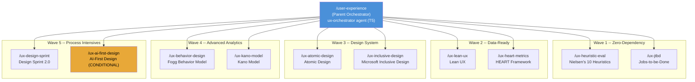
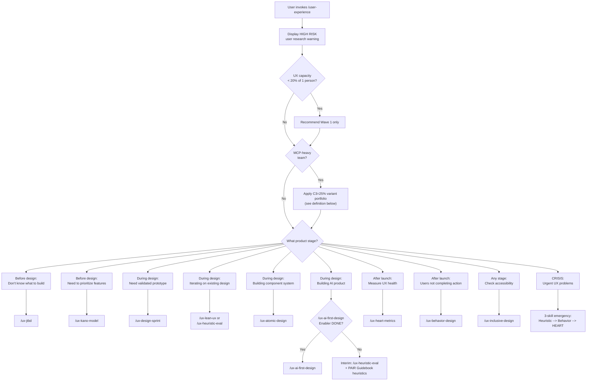
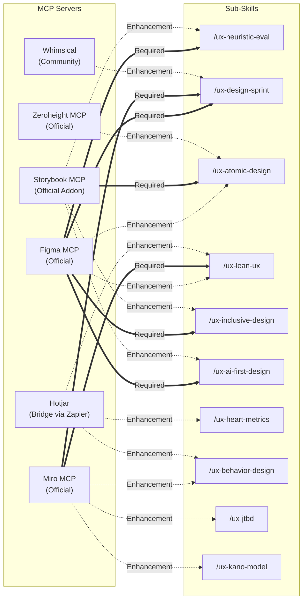
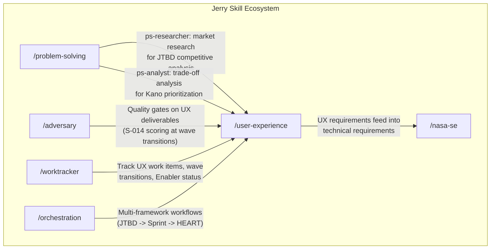

# `/user-experience` Skill Architecture Vision

> **Architecture vision for the Jerry `/user-experience` skill**: a hybrid parent orchestrator with 10 independently registerable framework sub-skills, designed for AI-augmented Tiny Teams (2-5 persons) building software products in 2026.

**Project:** PROJ-020-feature-enhancements
**Date:** 2026-03-03
**Status:** PROPOSED (pending user approval per P-020)
**Input Artifacts:**
- `projects/PROJ-020-feature-enhancements/work/analysis/ux-framework-selection.md` (C4 tournament-validated, 13 revisions, 8 adversarial iterations)
- `projects/PROJ-020-feature-enhancements/work/research/ux-frameworks-survey.md` (40 frameworks surveyed)
- `projects/PROJ-020-feature-enhancements/work/research/tiny-teams-research.md` (Gartner 2026 Tiny Teams trend)
- `projects/PROJ-020-feature-enhancements/work/research/mcp-design-tools-survey.md` (20 MCP tools assessed)

## Document Sections

| Section | Purpose |
|---------|---------|
| [L0: Executive Summary](#l0-executive-summary) | What this skill does, why it matters, and what it replaces |
| [L1: Full Architecture Specification](#l1-full-architecture-specification) | Technical design -- skill hierarchy, agents, routing, MCP integration |
| [1.1 Skill Hierarchy](#11-skill-hierarchy) | Parent skill + 10 sub-skills structure |
| [1.2 Parent Orchestrator](#12-parent-orchestrator-user-experience) | `/user-experience` entry point design |
| [1.3 Sub-Skill Specifications](#13-sub-skill-specifications) | Per-sub-skill specification table |
| [1.4 Agent Routing Architecture](#14-agent-routing-architecture) | Keyword routing, lifecycle triage, crisis mode |
| [1.5 MCP Integration Map](#15-mcp-integration-map) | Tool-to-sub-skill mapping with dependency classification |
| [1.6 Jerry Skill Integration](#16-jerry-skill-integration) | How `/user-experience` connects to existing Jerry skills |
| [1.7 Wave Deployment Plan](#17-wave-deployment-plan) | 5-wave criteria-gated rollout |
| [1.8 Synthesis Hypothesis Validation](#18-synthesis-hypothesis-validation) | Confidence gates for AI-generated UX outputs |
| [L2: Strategic Implications](#l2-strategic-implications) | Evolution path, systemic consequences, Tiny Teams enablement |
| [2.1 Tiny Teams Capability Mapping](#21-tiny-teams-capability-mapping) | How the portfolio replaces a UX department |
| [2.2 Known Gaps and V2 Roadmap](#22-known-gaps-and-v2-roadmap) | Documented limitations and extension plan |
| [2.3 Architecture Evolution Path](#23-architecture-evolution-path) | How the skill grows beyond V1 |
| [2.4 Risk Register](#24-risk-register) | Top architectural risks with mitigations |

---

## L0: Executive Summary

### What We Are Building

The `/user-experience` skill gives any software team -- even one with no UX specialists -- access to structured UX methodology through AI-guided workflows. Instead of one monolithic "UX skill," it is designed as a **parent orchestrator** that routes users to the right framework sub-skill based on their product stage and specific need.

There are 10 sub-skills, each implementing a proven UX framework. Together they cover the full product lifecycle:

- **Before you design:** Discover what problem to solve (Jobs-to-be-Done) and which features matter most (Kano Model)
- **While you design:** Run intensive design sprints (Design Sprint), iterate on hypotheses continuously (Lean UX), and catch usability problems before users see them (Nielsen's Heuristics)
- **While you build:** Structure your component library for reuse (Atomic Design) and ensure everyone can use your product (Microsoft Inclusive Design)
- **After you launch:** Measure whether your UX is actually working (HEART Framework) and diagnose why users are not doing what you expected (Fogg Behavior Model)
- **If you are building an AI product:** Apply AI-specific interaction patterns (AI-First Design -- conditional on a synthesis deliverable being completed first)

### Why This Matters

Gartner's 2026 "Tiny Teams" trend confirms that 2-5 person teams augmented by AI will replace department-scale staffing (Source: `work/research/tiny-teams-research.md`). Companies like Midjourney (11 people, $200M ARR) and Bolt.new (15 people, $20M in 60 days) demonstrate that AI-augmented tiny teams can deliver results previously requiring 50+ people [Source: Phase 1 Tiny Teams research, industry reports 2025-2026]. The `/user-experience` skill is designed to give those tiny teams the UX capability that they currently lack -- not by replacing human judgment, but by providing structured frameworks that make UX work accessible to non-specialists.

### What This Replaces

For a 2-3 person team, this skill portfolio provides the equivalent capability of hiring: a UX researcher (JTBD, Lean UX validation), a UX designer (Design Sprint, Nielsen's evaluation), a design systems engineer (Atomic Design), an accessibility specialist (Inclusive Design), and a UX metrics analyst (HEART, Fogg). Each sub-skill replaces a specialist role by combining AI execution of structured/analytical steps with human judgment on strategic decisions.

### Critical Limitations

This portfolio has a **HIGH RISK gap in user research**: there is no dedicated user research framework. AI-generated user insights are hypotheses, not validated findings. The onboarding flow warns every user about this. For consumer products or specialized populations, supplement with direct user contact before making design decisions based on AI synthesis outputs.

---

## L1: Full Architecture Specification

### 1.1 Skill Hierarchy

The `/user-experience` skill uses a **hybrid parent orchestrator + pluggable sub-skills** architecture. Each UX framework is a self-contained Jerry skill that can be independently registered, versioned, and evolved.



**Architecture decisions driving this structure:**

1. **Each framework = its own skill.** Sub-skills can be registered independently in CLAUDE.md and AGENTS.md. A team using only Nielsen's Heuristics and Lean UX does not load the other 8 sub-skills into context, preserving the Jerry progressive disclosure budget (CB-02).

2. **Parent orchestrator is the single entry point.** Only `/user-experience` is registered in `mandatory-skill-usage.md`. The parent routes to sub-skills via lifecycle-stage triage, preventing users from facing 10 equally-weighted options with no guidance.

3. **Sub-skills are independently evolvable.** When a better metrics framework than HEART emerges, only `/ux-heart-metrics` is updated. The parent orchestrator's routing table gets a new entry; other sub-skills are unaffected. New frameworks (V2 additions like Service Blueprinting) are added as new sub-skills without modifying existing ones.

4. **P-003 compliant single-level nesting.** The parent orchestrator (`ux-orchestrator`, T5) delegates to sub-skill agents via the Task tool. Sub-skill agents are T2-T3 and do NOT have Task tool access. Workers return results to the orchestrator.

### 1.2 Parent Orchestrator: `/user-experience`

**Location:** `skills/user-experience/SKILL.md`

**Primary Agent:** `ux-orchestrator`

| Attribute | Value |
|-----------|-------|
| Tool Tier | T5 (Full -- needs Task tool for sub-skill delegation) |
| Cognitive Mode | Integrative (combines user context with routing logic) |
| Model | Opus (complex routing decisions across 10 sub-skills) |
| MCP Tools | None (routing does not require external tool access) |

**Responsibilities:**

1. **Onboarding with HIGH RISK warning.** First invocation per session surfaces the user research gap warning (see Section 1.8).
2. **Capacity check.** Asks team UX time allocation; if < 20% of one person's time, restricts recommendations to Wave 1 sub-skills.
3. **MCP-heavy team detection.** Routes MCP-priority teams to the C3=25% variant portfolio (Service Blueprinting substitutions when available).
4. **Lifecycle-stage routing.** Triage mechanism routes to the correct sub-skill based on product stage (before design / during design / after launch).
5. **Crisis mode.** Emergency 3-skill sequence for products with urgent UX problems: Heuristic Eval --> Behavior Design --> HEART Metrics.
6. **Cross-framework integration.** Manages handoffs between sub-skills (e.g., JTBD job statement feeds into Design Sprint challenge statement).

**Routing triage mechanism:**



**C3=25% variant portfolio definition:** The C3=25% variant is a sensitivity-tested alternative weighting where C3 (MCP Integration) weight is increased from 15% to 25% (reducing C1 from 25% to 15%). This reweighting was tested in Phase 2 sensitivity analysis and changes the framework ranking to favor MCP-heavy frameworks. The variant is activated when a team's primary workflow is design-tool-centric. Reference: `work/analysis/ux-framework-selection.md` Section 1 Sensitivity Analysis.

### 1.3 Sub-Skill Specifications

Each sub-skill is a complete Jerry skill with its own `SKILL.md`, `agents/` directory, and `rules/` directory.

| Sub-Skill | Primary Agent | Cognitive Mode | Tool Tier | Required MCP | Enhancement MCP | Wave | Score |
|-----------|--------------|----------------|-----------|-------------|-----------------|------|-------|
| `/ux-heuristic-eval` | `ux-heuristic-evaluator` | Systematic | T3 | Figma | Storybook | 1 | 9.25 |
| `/ux-jtbd` | `ux-jtbd-analyst` | Divergent | T3 | None | Miro | 1 | 8.05 |
| `/ux-lean-ux` | `ux-lean-ux-facilitator` | Systematic | T3 | Miro | Figma, Hotjar (Bridge) | 2 | 8.25 |
| `/ux-heart-metrics` | `ux-heart-analyst` | Systematic | T2 | None | Analytics API, Hotjar (Bridge) | 2 | 8.30 |
| `/ux-atomic-design` | `ux-atomic-architect` | Systematic | T3 | Storybook | Zeroheight, Figma | 3 | 8.55 |
| `/ux-inclusive-design` | `ux-inclusive-evaluator` | Systematic | T3 | Figma | Storybook, Context7 | 3 | 8.00 |
| `/ux-behavior-design` | `ux-behavior-diagnostician` | Convergent | T2 | None | Miro, Hotjar (Bridge) | 4 | 7.45 |
| `/ux-kano-model` | `ux-kano-analyst` | Convergent | T2 | None | Miro | 4 | 7.50 |
| `/ux-design-sprint` | `ux-sprint-facilitator` | Systematic | T3 | Miro, Figma | Whimsical | 5 | 8.65 |
| `/ux-ai-first-design` | `ux-ai-design-guide` | Divergent | T3 | Figma | Storybook, Context7 | 5 (COND) | 7.80(P) |

**(P) = Projected score; COND = Conditional on synthesis Enabler reaching DONE status.**

**Agent naming convention:** `ux-{framework-slug}` prefix ensures routing signal clarity (AD-M-001). Each agent name describes the role, not just the framework (e.g., `ux-behavior-diagnostician` not `ux-fogg`), following the function-descriptive naming pattern established by `/eng-team` agents.

**Cognitive mode rationale:**

| Mode | Applied To | Why |
|------|-----------|-----|
| Systematic | Heuristic Eval, Lean UX, HEART, Atomic Design, Inclusive Design, Design Sprint | Step-by-step protocol with defined outputs per step; checklist execution |
| Divergent | JTBD, AI-First Design | Explores broadly to discover user jobs or emerging AI patterns |
| Convergent | Behavior Design, Kano Model | Narrows from behavioral data to diagnosis; narrows from survey data to priority classification |

**Sub-skill directory structure (per sub-skill):**

```
skills/
  user-experience/              # Parent skill
    SKILL.md                    # Parent orchestrator registration
    agents/
      ux-orchestrator.md        # T5 orchestrator agent
      ux-orchestrator.governance.yaml
    rules/
      ux-routing-rules.md       # Lifecycle triage logic
      synthesis-validation.md   # Synthesis hypothesis protocol
  ux-heuristic-eval/            # Sub-skill (independently registerable)
    SKILL.md
    agents/
      ux-heuristic-evaluator.md
      ux-heuristic-evaluator.governance.yaml
    rules/
      heuristic-evaluation-rules.md
    templates/
      heuristic-report-template.md
  ux-jtbd/                      # Sub-skill
    SKILL.md
    agents/
      ux-jtbd-analyst.md
      ux-jtbd-analyst.governance.yaml
    rules/
      jtbd-methodology-rules.md
    templates/
      job-statement-template.md
      switch-interview-guide.md
  ...                           # (pattern repeats for each sub-skill)
```

### 1.4 Agent Routing Architecture

The `/user-experience` parent skill is the **only** UX entry registered in `mandatory-skill-usage.md`. Sub-skills can be invoked directly via slash commands once the user knows which one they need, but keyword routing always goes through the parent first.

**Trigger map entry for `mandatory-skill-usage.md`:**

| Detected Keywords | Negative Keywords | Priority | Compound Triggers | Skill |
|---|---|---|---|---|
| UX, user experience, usability, design sprint, heuristic evaluation, accessibility, inclusive design, component library, design system, HEART metrics, jobs to be done, JTBD, kano model, lean UX, behavior design, AI UX, product design, wireframe, prototype, user testing, UX audit, UX metrics | adversarial, tournament, quality gate, penetration, exploit, transcript, requirements, specification, V&V, code review | 12 | "UX audit" OR "design sprint" OR "heuristic evaluation" OR "user experience" OR "design system" OR "HEART metrics" (phrase match) | `/user-experience` |

**Priority 12 rationale:** Higher than all existing skills (current max: 11 for `/diataxis` and `/prompt-engineering`). UX keywords are distinct from existing skill domains; false-positive risk is low. The negative keyword list prevents collision with `/adversary` ("quality gate"), `/red-team` ("penetration"), `/nasa-se` ("requirements"), and `/transcript`.

**Sub-skill direct invocation:** Users who know the specific sub-skill can invoke directly (e.g., `/ux-heuristic-eval`). This bypasses the parent's triage mechanism. Each sub-skill has its own trigger keywords in its `SKILL.md` activation-keywords list, but these are registered at a lower routing priority than the parent.

**Invocation protocol for common user intents:**

| User Says | Route To | Qualification |
|-----------|----------|---------------|
| "Improve my UX" / "Make this more usable" | `/ux-heuristic-eval` (existing design) or `/ux-design-sprint` (no design yet) | "Do you have an existing design?" |
| "Fix a specific UX problem" | `/ux-behavior-design` (behavioral) or `/ux-heuristic-eval` (design-level) | "Is the problem about user behavior or design quality?" |
| "Decide what to build" | `/ux-jtbd` (strategic) or `/ux-kano-model` (prioritize known features) | "Are you defining the problem or prioritizing features?" |
| "Measure whether UX is working" | `/ux-heart-metrics` | No qualification needed |
| "Make this accessible" | `/ux-inclusive-design` | Provide user context brief |
| "CRISIS: urgent UX problems" | Emergency 3-skill sequence | No qualification needed |

### 1.5 MCP Integration Map

The `/user-experience` skill is the most MCP-dependent skill in the Jerry framework. The following diagram shows tool-to-sub-skill connections with dependency classification.



**Legend:** Solid arrows (==>) = Required MCP (degraded mode + explicit error on failure). Dashed arrows (-.>) = Enhancement MCP (cosmetic limitation on failure).

**Figma dependency risk:** Figma MCP is required for 4 sub-skills and enhances 2 more. This creates a single point of failure. Mitigations:
- Each Figma-dependent sub-skill documents a non-Figma fallback (screenshot-input mode for heuristic eval; Miro-only for Design Sprint)
- Penpot MCP (currently experimental) is monitored as an alternative path
- The MCP maintenance contract (quarterly audits, named ownership) provides early warning of Figma MCP changes

**Cost structure:**
- **$0/month:** 4 sub-skills with no required MCP (HEART, JTBD, Kano, Behavior Design). Note: Storybook is free but is a Required MCP for `/ux-atomic-design`, not optional -- teams using Atomic Design need Storybook installed even at $0 cost.
- **~$46/month:** Minimum viable MCP config (Figma Professional + Miro Team for a 2-person team)
- **~$145-245/month:** Full enhancement stack (add Zeroheight + Hotjar)

### 1.6 Jerry Skill Integration

The `/user-experience` skill integrates with existing Jerry skills at defined touchpoints:



| Jerry Skill | Integration Point | Direction |
|-------------|------------------|-----------|
| `/problem-solving` | `ps-researcher` provides market research for JTBD competitive job analysis; `ps-analyst` supports Kano survey data interpretation | Upstream to `/user-experience` |
| `/adversary` | Quality gates on UX deliverables at wave transitions; S-014 scoring for C2+ UX artifacts | Applied to `/user-experience` outputs |
| `/worktracker` | Tracks all UX work items: sub-skill stories, wave transition tasks, Enabler status for AI-First Design, MCP ownership verification | Operational infrastructure |
| `/orchestration` | Coordinates multi-framework workflows: canonical sequence JTBD --> Design Sprint --> Lean UX --> HEART | Coordinates `/user-experience` sub-skills |
| `/nasa-se` | UX requirements (from JTBD job statements, Nielsen's findings) feed into technical requirements and V&V criteria | Downstream from `/user-experience` |
| `/diataxis` | UX documentation (component docs, design system guides) use Diataxis quadrant methodology | Complementary |

### 1.7 Wave Deployment Plan

Sub-skills deploy in 5 criteria-gated waves. Progression is **criteria-gated, not time-gated** -- teams advance when readiness criteria are met, not on a calendar schedule.

```mermaid
gantt
    title Wave Deployment Timeline (Criteria-Gated)
    dateFormat X
    axisFormat %s

    section Wave 1
    /ux-heuristic-eval     :w1a, 0, 1
    /ux-jtbd               :w1b, 0, 1

    section Wave 2
    /ux-lean-ux            :w2a, 1, 2
    /ux-heart-metrics      :w2b, 1, 2

    section Wave 3
    /ux-atomic-design      :w3a, 2, 3
    /ux-inclusive-design    :w3b, 2, 3

    section Wave 4
    /ux-behavior-design    :w4a, 3, 4
    /ux-kano-model         :w4b, 3, 4

    section Wave 5
    /ux-design-sprint      :w5a, 4, 5
    /ux-ai-first-design    :crit, w5b, 4, 5
```



| Wave | Sub-Skills | Rationale | Entry Criteria |
|------|-----------|-----------|----------------|
| **1: Zero-Dependency** | `/ux-heuristic-eval`, `/ux-jtbd` | No external user data or MCP required for core function. Highest return-per-hour entry skills. | KICKOFF-SIGNOFF.md completed with all owners |
| **2: Data-Ready** | `/ux-lean-ux`, `/ux-heart-metrics` | Requires Miro (Lean UX) or analytics source (HEART). Builds on Wave 1 foundations. | Wave 1: at least 1 heuristic eval completed + 1 JTBD job statement used |
| **3: Design System** | `/ux-atomic-design`, `/ux-inclusive-design` | Requires Storybook setup (Atomic) and Figma (Inclusive). Component infrastructure for all future design work. | Wave 2: launched product with analytics OR 1 completed Lean UX hypothesis cycle |
| **4: Advanced Analytics** | `/ux-behavior-design`, `/ux-kano-model` | Both require user data. Post-launch skills assuming some user base exists. | Wave 3: Storybook with 5+ Atom stories; 1 Persona Spectrum review completed |
| **5: Process Intensives** | `/ux-design-sprint`, `/ux-ai-first-design` (CONDITIONAL) | Design Sprint requires 4-day team commitment. AI-First Design conditional on Enabler. | Wave 4: 30+ users for Kano OR 1 B=MAP bottleneck diagnosed; AI-First: Enabler DONE + WSM (Weighted Sum Method -- the scoring formula from Phase 2: Total = C1x0.25 + C2x0.20 + C3x0.15 + C4x0.15 + C5x0.15 + C6x0.10; see `work/analysis/ux-framework-selection.md` Section 1 for full methodology) >= 7.80 |

**Wave bypass/stall recovery:** If a wave stalls for 2+ sprint cycles, bypass conditions allow teams to proceed with partial capability. All 10 sub-skills have documented non-MCP fallback paths -- no sub-skill is entirely blocked by MCP unavailability.

### 1.8 Synthesis Hypothesis Validation

Multiple sub-skills produce "synthesis hypothesis" outputs -- AI-generated abstractions that may reflect training data biases rather than the team's specific users. A 3-tier confidence gate fires at skill invocation time:

| Confidence | Gate | What Happens |
|------------|------|--------------|
| **HIGH** | User reviews output + acknowledges specific AI judgment calls via Synthesis Judgments Summary | Advances to design decisions after enumerated acknowledgment |
| **MEDIUM** | Requires expert review OR validation against 2-3 real user data points | Cannot advance to design decisions without named validation source |
| **LOW** | Output permanently labeled reference-only; design recommendation section structurally omitted | Cannot be overridden by any user action |

**Sub-skills producing synthesis outputs:**

| Sub-Skill | Synthesis Steps | Typical Confidence |
|-----------|----------------|-------------------|
| `/ux-jtbd` | Job statement synthesis from secondary research | MEDIUM |
| `/ux-lean-ux` | Assumption mapping; hypothesis generation | MEDIUM |
| `/ux-design-sprint` | Day 4 interview thematic analysis | HIGH |
| `/ux-design-sprint` | Day 2 sketch selection rationale | MEDIUM |
| `/ux-inclusive-design` | Persona Spectrum customization | MEDIUM |
| `/ux-kano-model` | Directional classification (5-8 respondents) | MEDIUM |
| `/ux-kano-model` | Feature priority conflict interpretation | LOW |
| `/ux-behavior-design` | B=MAP bottleneck diagnosis | MEDIUM |
| `/ux-behavior-design` | Design intervention recommendation | LOW |
| `/ux-heart-metrics` | Goal-metric mapping interpretation | MEDIUM |
| `/ux-heart-metrics` | Metric threshold recommendation | LOW |
| `/ux-ai-first-design` | AI interaction pattern recommendations | LOW |

**Onboarding warning (displayed first invocation per session):**

> "IMPORTANT: This skill portfolio does NOT include a dedicated user research framework. AI-generated user insights (personas, job statements, assumption maps) are hypotheses, not validated findings. For consumer products or specialized populations, supplement with direct user contact (interviews, observations, surveys) before making design decisions based on synthesis outputs."

---

## L2: Strategic Implications

### 2.1 Tiny Teams Capability Mapping

The 10-framework portfolio maps to traditional UX department roles, showing how a 2-3 person team with AI augmentation achieves department-scale UX capability:

| Traditional UX Role | Sub-Skill(s) That Replace It | What AI Does | What Humans Still Do |
|---------------------|------------------------------|-------------|---------------------|
| **UX Researcher** | `/ux-jtbd`, `/ux-lean-ux` (validation loops) | Synthesizes job statements from interview transcripts; generates assumption maps; themes interview data | Conducts actual user interviews; judges hypothesis validity; decides what to learn next |
| **UX Designer** | `/ux-design-sprint`, `/ux-lean-ux` | Generates 20+ sketch variants; builds interactive Figma prototypes; creates wireframes from prompts | Sets design direction; selects from AI variants; makes aesthetic and strategic judgments |
| **UX Evaluator / Auditor** | `/ux-heuristic-eval` | Evaluates designs against Nielsen's 10 heuristics; generates severity-rated findings report | Triages findings; provides platform context for contextual heuristics; decides which to fix |
| **Design Systems Engineer** | `/ux-atomic-design` | Discovers existing components from Storybook; composes new Organisms from Atoms/Molecules; maintains docs | Defines component boundaries (Atom vs. Molecule); validates against brand/accessibility standards |
| **UX Metrics Analyst** | `/ux-heart-metrics`, `/ux-behavior-design` | Populates HEART GSM template from analytics; diagnoses B=MAP bottlenecks; generates measurement reports | Interprets metric trends; identifies confounders; makes product decisions from data |
| **Accessibility Specialist** | `/ux-inclusive-design` | Evaluates contrast ratios, text sizing, touch targets; checks WCAG 2.2 compliance; applies Persona Spectrum | Provides user population context; validates accommodations for non-standard populations |
| **Product Strategist (UX)** | `/ux-jtbd`, `/ux-kano-model` | Synthesizes competitive job analysis; processes Kano survey responses; generates feature priority matrix | Frames the strategic problem; decides which job to pursue; validates Kano classifications |
| **UX Department Manager** | `/user-experience` (parent orchestrator) | Routes to correct sub-skill; manages cross-framework integration; tracks hypothesis backlogs | Provides product context; makes final design decisions; provides organizational judgment |

**Aggregate capability scope metric:** A solo developer or 2-person team using the full Wave 1-4 portfolio has access to the methodology CAPABILITY AREAS covered by a 6-8 person UX team -- meaning the portfolio spans the same UX discipline scope (research, design, evaluation, metrics, accessibility, design systems, behavioral analysis, strategy), not that it matches the throughput or depth of 6-8 full-time specialists. The gap is in user research depth (the HIGH RISK limitation) and the creative/strategic judgment that only human expertise provides.

### 2.2 Known Gaps and V2 Roadmap

| Priority | Gap | V2 Candidate | Impact |
|----------|-----|-------------|--------|
| **P1 (HIGH RISK)** | No dedicated user research framework | Maze/UserZoom integration as `/ux-user-research` | Closes the single largest portfolio gap; unblocks validated research for all synthesis outputs |
| **P1** | No service design coverage | Service Blueprinting as `/ux-service-blueprinting` (rank #12, score 7.40) | Covers end-to-end service process niche; also the auto-substitute if AI-First Design Enabler expires |
| **P1** | No dark patterns audit | Brignull deceptive.design taxonomy as `/ux-dark-patterns-audit` | Ethics gap: teams with subscription flows, notification patterns, or engagement mechanics |
| **P1** | No algorithmic bias review | PAIR Guidebook + ACM FAccT as `/ux-algorithmic-bias-review` | Ethics gap: critical for AI-generated UX content |
| **P2** | No cognitive walkthrough | Cognitive Walkthrough (rank #17, score 6.70) as `/ux-cognitive-walkthrough` | Feature discoverability and complex navigation gap |
| **P2** | No privacy-by-design | Cavoukian 7 principles as `/ux-privacy-design` | Legal compliance (GDPR/CCPA) |
| **P3** | Process visualization | Double Diamond as alternative process framework | For teams preferring visual diverge-converge model |

**V2 scoping triggers:** V2 planning begins when any 2 of these conditions are met in a single month: (1) a team reports a major product decision made incorrectly due to missing user research; (2) the MCP-heavy variant is activated for 20%+ of invocations; (3) 3+ monthly requests for AI UX pattern guidance while the Enabler is incomplete; (4) a concrete dark pattern complaint or algorithmic bias issue occurs.

### 2.3 Architecture Evolution Path

**Phase 1 (V1 Launch):** Parent orchestrator + 10 sub-skills deployed in 5 waves. Each sub-skill is a standalone Jerry skill. Parent routing is keyword-based with lifecycle-stage triage.

**Phase 2 (V2 -- 6-12 months post-launch):** Add P1 gap-closing sub-skills (user research, service blueprinting, ethics frameworks). Parent routing table expands. Cross-sub-skill integration paths deepen (e.g., user research feeds validated personas into JTBD and Design Sprint).

**Phase 3 (V3 -- 12-24 months):** Evaluate whether the sub-skill count (potentially 14-16) warrants Layer 2 rule-based routing per the Jerry scaling roadmap (agent-routing-standards.md). Consider sub-skill groupings: Discovery (JTBD, Kano, User Research), Design (Sprint, Lean UX, Heuristic Eval), Build (Atomic, Inclusive), Measure (HEART, Fogg, Behavior), Ethics (Dark Patterns, Bias Review, Privacy). These groupings become Layer 2 routing categories.

**Phase 4 (V4+ -- 24+ months):** If the skill reaches 20+ sub-skills, evaluate LLM-as-Router (Layer 3) per agent-routing-standards.md Phase 3 thresholds. Consider embedding-based semantic routing for UX-domain requests. Evaluate whether popular sub-skill combinations (e.g., "JTBD then Sprint") should become first-class composite workflows.

### 2.4 Risk Register

| # | Risk | Likelihood | Impact | Mitigation |
|---|------|-----------|--------|------------|
| R1 | **Figma MCP breaking change** disrupts 4+ sub-skills simultaneously | Medium | High | Each sub-skill documents non-Figma fallback; quarterly MCP audit; named MCP maintenance owner |
| R2 | **User research gap** causes teams to make poor product decisions from unvalidated AI synthesis | High | High | Onboarding warning; synthesis hypothesis validation protocol; V2 P1 priority for user research framework |
| R3 | **AI-First Design Enabler** fails or expires, leaving a gap in AI product UX coverage | Medium | Medium | Service Blueprinting auto-substitution path documented; interim PAIR Guidebook + Lean UX workaround |
| R4 | **Context window pressure** from 10+ sub-skill definitions loaded simultaneously | Low | High | Only parent skill loaded at session start (Tier 1); sub-skills loaded on-demand via Task tool (Tier 2); CB-02 budget preserved |
| R5 | **Scope creep** as V2 additions expand sub-skill count beyond manageable routing | Medium | Medium | Layer 2 routing at 15+ sub-skills per scaling roadmap; sub-skill groupings pre-designed for Phase 3 |
| R6 | **Over-reliance on AI synthesis** despite confidence gates | Medium | High | LOW gate structurally omits design recommendations; MEDIUM gate requires named validation source; audit trail in output artifacts |
| R7 | **Wave adoption stalls** at Wave 1-2 due to team capacity constraints | Medium | Low | Bypass conditions documented; free-tier configuration supports 5 sub-skills at $0 MCP cost |
| R8 | **Community MCP server abandonment** (Whimsical) removes secondary integration | Medium | Low | Community MCPs are Enhancement-only, never Required; verify GitHub activity before implementation |

---

## Appendix: Implementation Artifacts Required

The following artifacts must be created during implementation. This checklist consolidates requirements from the selection analysis Section 7.5.

| # | Artifact | Path | Blocking |
|---|----------|------|----------|
| 1 | KICKOFF-SIGNOFF.md | `projects/PROJ-020-feature-enhancements/KICKOFF-SIGNOFF.md` | Blocks Wave 1 |
| 2 | Parent skill SKILL.md | `skills/user-experience/SKILL.md` | Blocks all routing |
| 3 | Parent orchestrator agent | `skills/user-experience/agents/ux-orchestrator.md` | Blocks all routing |
| 4 | Parent routing rules | `skills/user-experience/rules/ux-routing-rules.md` | Blocks lifecycle triage |
| 5 | Synthesis validation rules | `skills/user-experience/rules/synthesis-validation.md` | Blocks confidence gates |
| 6 | Per-sub-skill SKILL.md (x10) | `skills/ux-{slug}/SKILL.md` | Per-wave gating |
| 7 | Per-sub-skill primary agent (x10) | `skills/ux-{slug}/agents/ux-{agent-name}.md` | Per-wave gating |
| 8 | Per-sub-skill governance YAML (x10) | `skills/ux-{slug}/agents/ux-{agent-name}.governance.yaml` | Per-wave gating |
| 9 | Trigger map update | `.context/rules/mandatory-skill-usage.md` | Blocks keyword routing |
| 10 | CLAUDE.md registration | `CLAUDE.md` skill table entry | Blocks skill discovery |
| 11 | AGENTS.md registration | `AGENTS.md` agent registry entries | Blocks agent discovery |

**Worktracker decomposition note:** Following user approval of this architecture vision, the next step is worktracker decomposition into EPIC -> Feature -> Story -> Task entities per `/worktracker` standards. This decomposition is Phase 3->4 transition work, not captured in this vision document.

---

*Architecture Vision Version: 1.0.0*
*Source: Phase 2 Selection Analysis (C4 tournament-validated, 13 revisions)*
*Agent: ps-architect (Opus)*
*Constitutional Compliance: Jerry Constitution v1.0 (P-002 file persistence, P-003 single-level nesting, P-020 PROPOSED status, P-022 gaps documented)*
