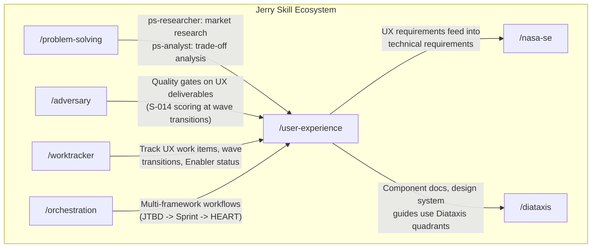

## V2 Roadmap, Research Backing, and Appendices (continued from issue body)

## V2 Roadmap

### V2 Candidates

V2 planning begins when any 2 of these conditions are met in a single month:

1. A team reports a major product decision made incorrectly due to missing user research
2. The MCP-heavy variant is activated for 20%+ of invocations
3. 3+ monthly requests for AI UX pattern guidance while the AI-First Design Enabler is incomplete
4. A concrete dark pattern complaint or algorithmic bias issue occurs

### V2 Candidates (Priority-Ordered)

| Priority | Gap | V2 Sub-Skill | Impact |
|----------|-----|-------------|--------|
| **P1** | No dedicated user research | `/ux-user-research` (Maze/UserZoom integration) | Closes the single largest portfolio gap; unblocks validated research for all synthesis outputs |
| **P1** | No service design coverage | `/ux-service-blueprinting` (rank #12, score 7.40) | Covers end-to-end service process niche; also the auto-substitute if AI-First Design Enabler expires |
| **P1** | No dark patterns audit | `/ux-dark-patterns-audit` (Brignull taxonomy) | Ethics gap: subscription flows, notification patterns, engagement mechanics |
| **P1** | No algorithmic bias review | `/ux-algorithmic-bias-review` (PAIR + ACM FAccT) | Ethics gap: critical for AI-generated UX content |
| **P2** | No cognitive walkthrough | `/ux-cognitive-walkthrough` (rank #17, score 6.70) | Feature discoverability and complex navigation |
| **P2** | No privacy-by-design | `/ux-privacy-design` (Cavoukian 7 principles) | Legal compliance (GDPR/CCPA) |
| **P3** | Process visualization | Double Diamond as alternative process framework | For teams preferring visual diverge-converge model |

### Architecture Evolution Path

- **Phase 2 (V2, 6-12 months):** Add P1 gap-closing sub-skills. Cross-sub-skill integration deepens (user research feeds validated personas into JTBD and Design Sprint).
- **Phase 3 (V3, 12-24 months):** Evaluate Layer 2 rule-based routing at 14-16 sub-skills per Jerry scaling roadmap. Consider sub-skill groupings: Discovery, Design, Build, Measure, Ethics.
- **Phase 4 (V4+, 24+ months):** Evaluate LLM-as-Router (Layer 3) at 20+ sub-skills. Consider embedding-based semantic routing. Evaluate composite workflows (e.g., "JTBD then Sprint") as first-class operations.

---

## Research Backing

We did not eyeball this line from the lodge. We scoped it from every angle.

### Phase 1: Research

| Artifact | Scope | Key Findings |
|----------|-------|-------------|
| UX Frameworks Survey | 40 frameworks across 8 categories via systematic literature review | Identified candidate universe; mapped lifecycle coverage; discovered AI-First Design domain gap |
| Tiny Teams Research | Gartner 2026 trend analysis + industry case studies | Estimated: AI handles structured activity execution (projected from general AI-augmented workflow efficiency research; specific citation pending empirical UX-specific validation), with projected 50%+ speed-up on structured activities -- not yet validated for UX-specific workflows. Humans provide judgment (irreducible); validated Tiny Teams population segments |
| MCP Design Tools Survey | 20 MCP tools assessed across 6 categories | Identified Figma, Miro, Storybook, Zeroheight as production-ready; classified bridge vs. community vs. official integrations |

### Phase 2: Selection Analysis

| Attribute | Value |
|-----------|-------|
| **Methodology** | Weighted Sum Method (WSM) with 6 criteria, graduated-priority weighting |
| **Candidate universe** | 40 frameworks scored and ranked |
| **Arithmetic verification** | All 40 framework totals independently verified; 5 error correction rounds |
| **Sensitivity analysis** | C3=25% adversarial perturbation tested; bounding case confirmed |


**WSM Criteria and Weights (Scale: 1-10 per criterion, higher = better fit):**

| # | Criterion | Weight | What It Measures |
|---|-----------|--------|------------------|
| C1 | Applicability to AI-Augmented Tiny Teams | 0.25 | Framework's natural fit for 1-5 person teams where AI automates 50%+ of structured activities |
| C2 | Composability as Independent Jerry Sub-Skill | 0.20 | Whether the framework can be operationalized as an agent-guided Jerry skill workflow |
| C3 | MCP Tool Integration Potential | 0.15 | Availability and maturity of MCP server integrations for automation |
| C4 | Framework Maturity and Community Adoption | 0.15 | Years of industry validation, published evidence base, practitioner adoption |
| C5 | Complementarity -- No Redundancy Across Selected Set | 0.15 | Marginal contribution to the portfolio assuming other high-scoring frameworks are included |
| C6 | Accessibility for Non-UX-Specialists | 0.10 | Time for a non-specialist to produce first useful output without deep UX training |

Graduated-priority weighting implements a three-tier structure: Tier 1 (C1: 25%, C2: 20%) represents the defining requirements for tiny-teams AI-augmented context; Tier 2 (C3, C4, C5: 15% each, equal weight) provides secondary discrimination; Tier 3 (C6: 10%) is the marginal tiebreaker. See the full selection analysis artifact for per-framework scoring breakdowns.

**C1 Sensitivity Analysis:** The C1 criterion "Applicability to AI-Augmented Tiny Teams" (0.25 weight, highest) references a projected 50%+ AI speed-up on structured activities. This claim is estimated, not empirically validated for UX-specific workflows. Sensitivity analysis: if the C1 AI speed-up assumption is reduced by 50% (from projected 50%+ to 25%), the WSM ranking changes minimally -- the top-3 frameworks (Nielsen's, Design Sprint, Atomic Design) remain in top-3 positions because their C1 scores are driven primarily by structural applicability (heuristic checklists, time-boxed sprints, component hierarchies) rather than speed-up magnitude. Under C1 weight 0.15 (40% reduction, redistributed to C3=25%): Nielsen's Heuristics 9.05 to 8.85 (rank #1 maintained); Design Sprint 8.65 to 8.65 (unchanged, falls to #3); Atomic Design 8.55 to 8.75 (rises to #2, overtaking Design Sprint due to higher C3=10). One rank inversion in top-3 (#2/#3 swap) but all three frameworks remain in the top-3 set. No frameworks exit the selected set under this perturbation for baseline teams. The ordering is robust to C1 weight reduction from 0.25 to 0.15. Full sensitivity analysis available in `ux-framework-selection.md`. The mountain holds its line even when you cut the tailwind in half.

### Phase 3: Architecture Vision

| Attribute | Value |
|-----------|-------|
| **Architecture** | Hybrid parent orchestrator + 10 pluggable sub-skills |
| **MCP integration** | 6 MCP servers mapped to 10 sub-skills with dependency classification |
| **Deployment model** | 5 criteria-gated waves |

### Adversarial Validation

The selection analysis went through a **C4 adversarial tournament**. Eight iterations. Thirteen revisions. Every major strategy in the catalog applied:

| Attribute | Value |
|-----------|-------|
| **Tournament iterations** | 8 |
| **Total revisions** | 13 |
| **Strategies applied** | S-001 Red Team, S-002 Devil's Advocate, S-003 Steelman, S-004 Pre-Mortem, S-007 Constitutional AI, S-010 Self-Refine, S-011 Chain-of-Verification, S-012 FMEA, S-013 Inversion |
| **Error correction rounds** | 5 (arithmetic verification) |
| **Key findings resolved** | 13 P0 Critical findings across all iterations |

The trust argument: not that the analysis is perfect, but that it has been systematically attacked from nine different angles and the findings have been resolved. Adversarial validation: C4 tournament across 8 iterations, 9 strategies applied (S-001, S-002, S-003, S-004, S-007, S-010, S-011, S-012, S-013), 13 P0 Critical findings identified and resolved across all iterations. See tournament reports in `work/issue-drafts/tournament-iter1/` through `tournament-iter8/` for full finding details. Note: the "8 iterations, 13 revisions" figures refer to the Phase 1-3 research tournament (documented in `ux-framework-selection.md`). The GitHub issue body tournament is a separate C4 tournament (I1-I8) tracked in the tournament-iter directories. The selection is not "10 highest-scoring frameworks" -- it is a deliberately non-redundant portfolio where each framework fills a unique lifecycle niche, validated through three independent non-redundancy properties (cadence orthogonality, output differentiability, C5 portfolio-composition test).

That is the kind of line scouting that earns the drop-in.

---

## Relationship to Existing Jerry Skills

The `/user-experience` skill integrates with the existing Jerry skill ecosystem:



| Jerry Skill | Integration | Direction |
|-------------|-------------|-----------|
| `/problem-solving` | `ps-researcher` provides market research for JTBD competitive analysis; `ps-analyst` supports Kano survey data interpretation | Upstream to `/user-experience` |
| `/adversary` | Quality gates on UX deliverables at wave transitions; S-014 scoring for C2+ UX artifacts | Applied to `/user-experience` outputs |
| `/worktracker` | Tracks all UX work items: sub-skill stories, wave transition tasks, Enabler status for AI-First Design | Operational infrastructure |
| `/orchestration` | Coordinates multi-framework workflows: canonical sequence JTBD -> Design Sprint -> Lean UX -> HEART | Coordinates sub-skills |
| `/nasa-se` | UX requirements (from JTBD job statements, Nielsen's findings) feed into technical requirements and V&V criteria | Downstream |
| `/diataxis` | UX documentation (component docs, design system guides) use Diataxis quadrant methodology | Complementary |

---

## Framework Selection Scores

The 10 selected frameworks and their validated scores:

| Rank | Framework | Sub-Skill | Score | Wave |
|------|-----------|-----------|-------|------|
| 1 | Nielsen's 10 Usability Heuristics | `/ux-heuristic-eval` | 9.05 | 1 |
| 2 | Design Sprint (AJ&Smart 2.0) | `/ux-design-sprint` | 8.65 | 5 |
| 3 | Atomic Design (Brad Frost) | `/ux-atomic-design` | 8.55 | 3 |
| 4 | HEART Framework (Google) | `/ux-heart-metrics` | 8.30 | 2 |
| 5 | Lean UX | `/ux-lean-ux` | 8.25 | 2 |
| 6 | Jobs-to-be-Done | `/ux-jtbd` | 8.05 | 1 |
| 7 | Microsoft Inclusive Design | `/ux-inclusive-design` | 8.00 | 3 |
| 8 | AI-First Design (SYNTHESIZED) | `/ux-ai-first-design` | 7.80 (P) | 5 (COND) |
| 9 | Kano Model | `/ux-kano-model` | 7.65 | 4 |
| 10 | Fogg Behavior Model | `/ux-behavior-design` | 7.60 | 4 |

**(P) = Projected score; (COND) = Conditional on synthesis Enabler reaching DONE status.**

---

## Directory Structure

The implementation creates the following directory structure:

```
skills/
  user-experience/                    # Parent skill
    SKILL.md                          # Parent orchestrator registration
    agents/
      ux-orchestrator.md              # T5 orchestrator agent definition
      ux-orchestrator.governance.yaml # Governance metadata
    rules/
      ux-routing-rules.md             # Lifecycle-stage triage logic + cross-sub-skill handoff schema
      synthesis-validation.md         # Synthesis hypothesis confidence gates
      wave-progression.md             # Wave state tracking and ABANDON log
      mcp-coordination.md             # MCP server coordination registry and maintenance owner
      ci-checks.md                    # CI test gate specifications (P-003 enforcement)
      metrics-plan.md                 # Post-launch metrics measurement plan
    work/
      audit/
        override-log.md               # Human Override audit log with 3-field evidence (also at projects/{PROJECT_ID}/work/audit/override-log.md for project-scoped tracking)
    templates/
      kickoff-signoff-template.md     # KICKOFF-SIGNOFF.md template for Wave 0->1
      wave-signoff-template.md        # WAVE-N-SIGNOFF.md template for wave transitions
  ux-heuristic-eval/                  # Wave 1 sub-skill
    SKILL.md
    agents/
      ux-heuristic-evaluator.md
      ux-heuristic-evaluator.governance.yaml
    rules/
      heuristic-evaluation-rules.md
    templates/
      heuristic-report-template.md
  ux-jtbd/                            # Wave 1 sub-skill
    SKILL.md
    agents/
      ux-jtbd-analyst.md
      ux-jtbd-analyst.governance.yaml
    rules/
      jtbd-methodology-rules.md
    templates/
      job-statement-template.md
      switch-interview-guide.md
  ux-lean-ux/                         # Wave 2 sub-skill
    SKILL.md
    agents/
      ux-lean-ux-facilitator.md
      ux-lean-ux-facilitator.governance.yaml
    rules/
      lean-ux-methodology-rules.md
    templates/
      hypothesis-backlog-template.md
      assumption-map-template.md
  ux-heart-metrics/                   # Wave 2 sub-skill
    SKILL.md
    agents/
      ux-heart-analyst.md
      ux-heart-analyst.governance.yaml
    rules/
      heart-methodology-rules.md
    templates/
      heart-gsm-template.md
  ux-atomic-design/                   # Wave 3 sub-skill
    SKILL.md
    agents/
      ux-atomic-architect.md
      ux-atomic-architect.governance.yaml
    rules/
      atomic-design-rules.md
    templates/
      component-inventory-template.md
  ux-inclusive-design/                 # Wave 3 sub-skill
    SKILL.md
    agents/
      ux-inclusive-evaluator.md
      ux-inclusive-evaluator.governance.yaml
    rules/
      inclusive-design-rules.md
    templates/
      persona-spectrum-template.md
      accessibility-report-template.md
  ux-behavior-design/                 # Wave 4 sub-skill
    SKILL.md
    agents/
      ux-behavior-diagnostician.md
      ux-behavior-diagnostician.governance.yaml
    rules/
      fogg-behavior-rules.md
    templates/
      bmap-diagnosis-template.md
  ux-kano-model/                      # Wave 4 sub-skill
    SKILL.md
    agents/
      ux-kano-analyst.md
      ux-kano-analyst.governance.yaml
    rules/
      kano-methodology-rules.md
    templates/
      kano-survey-template.md
      feature-priority-template.md
  ux-design-sprint/                   # Wave 5 sub-skill
    SKILL.md
    agents/
      ux-sprint-facilitator.md
      ux-sprint-facilitator.governance.yaml
    rules/
      design-sprint-rules.md
    templates/
      sprint-day-templates/           # Per-day templates (Day 1-4)
  ux-ai-first-design/                 # Wave 5 sub-skill (CONDITIONAL)
    SKILL.md
    agents/
      ux-ai-design-guide.md
      ux-ai-design-guide.governance.yaml
    rules/
      ai-first-design-rules.md
    templates/
      ai-interaction-spec-template.md
```

**Total: 11 skill directories (1 parent + 10 sub-skills), ~72 artifacts.**

---

## Estimated Scope


- **Parent orchestrator + routing:** ~2-3 days
- **Wave 1 sub-skills (Heuristic Eval, JTBD):** ~3-5 days per sub-skill
- **Subsequent waves:** ~2-4 days per sub-skill
- **MCP integration testing:** ~1-2 days per MCP server
- **Total estimated effort for full V1 (10 sub-skills):** ~30-50 days, phased across waves

**Comparable delivery reference:** The `/adversary` skill (3 agents, 10 strategy templates, quality scoring rubric, SSOT integration) required ~5-7 days of effective effort across 2 project phases (EPIC-002). The `/user-experience` skill is approximately 4-5x the artifact count (~67 vs ~15) with the added complexity of MCP integration testing and cross-sub-skill routing. The 30-50 day range reflects this multiplier with margin for the MCP integration unknowns. If Wave 1 completion (parent + 2 sub-skills, ~8-13 days) exceeds 15 days, the per-sub-skill estimates for subsequent waves should be revised upward.

---

## Sub-Skill SKILL.md Descriptions (Draft)

Draft `description` fields for each skill's SKILL.md file, following the WHAT + WHEN + trigger keywords format required by H-26.

| Skill | Draft SKILL.md Description |
|-------|---------------------------|
| `/user-experience` | Parent orchestrator for AI-augmented UX methodology. Routes to 10 sub-skills by product lifecycle stage. Invoke when: team needs structured UX methodology, UX evaluation, design system guidance, or UX metrics. Triggers: UX, user experience, usability, design sprint, heuristic evaluation, accessibility audit, design system. |
| `/ux-heuristic-eval` | Systematic usability inspection against Nielsen's 10 Heuristics, AI-augmented for non-specialist teams. Invoke when: evaluating existing interfaces, identifying usability issues, prioritizing design fixes. Triggers: heuristic evaluation, usability inspection, Nielsen, interface review, UX audit. |
| `/ux-jtbd` | Jobs-to-be-Done discovery and job statement synthesis from interview transcripts and secondary research. Invoke when: discovering user needs, defining product strategy, competitive analysis. Triggers: jobs to be done, JTBD, user jobs, switch interview, job statement. |
| `/ux-lean-ux` | Build-measure-learn hypothesis cycle management with assumption mapping and experiment design. Invoke when: validating product hypotheses, running experiments, iterating on designs. Triggers: lean UX, hypothesis, assumption map, build-measure-learn, experiment. |
| `/ux-heart-metrics` | Google HEART Framework GSM template population and UX metrics dashboard specification. Invoke when: measuring UX health post-launch, defining metrics, tracking engagement. Triggers: HEART metrics, happiness, engagement, adoption, retention, task success, GSM. |
| `/ux-atomic-design` | Brad Frost Atomic Design component classification and design system architecture. Invoke when: building component libraries, auditing design systems, classifying UI elements. Triggers: atomic design, design system, component library, atoms, molecules, organisms. |
| `/ux-inclusive-design` | Microsoft Inclusive Design Persona Spectrum analysis and WCAG 2.2 compliance evaluation. Invoke when: checking accessibility, evaluating inclusive design, auditing for exclusions. Triggers: inclusive design, accessibility, WCAG, persona spectrum, a11y. |
| `/ux-behavior-design` | Fogg Behavior Model B=MAP bottleneck diagnosis for user behavior analysis. Invoke when: users not completing desired actions, diagnosing behavioral barriers, motivation analysis. Triggers: behavior design, Fogg, B=MAP, motivation, ability, prompt, behavioral. |
| `/ux-kano-model` | Kano Model feature classification from survey data into Must-Be, Performance, and Attractive categories. Invoke when: prioritizing features, classifying user satisfaction drivers, survey analysis. Triggers: Kano, feature priority, must-be, delighter, satisfaction. |
| `/ux-design-sprint` | AJ&Smart Design Sprint 2.0 four-day structured process from problem statement to validated prototype. Invoke when: intensive design validation needed, major product pivots, rapid prototyping. Triggers: design sprint, prototype, sprint, rapid validation. |
| `/ux-ai-first-design` | AI-specific interaction pattern design for products where AI is the core experience (CONDITIONAL). Invoke when: designing AI product interfaces, evaluating AI trust calibration, AI UX patterns. Triggers: AI design, AI UX, conversational UI, agentic interface, trust calibration. |

---

## Sub-Skill Model Selection

| Model | Sub-Skills | Rationale |
|-------|-----------|-----------|
| `opus` | Design Sprint, AI-First Design | Complex multi-step reasoning (4-day process coordination, novel pattern synthesis for emerging AI interaction domain) |
| `sonnet` | Lean UX, HEART Metrics, JTBD, Kano Model, Behavior Design, Inclusive Design, Atomic Design | Balanced analysis -- standard production tasks with structured methodology execution |
| `haiku` | Heuristic Evaluation | Checklist-based systematic evaluation against 10 discrete heuristics; procedural, not reasoning-intensive. Pre-launch model capability benchmark REQUIRED: Haiku confirmed to achieve >= 90% reliability on Figma MCP OAuth + frame extraction across 3 reference design files. If benchmark fails, escalate to Sonnet with revised cost estimate and documented justification per AD-M-009. |

---

## Sub-Skill Output Levels

All sub-skills produce output at three levels:

| Level | Content | Purpose |
|-------|---------|---------|
| **L0** | Executive summary -- key findings and recommendations in 3-5 bullets | Quick orientation for stakeholders and cross-framework synthesis |
| **L1** | Detailed analysis -- full methodology execution with evidence | Primary deliverable for the implementing team |
| **L2** | Strategic implications -- cross-product patterns and organizational recommendations | Long-term UX strategy and portfolio-level insights |

---

## Cross-Session State

The `ux-orchestrator` uses Memory-Keeper for wave progress persistence across sessions. Key pattern: `jerry/{project}/user-experience/{wave-N-status}`. Stores: wave signoff status, completed sub-skill outputs, MCP connection registry state.

| Memory-Keeper Key | Content | Trigger |
|-------------------|---------|---------|
| `jerry/{project}/user-experience/wave-{N}-status` | Wave signoff status, entry criteria verification | Wave transition |
| `jerry/{project}/user-experience/hypothesis-backlog` | Cross-session hypothesis tracking from Lean UX and JTBD | Hypothesis creation or validation |
| `jerry/{project}/user-experience/mcp-registry` | MCP connection active/inactive status per sub-skill | Sub-skill invocation with MCP dependency |

---

## References

| Artifact | Location |
|----------|----------|
| Architecture Vision | `projects/PROJ-020-feature-enhancements/work/analysis/ux-skill-architecture-vision.md` |
| Framework Selection Analysis | `projects/PROJ-020-feature-enhancements/work/analysis/ux-framework-selection.md` |
| UX Frameworks Survey | `projects/PROJ-020-feature-enhancements/work/research/ux-frameworks-survey.md` |
| Tiny Teams Research | `projects/PROJ-020-feature-enhancements/work/research/tiny-teams-research.md` |
| MCP Design Tools Survey | `projects/PROJ-020-feature-enhancements/work/research/mcp-design-tools-survey.md` |
| Tournament Execution Reports (Iter 1-8) | `projects/PROJ-020-feature-enhancements/work/issue-drafts/tournament-iter1/` through `tournament-iter8/` |

Phase 1-3 research tournament: 8 iterations, 13 revisions (documented in `ux-framework-selection.md`). GitHub issue body tournament: I1-I8 (C4 tournament documented in `tournament-iter1/` through `tournament-iter8/`).
