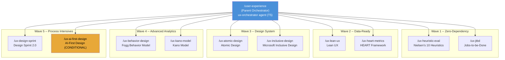
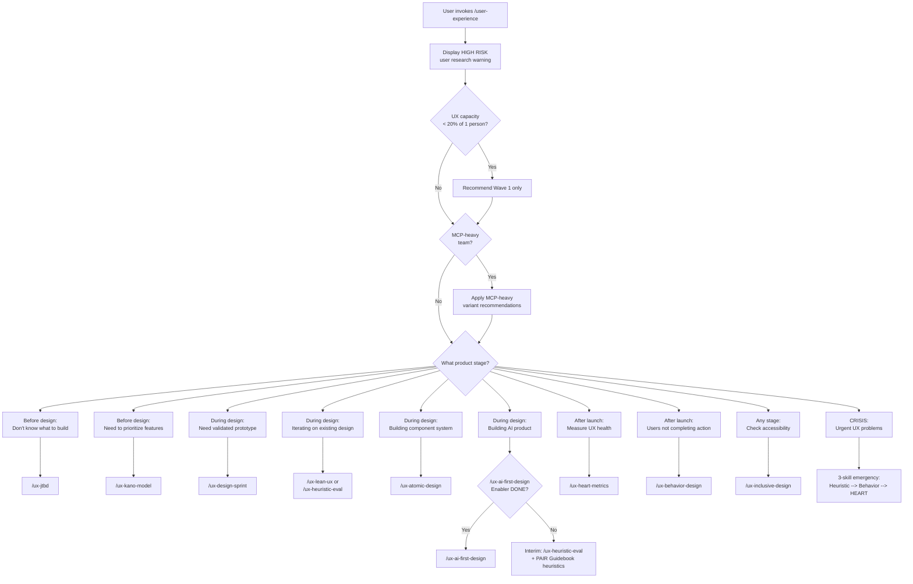
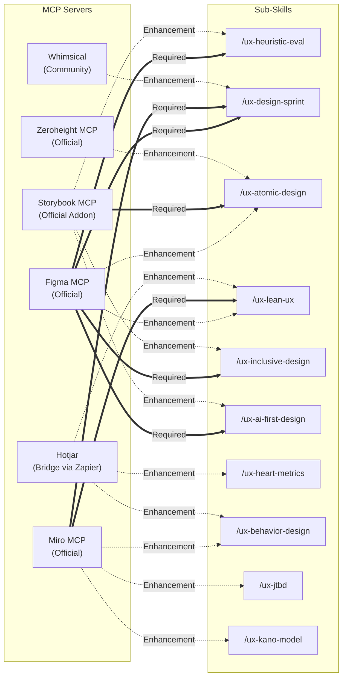
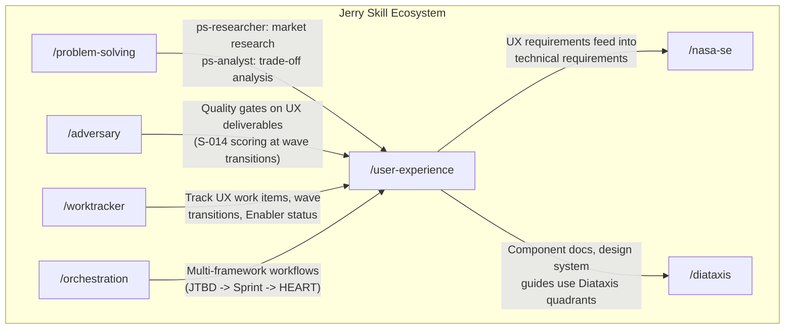

# feat: Add `/user-experience` skill -- AI-augmented UX for Tiny Teams

<!-- [R1-fix: CC-001, SR-001] Added H-23 navigation table -->

## Document Sections

| Section | Purpose |
|---------|---------|
| [Vision](#vision) | Skill mission and design philosophy |
| [The Problem](#the-problem) | Tiny teams UX capability gap and population segments |
| [The Solution](#the-solution) | Parent orchestrator, 10 sub-skills, detailed descriptions |
| [Key Design Decisions](#key-design-decisions) | Framework-per-skill, routing, P-003 compliance, MCP integration, wave deployment, synthesis validation |
| [Tiny Teams Capability Map](#tiny-teams-capability-map) | Capability coverage mapping to traditional UX roles | <!-- [R2-fix: SR-002-I2] Updated nav link to match new section title -->
| [Known Limitations](#known-limitations) | User research gap, AI-First conditional status, ethics gaps, Figma SPOF, context window |
| [Acceptance Criteria](#acceptance-criteria) | Parent orchestrator, wave sub-skills, synthesis validation, quality standards, wave progression |
| [V2 Roadmap](#v2-roadmap) | V2 candidates, architecture evolution path |
| [Research Backing](#research-backing) | Phase 1-3 artifacts, adversarial validation |
| [Relationship to Existing Jerry Skills](#relationship-to-existing-jerry-skills) | Integration with problem-solving, adversary, worktracker, orchestration, nasa-se, diataxis |
| [Framework Selection Scores](#framework-selection-scores) | Validated WSM scores for all 10 frameworks |
| [Directory Structure](#directory-structure) | Implementation file layout (11 skill directories, ~72 artifacts) |
| [Estimated Scope](#estimated-scope) | Effort estimates with comparable delivery reference |
| [Sub-Skill SKILL.md Descriptions (Draft)](#sub-skill-skillmd-descriptions-draft) | Draft SKILL.md description fields per H-26 |
| [Sub-Skill Model Selection](#sub-skill-model-selection) | Model selection rationale per AD-M-009 |
| [Sub-Skill Output Levels](#sub-skill-output-levels) | L0/L1/L2 output level specification per AD-M-004 |
| [Cross-Session State](#cross-session-state) | Memory-Keeper specification per MCP-002 |
| [References](#references) | Source artifact locations |

---

## Vision

Two people, one product, zero UX specialists — and the product is going to feel like a team of eight built it.

The `/user-experience` skill is a parent orchestrator backed by 10 independently evolvable sub-skills covering the full product lifecycle from discovery through post-launch measurement. Each sub-skill implements a single proven UX framework as its own Jerry skill — registered independently, versioned independently, loaded on-demand. The orchestrator reads the product stage and the team's need, then drops the developer into the right framework.

This is the UX department a 2-person team never thought they could have. Built on frameworks battle-tested across thousands of products over the past three decades. Not watered down. Not a chatbot that gives generic advice. The full methodology, AI-augmented so non-specialists can execute it (with confidence-gated output depth -- HIGH-confidence sub-skills produce full recommendations; MEDIUM produce guided analysis requiring validation; LOW produce reference summaries requiring specialist interpretation), with guardrails that draw a hard line between what AI handles and what humans decide. <!-- [R3-fix: DA-005-iter3] Qualified Vision claim with confidence-gated output depth -->

The boldest line on the mountain is the one nobody thought was skiable. This is that line for tiny teams and UX.

---

## The Problem

### Tiny Teams Cannot Afford UX -- And It Shows

Gartner's 2026 Strategic Technology Trends report identifies "Tiny Teams" -- teams of 2-5 people augmented by AI replacing department-scale staffing across software development -- as a top trend (source: [Gartner Top Strategic Technology Trends 2026](https://www.gartner.com/en/articles/top-technology-trends-2026), published January 2026). Companies like Midjourney (11 people, reported $200M ARR per [The Information, August 2023](https://www.theinformation.com/articles/midjourney-generates-over-200-million-in-revenue)) and Bolt.new (15 people, reported $20M in 60 days per [StackBlitz blog, December 2024](https://blog.stackblitz.com/posts/bolt-new-20m-60-days/)) demonstrate that AI-augmented tiny teams can deliver results previously requiring 50+ people. <!-- [R1-fix: SR-006, CV-005] Added source citations for Gartner, Midjourney, Bolt.new statistics -->

There is a glaring gap in this trend: **UX capability**. <!-- [R1-fix: SM-001] Added market quantification context --> While precise market sizing for "tiny teams needing UX capability" does not exist as a tracked segment, the adjacent indicators are substantial: the global UX design services market was valued at $3.5B in 2023 (Grand View Research) and the no-code/low-code market enabling non-specialist development reached $26.9B in 2023 (Gartner). The intersection -- teams who can build products without specialists but cannot design them well -- represents a meaningful and growing population.

A 2-person startup can use AI to write code, generate tests, create documentation, and manage infrastructure. What they cannot do:

- **Discover what to build.** Without structured user research methodology, teams build what they assume users want. Jobs-to-be-Done and Kano Model provide the frameworks for this -- but only if someone on the team knows how to apply them.

- **Evaluate what they have built.** Without heuristic evaluation or usability testing, teams ship designs with preventable usability problems. Nielsen's 10 Heuristics have been the gold standard for 30 years -- but a developer who has never heard of them cannot apply them.

- **Measure whether their UX works.** Without structured metrics (HEART, Fogg Behavior Model), teams rely on gut feel to assess UX quality. They know something is wrong but cannot diagnose what or why.

- **Build accessible products.** Without inclusive design methodology, teams build for themselves and miss the estimated 16% of the global population with disabilities (source: [WHO Global Report on Health Equity for Persons with Disabilities, December 2022](https://www.who.int/publications/i/item/9789240063600); the commonly cited 15-20% range reflects WHO's 2011 World Report on Disability estimate of 15% updated by the 2022 report's 1.3 billion figure), plus the situational impairments that affect everyone. <!-- [R1-fix: SM-002, CV-005] Added WHO citation for disability statistic -->

- **Build consistent products.** Without component architecture (Atomic Design), teams create one-off UI elements that diverge over time, increasing maintenance cost and degrading user experience.

The result: tiny teams ship fast but ship poorly. They iterate on code but not on experience. They optimize for features but not for usability. The products work -- technically -- but they do not work well for the humans who use them.

That is the equivalent of standing at the top of a line you scouted from every angle, strapped in with the best gear on the market, and then skiing it with your eyes closed. The mountain is there. The capability is there. You just need the methodology to see it.

### Why Existing Tools Do Not Solve This

- **Design tools** (Figma, Sketch) provide the canvas but not the methodology. Knowing how to use Figma does not mean knowing when to run a heuristic evaluation or how to structure a design sprint.
- **UX books and courses** provide the knowledge but not the execution. A developer who reads "Don't Make Me Think" understands the principles but still cannot run a structured JTBD analysis.
- **AI chatbots and AI-augmented tools** provide partial coverage. Tools like Notion AI (2M+ users, structured workflows and templates) and general-purpose AI assistants can answer UX questions and offer template-based guidance. Combined with structured prompt templates, they provide a meaningful starting point. However, no existing tool combines structured UX methodology with adversarial quality gates, constitutional compliance enforcement, synthesis hypothesis confidence gating, and MCP design tool integration into a single coordinated workflow. The gap is not "AI cannot help with UX" -- it is that existing AI UX assistance is disconnected from the structured frameworks, quality enforcement, and tool integrations that make methodology outputs trustworthy and actionable. <!-- [R3-fix: DA-001-iter3] Qualified competitive gap claim; acknowledged Notion AI and AI chatbot + template partial coverage; specified Jerry's differentiation -->

The missing piece is the **middle layer**: structured, AI-guided workflows that take proven UX frameworks and make them executable by non-specialists, with guardrails about what AI can and cannot do, quality gates that enforce rigor, and design tool integrations that connect methodology to execution.

### Who This Is For: Tiny Teams Population Segments

The 2026 Tiny Teams trend encompasses distinct population segments with different needs:

| Segment | Team Size | Characteristics | Portfolio Fit |
|---------|----------|-----------------|---------------|
| **Solo practitioner** | 1 | No collaboration overhead; all roles in one person; time is the binding constraint | HIGH for Waves 1-3 (all sub-skills usable by one person); Wave 4 data-collection prerequisites (HEART metric data, B=MAP behavioral data) may require external data sources; Wave 5 Design Sprint adapts to 1-2 day solo sprint but is optional for this segment | <!-- [R4-fix: RT-005-I4] Qualified solo practitioner fit to distinguish Wave 1-3 vs Wave 4-5 access -->
| **Dev+Designer pair** | 2 | Minimal coordination; complementary skills; one person typically drives UX | HIGH -- portfolio's "pair review" patterns (Nielsen's, Lean UX hypothesis validation) map directly |
| **Small cross-functional team** | 3-5 | Enough for role separation; can run a full Design Sprint; manageable coordination | HIGH -- primary optimization target; all sub-skills operate at full design intent |
| **Part-time UX** | 2-5 (one part-time) | UX is a part-time responsibility; depth is limited; frameworks must be low-ceremony | HIGH -- primary design target; Waves 1-2 calibrated for 20-50% allocation; Waves 3-5 aspirational. [R6-fix: CV-002-I6] Note: Portfolio Fit upgraded from MEDIUM (analysis SSOT in `ux-framework-selection.md`) to HIGH based on tournament finding SM-001-I5: Part-time UX is the primary design target segment, and Waves 1-2 are explicitly calibrated for 20-50% allocation. The analysis SSOT retains the original MEDIUM as the pre-calibration baseline. | <!-- [R4-fix: SM-001-I4] Part-time UX is the most common segment per Gartner's Tiny Teams research --> <!-- [R5-fix: DA-002-I5, SM-001-I5, SM-002-I5] Changed MEDIUM to HIGH to resolve contradiction with "most common segment" designation; description clarifies wave-specific fit -->

Population segments (Solo Practitioner, Part-time UX, Dedicated UX) define the range of teams this skill serves. Part-time UX (20-50% allocation) is the most common segment (inferred from Gartner 2026 Tiny Teams trend characterization -- direct UX allocation measurement not available from this source). <!-- [R7-fix: SR-008-I7] --> Each wave's entry criteria and time estimates are calibrated for this median case. <!-- [R4-fix: SM-001-I4] Strengthened part-time UX framing as primary design center -->

Teams in the "part-time UX" segment should treat wave progression beyond Wave 2 as aspirational and focus on the zero-MCP-cost sub-skills (HEART, JTBD, Kano, Behavior Design). Wave 1 requires zero MCP tool cost. Wave 2 MCP cost depends on Miro usage -- Lean UX requires Miro (free tier available; paid Starter tier $8/user/month for advanced features), while HEART has no required MCP. <!-- [R3-fix: DA-006-iter3] Qualified Wave 2 MCP cost dependency on Miro -->

**Wave 1 time-to-first-value:** [R6-fix: SM-002-I6] Wave 1 timeline includes ~1-2 hours KICKOFF setup (team profile, product context, tooling verification). Total time-to-first-value: KICKOFF (~2 hours) + first sub-skill session (2-4 hours) = initial findings within one working day. A team completing the kickoff-signoff and running their first Nielsen Heuristic Evaluation sub-skill should reach initial findings within a single work session (estimated 2-4 hours post-KICKOFF). Wave 1 completion (both Heuristic Eval and JTBD sub-skills operational, first outputs produced) is estimated at 8-13 days including KICKOFF, based on the comparable delivery reference in [Estimated Scope](#estimated-scope). This estimate will be validated during pre-launch testing. <!-- [R4-fix: SM-002-I4] Added time-to-first-value narrative --> <!-- [R5-fix: SM-002-I5] Added 8-13 day Wave 1 anchor consistent with Estimated Scope section -->

---

## The Solution

### A Parent Orchestrator with 10 Pluggable Sub-Skills

The `/user-experience` skill uses a **hybrid parent orchestrator + pluggable sub-skills** architecture. Each UX framework is a self-contained Jerry skill that can be independently registered, versioned, and evolved.

The orchestrator knows the terrain; the 10 sub-skills are the gear. You carry what the mountain demands.



### The 10 Sub-Skills

Each sub-skill implements a single, proven UX framework. Together they cover the full product lifecycle. Below is a summary table followed by detailed descriptions of each sub-skill.

#### Summary Table

| # | Sub-Skill | Framework | Lifecycle Stage | Cognitive Mode | Tool Tier | Wave | Score |
|---|-----------|-----------|----------------|----------------|-----------|------|-------|
| 1 | `/ux-heuristic-eval` | Nielsen's 10 Heuristics | During Design | Systematic | T3 | 1 | 9.05 | <!-- [R2-fix: CV-003] Corrected from 9.25 to source-verified 9.05 -->
| 2 | `/ux-jtbd` | Jobs-to-be-Done | Before Design | Divergent | T3 | 1 | 8.05 |
| 3 | `/ux-lean-ux` | Lean UX | During Design | Systematic | T3 | 2 | 8.25 |
| 4 | `/ux-heart-metrics` | HEART Framework | After Launch | Systematic | T2 | 2 | 8.30 |
| 5 | `/ux-atomic-design` | Atomic Design | While Building | Systematic | T3 | 3 | 8.55 |
| 6 | `/ux-inclusive-design` | Microsoft Inclusive Design | While Building | Systematic | T3 | 3 | 8.00 |
| 7 | `/ux-behavior-design` | Fogg Behavior Model | After Launch | Convergent | T2 | 4 | 7.60 | <!-- [R2-fix: CV-004] Corrected from 7.45 to source-verified 7.60 -->
| 8 | `/ux-kano-model` | Kano Model | Before Design | Convergent | T2 | 4 | 7.65 | <!-- [R2-fix: CV-005] Corrected from 7.50 to source-verified 7.65 -->
| 9 | `/ux-design-sprint` | Design Sprint 2.0 | During Design | Systematic | T3 | 5 | 8.65 |
| 10 | `/ux-ai-first-design` | AI-First Design | AI Products | Divergent | T3 | 5 (COND) | 7.80 (P) |

#### Detailed Sub-Skill Descriptions

> **Ordering note:** Sub-skill descriptions below are ordered by Wave deployment sequence (Wave 1 first), not by WSM selection rank. Wave deployment order differs from WSM rank because it optimizes for dependency satisfaction and learning curve -- high-WSM frameworks that depend on Wave 1 outputs deploy in later waves. For WSM rank ordering, see the [Framework Selection Scores](#framework-selection-scores) section. <!-- [R3-fix: SR-001-I3] Added dual ordering explanation (persistent 3 iterations) -->

---

#### 1. `/ux-heuristic-eval` -- Nielsen's 10 Usability Heuristics

**Rank #1 | Score: 9.05 | Wave 1** <!-- [R2-fix: CV-003] Corrected from 9.25 to source-verified 9.05 -->

The most universally applicable UX evaluation framework in existence. Thirty years of validation across thousands of products. The 10-heuristic checklist maps to a systematic agent that evaluates a design artifact (screenshot, wireframe, prototype URL) against each heuristic and produces a structured findings report with severity ratings. This is the steepest, most proven line on the mountain -- and the first one you should ski.

| Attribute | Value |
|-----------|-------|
| Agent | `ux-heuristic-evaluator` |
| Cognitive Mode | Systematic (10 discrete heuristics, scored findings list) |
| Tool Tier | T3 (external access for Figma) |
| Required MCP | Figma (design file reading, frame extraction) |
| Enhancement MCP | Storybook (component-level heuristic checks) |
| Time to Complete | ~30-35 minutes with AI assistance (design target) |

**What AI does:** Evaluates designs against all 10 Nielsen heuristics; assigns severity ratings (0-4 scale) per violation; generates structured findings report with fix recommendations; cross-references findings against platform conventions.

**What humans do:** Provides platform-specific context (mobile vs. web vs. desktop conventions); triages findings by business priority (not all severity-4 violations are worth fixing immediately); makes the final fix-or-accept decision; reviews contextual heuristics (H4: Consistency, H7: Flexibility) that require domain knowledge.

**Non-MCP fallback:** Screenshot-input mode. User provides design screenshots as image inputs. Reduced automation but full heuristic coverage retained.

---

#### 2. `/ux-jtbd` -- Jobs-to-be-Done

**Rank #6 | Score: 8.05 | Wave 1**

Before you build anything, figure out what problem you are actually solving. JTBD discovers the "jobs" users hire products to do. Based on Clayton Christensen's framework with Intercom's JTBD Playbook adaptations for product teams.

| Attribute | Value |
|-----------|-------|
| Agent | `ux-jtbd-analyst` |
| Cognitive Mode | Divergent (explores broadly to discover user jobs) |
| Tool Tier | T3 |
| Required MCP | None |
| Enhancement MCP | Miro (visual job mapping) |
| Key Output | Job statement synthesis, switch interview guide, competitive job analysis |

**What AI does:** Synthesizes job statements from interview transcripts and secondary research; generates competitive job analysis showing how users currently hire alternative solutions; maps job-to-feature relationships; creates switch interview guides for user research validation.

**What humans do:** Conducts actual user interviews (irreducible -- AI cannot observe real behavior); judges hypothesis validity against their knowledge of the user population; decides which job to pursue (strategic product decision); validates that AI-generated job statements resonate with observed user language.

**Synthesis hypothesis warning:** Job statements generated from secondary research are MEDIUM confidence. They require named validation sources before feeding into Design Sprint challenge statements.

---

#### 3. `/ux-lean-ux` -- Lean UX

**Rank #5 | Score: 8.25 | Wave 2**

Build-measure-learn, on repeat. Lean UX iterates on hypotheses continuously through structured cycles. Based on Jeff Gothelf's Lean UX with adaptations for AI-augmented hypothesis generation.

| Attribute | Value |
|-----------|-------|
| Agent | `ux-lean-ux-facilitator` |
| Cognitive Mode | Systematic (hypothesis cycle is a repeatable process) |
| Tool Tier | T3 |
| Required MCP | Miro (assumption mapping, hypothesis tracking) |
| Enhancement MCP | Figma (MVP prototyping), Hotjar (experiment analytics via bridge) |
| Key Output | Assumption map, hypothesis backlog, experiment design, validation report |

**What AI does:** Generates assumption maps categorizing team beliefs by risk and uncertainty; creates hypothesis backlogs in structured format ("We believe [assumption]. We will know we are right when [measurable signal]."); builds MVPs from hypothesis specifications; tracks experiment results against hypothesis predictions.

**What humans do:** Identifies which assumptions are riskiest (requires product judgment about what matters); judges whether hypothesis results validate or invalidate the assumption; decides what to learn next; determines when to pivot vs. persevere.

---

#### 4. `/ux-heart-metrics` -- HEART Framework (Google)

**Rank #4 | Score: 8.30 | Wave 2**

You shipped the product. Now measure whether it actually works for humans. Google's HEART framework -- Happiness, Engagement, Adoption, Retention, Task Success -- translates abstract UX goals into concrete, measurable signals and metrics.

| Attribute | Value |
|-----------|-------|
| Agent | `ux-heart-analyst` |
| Cognitive Mode | Systematic (GSM template population is procedural) |
| Tool Tier | T2 (no external MCP required for core function) |
| Required MCP | None |
| Enhancement MCP | Analytics API (data ingestion), Hotjar (behavioral data via bridge) |
| Key Output | HEART GSM (Goals-Signals-Metrics) populated template, metric dashboard specification, anomaly detection report |

**What AI does:** Populates HEART GSM templates from analytics data; generates metric definitions with measurement methods; creates dashboard specifications; detects metric anomalies and trends; generates comparison reports across time periods.

**What humans do:** Selects which HEART dimensions matter most for their product (not all 5 are equally relevant); interprets metric trends in business context; identifies confounding factors (seasonality, marketing campaigns, etc.); makes product decisions based on metric data.

**Synthesis hypothesis warning:** Metric threshold recommendations (e.g., "Adoption rate should exceed 30%") are LOW confidence. They are reference benchmarks drawn from training data, not targets calibrated to the team's specific product and user base. Threshold selection requires domain-specific judgment. <!-- [R3-fix: FM-010-I3] Added missing HEART synthesis hypothesis warning consistent with Fogg, Kano, AI-First Design sub-skills -->

---

#### 5. `/ux-atomic-design` -- Atomic Design (Brad Frost)

**Rank #3 | Score: 8.55 | Wave 3**

Components that compose. Brad Frost's atoms-molecules-organisms-templates-pages hierarchy structures component libraries for reuse. The most AI-automatable design system framework in the portfolio due to its rule-based classification system.

| Attribute | Value |
|-----------|-------|
| Agent | `ux-atomic-architect` |
| Cognitive Mode | Systematic (classification hierarchy is rule-based) |
| Tool Tier | T3 |
| Required MCP | Storybook (component library evaluation, story management) |
| Enhancement MCP | Zeroheight (design system documentation), Figma (visual component extraction) |
| Key Output | Component inventory, atomic classification, composition recommendations, documentation |

**What AI does:** Discovers existing components from Storybook; classifies components into atomic hierarchy levels; composes new Organisms from existing Atoms and Molecules; generates component documentation; detects inconsistencies (duplicate components, naming violations, unused atoms); recommends consolidation opportunities.

**What humans do:** Defines component boundaries (when an Atom becomes a Molecule is a design judgment); validates classifications against brand standards and design language; decides on component API surface (props, variants, composability rules); reviews documentation for accuracy.

---

#### 6. `/ux-inclusive-design` -- Microsoft Inclusive Design

**Rank #7 | Score: 8.00 | Wave 3**

Build for everyone. Microsoft's Recognize-Learn-Build exclusion methodology and Persona Spectrum approach goes beyond WCAG compliance to address situational and temporary impairments. An estimated 16% of the global population has a disability (WHO, 2022). Situational impairments affect the rest. Inclusive design catches both.

| Attribute | Value |
|-----------|-------|
| Agent | `ux-inclusive-evaluator` |
| Cognitive Mode | Systematic (checklist evaluation against exclusion categories) |
| Tool Tier | T3 |
| Required MCP | Figma (design evaluation, contrast analysis) |
| Enhancement MCP | Storybook (component-level accessibility), Context7 (WCAG reference docs) |
| Key Output | Persona Spectrum analysis, WCAG 2.2 compliance report, exclusion audit, remediation recommendations |

**What AI does:** Evaluates contrast ratios, text sizing, touch targets against WCAG 2.2 criteria; applies Persona Spectrum analysis to identify permanent, temporary, and situational exclusions; generates compliance reports with specific remediation steps; checks color-blind accessibility; evaluates keyboard navigation paths.

**What humans do:** Provides user population context (which disability types are prevalent in their user base); validates accommodations for non-standard populations (cultural, linguistic, cognitive); prioritizes remediation by impact; reviews Persona Spectrum customizations for accuracy.

---

#### 7. `/ux-behavior-design` -- Fogg Behavior Model

**Rank #10 | Score: 7.60 | Wave 4** <!-- [R2-fix: CV-004] Corrected from 7.45 to source-verified 7.60 -->

Users are not doing the thing. Why? Fogg's B=MAP equation -- Behavior = Motivation x Ability x Prompt -- diagnoses the bottleneck. The only behavioral diagnostic framework in the portfolio.

| Attribute | Value |
|-----------|-------|
| Agent | `ux-behavior-diagnostician` |
| Cognitive Mode | Convergent (narrows from behavioral data to bottleneck diagnosis) |
| Tool Tier | T2 |
| Required MCP | None |
| Enhancement MCP | Miro (behavior mapping), Hotjar (behavioral recording data via bridge) |
| Key Output | B=MAP bottleneck diagnosis, Reference Intervention Patterns (non-prescriptive), motivation-ability profile | <!-- [R2-fix: FM-011] Aligned Key Output with renamed intervention output -->

<!-- [R2-fix: FM-011] Renamed "design intervention recommendations" to "Reference Intervention Patterns" and reclassified as MEDIUM confidence to resolve contradiction with LOW-confidence structural omission gate -->
**What AI does:** Diagnoses which component of B=MAP is the bottleneck (motivation too low? ability too hard? prompt missing or mistimed?); generates Reference Intervention Patterns (non-prescriptive) matched to the bottleneck type -- these are cataloged pattern options, not design recommendations; maps motivation-ability profiles for key user actions; tracks intervention effectiveness.

**What humans do:** Provides behavioral context (why users might have low motivation -- often requires product/market knowledge); validates bottleneck diagnosis against their observation of user behavior; selects intervention approach (there are multiple valid interventions for each bottleneck type); decides which user actions to analyze.

**Synthesis hypothesis warning:** Reference Intervention Patterns are MEDIUM confidence. They require expert review (see [Synthesis Hypothesis Validation](#key-design-decisions) for expert qualification: minimum 2 years UX practice, non-team-member) OR validation against 2-3 real user data points before use in design decisions. The agent generates cataloged intervention patterns, not prescriptive design recommendations. <!-- [R2-fix: FM-011] Reclassified from LOW to MEDIUM; renamed from "design intervention recommendations" to "Reference Intervention Patterns" --> <!-- [R5-fix: IN-004-I5] Cross-referenced expert qualification definition -->

---

#### 8. `/ux-kano-model` -- Kano Model

**Rank #9 | Score: 7.65 | Wave 4** <!-- [R2-fix: CV-005] Corrected from 7.50 to source-verified 7.65 -->

Not all features are created equal. Noriaki Kano's three-category model classifies them: Must-Be (expected), Performance (proportional satisfaction), and Attractive (delighters). The difference between a feature that prevents churn and a feature that drives word-of-mouth. Requires user survey data.

| Attribute | Value |
|-----------|-------|
| Agent | `ux-kano-analyst` |
| Cognitive Mode | Convergent (narrows from survey data to priority classification) |
| Tool Tier | T2 |
| Required MCP | None |
| Enhancement MCP | Miro (feature mapping visualization) |
| Key Output | Kano classification matrix, feature priority recommendations, satisfaction coefficients |

**What AI does:** Processes Kano survey responses (functional/dysfunctional question pairs); classifies features into Must-Be, Performance, Attractive, Indifferent, Reverse categories; generates feature priority matrices with satisfaction coefficients; detects classification conflicts within the data; produces visual priority maps.

**What humans do:** Designs the survey questions (feature descriptions must be user-facing, not technical); recruits survey respondents (minimum 30 for statistical reliability); interprets classification results in business context (a "Must-Be" feature that is technically expensive still requires strategic judgment); makes build/defer/cut decisions.

**Synthesis hypothesis warning:** Directional classifications from 5-8 respondents are MEDIUM confidence. Feature priority conflict interpretations are LOW confidence (reference-only).

---

#### 9. `/ux-design-sprint` -- Design Sprint 2.0

**Rank #2 | Score: 8.65 | Wave 5**

Four days. Problem statement to validated prototype. AJ&Smart's Design Sprint 2.0, evolved from the original Google Ventures methodology. The highest-ceremony, highest-impact framework in the portfolio — the one that takes commitment and pays back in spades.

| Attribute | Value |
|-----------|-------|
| Agent | `ux-sprint-facilitator` |
| Cognitive Mode | Systematic (4-day structured process with defined daily outputs) |
| Tool Tier | T3 |
| Required MCP | Miro (sprint exercises, voting, mapping), Figma (prototype building) |
| Enhancement MCP | Whimsical (flowchart alternatives) |
| Key Output | Challenge statement, solution sketches, interactive prototype, Day 4 test findings |

**What AI does:** Design Sprint aims to generate multiple sketch variants during Day 2 ideation and facilitate Figma prototype construction during Day 3 (exact output volume depends on LLM capability at implementation time; acceptance criteria will validate against 2-person team workflow benchmarks during Wave 5 implementation); creates interview guides for Day 4 testing; themes Day 4 interview data into patterns; manages sprint exercise templates (Lightning Demos, How Might We notes, Solution Sketches). <!-- [R4-fix: DA-001-I4] Qualified Design Sprint AI capability claims as design targets, not verified capabilities -->

**What humans do:** Sets design direction and challenge statement (Day 1); selects from AI-generated sketch variants (Day 2 decision-making); reviews and refines prototype fidelity (Day 3); conducts user interviews (Day 4 -- irreducible human contact); makes strategic pivot/persevere decisions based on test results.

**Team size adaptation:** Design Sprint 2.0 is designed for 4-5 participants. For 2-person teams, the sprint collapses to 1-2 days with the AI filling the "missing participant" roles (note-taker, sketch generator, prototype builder). The facilitator and decision-maker roles remain human.

**Part-time time commitment:** Wave 5 (Design Sprint) requires dedicated UX time commitment beyond the part-time median case. Teams operating at < 20% UX time allocation may choose to defer Wave 5 or adapt the 5-day sprint to a 2-week part-time format. Wave 5 is optional -- Waves 1-4 deliver substantial UX capability without it. <!-- [R4-fix: DA-002-I4] Added honest qualification for part-time teams; Wave 5 made optional -->

---

#### 10. `/ux-ai-first-design` -- AI-First Design (SYNTHESIZED)

**Rank #8 | Score: 7.80 (Projected) | Wave 5 (CONDITIONAL)**

When AI is the product, the UX rules change. This sub-skill applies AI-specific interaction patterns -- conversational, agentic, augmentative, autonomous -- for products where AI is the core experience. This is a **synthesized framework** -- it must be created by this project before implementation. No established framework exists at the methodology level required.

| Attribute | Value |
|-----------|-------|
| Agent | `ux-ai-design-guide` |
| Cognitive Mode | Divergent (explores emerging AI interaction patterns) |
| Tool Tier | T3 |
| Required MCP | Figma (AI interface evaluation) |
| Enhancement MCP | Storybook (AI component patterns), Context7 (AI UX research) |
| Key Output | AI interaction specification, trust calibration report, explanation pattern map |

**What AI does:** Generates AI interaction pattern recommendations (conversational, agentic, augmentative, autonomous modes); evaluates trust calibration (does the UI accurately convey AI confidence and limitations?); maps explanation patterns (when and how to explain AI decisions to users); reviews error handling UX for AI failures.

**What humans do:** Provides product context (what type of AI interactions does the product have?); validates AI interaction pattern appropriateness for their user population; decides on explanation depth (how much should the AI explain itself?); reviews trust calibration against actual AI capability.

**Conditional status:**

- **Blocking prerequisite:** A synthesis Enabler must reach DONE status with a verified WSM score >= 8.00. Independent reviewer sign-off required on WSM scoring for Enabler validation. Independent reviewer = any Jerry Framework user who did NOT author the sub-skill under review (i.e., the person scoring the Enabler cannot be the person who built it, and must not have contributed to its design or implementation) <!-- [R2-fix: RT-005] Raised gate from >= 7.80 to >= 8.00; added independent reviewer requirement --> <!-- [R3-fix: RT-002-I3] Defined "independent reviewer" -->
- **Expiry:** 90-day time-box from Enabler creation; auto-substitution on expiry
- **Substitution path:** If the AI-First Design Enabler has not achieved its validation gate by Wave 5, Wave 5 delivers Design Sprint only; Service Blueprinting is a V2 P1 candidate <!-- [R2-fix: PM-006] Fixed substitution to reflect that Service Blueprinting has no V1 implementation -->
- **Interim path:** The parent orchestrator routes AI product UX requests to `/ux-heuristic-eval` with supplemental PAIR Guidebook heuristics until the Enabler completes

**Synthesis hypothesis warning:** All AI interaction pattern recommendations are LOW confidence. This is an emerging domain without the 10+ years of validation that frameworks like Nielsen's Heuristics or JTBD have.

---

## Key Design Decisions

Every decision here was a deliberate line choice. No shortcuts, no "we'll figure it out later."

### 1. Each Framework = Its Own Skill

Sub-skills can be registered independently in CLAUDE.md and AGENTS.md. A team using only Nielsen's Heuristics and Lean UX does not load the other 8 sub-skills into context, preserving the Jerry progressive disclosure budget (PR-004 three-tier loading model per `agent-development-standards.md`). <!-- [R1-fix: CV-003] Fixed CB-02 misattribution; CB-02 governs tool result context allocation (50% limit), not progressive disclosure -->

This means:
- **Independent versioning.** When a better metrics framework than HEART emerges, only `/ux-heart-metrics` is updated.
- **Independent evolution.** New frameworks (V2 additions like Service Blueprinting) are added as new sub-skills without modifying existing ones.
- **Context budget preservation.** Only the parent skill description is loaded at session start (Tier 1 metadata per `agent-development-standards.md` progressive disclosure, ~500 tokens). Sub-skills are loaded on-demand via Task tool invocation (Tier 2 core). <!-- [R1-fix: CV-004] Clarified Tier 1/Tier 2 terminology with precise source reference -->

Only the parent loads at session start — sub-skills load when you actually need them.

### 2. Parent Orchestrator Routes via Lifecycle-Stage Triage

Only `/user-experience` is registered in `mandatory-skill-usage.md`. The parent orchestrator:

1. **Onboards with a HIGH RISK warning** about the user research gap (first invocation per session)
2. **Checks team UX capacity** -- if < 20% of one person's time, gates routing to Wave 1 sub-skills only (advisory; user can override per P-020) <!-- [R4-fix: CC-004-I4] Replaced ambiguous "restricts" with "gates routing to" for P-020 clarity -->
3. **Routes by product stage:**
   - "Before design" requests go to JTBD or Kano
   - "During design" requests go to Design Sprint, Lean UX, or Heuristic Eval
   - "While building" requests go to Atomic Design or Inclusive Design
   - "After launch" requests go to HEART or Behavior Design
   - "AI product" requests go to AI-First Design (if Enabler complete) or interim heuristic path
4. **Handles crisis mode** -- emergency 3-skill sequence (Heuristic Eval -> Behavior Design -> HEART) for products with urgent UX problems. Selection rationale: Heuristic Eval identifies *what* is wrong (design-level violations), Behavior Design diagnoses *why* users are not completing desired actions (B=MAP bottleneck), HEART measures the *impact* (quantified UX health). This sequence covers diagnose-explain-measure in the minimum sub-skill count. Crisis mode activates when the user explicitly describes urgency ("urgent", "critical UX issue", "users are leaving") or when the orchestrator detects multiple prior sub-skill invocations without resolution. <!-- [R1-fix: SM-004, DA-009, PM-006] Added crisis mode selection rationale and activation criteria -->

Users who know the specific sub-skill they need can invoke it directly (e.g., `/ux-heuristic-eval`) to bypass the triage. Direct invocation still checks wave prerequisites: when `WAVE-{N-1}-SIGNOFF.md` does not exist, BOTH orchestrator routing AND direct sub-skill invocation return BLOCK (denial + signoff completion instructions). Direct invocation bypass of a BLOCK state requires the same 3-field documented justification as any other P-020 override (named data source, specific supporting data point, validation date). Enforcement is declared co-equal in `ux-routing-rules.md` -- the sub-skill and orchestrator apply identical prerequisite checks with identical outcomes. <!-- [R1-fix: DA-006] Added wave prerequisite check for direct sub-skill invocation --> <!-- [R5-fix: IN-003-I5] Aligned direct-invocation BLOCK behavior with orchestrator BLOCK behavior -->

**Routing triage flowchart:**



**Common intent resolution:**

| User Says | Routes To | Qualification Question |
|-----------|----------|----------------------|
| "Improve my UX" / "Make this more usable" | Heuristic Eval (existing design) or Design Sprint (no design yet) | "Do you have an existing design?" |
| "Fix a specific UX problem" | Behavior Design (behavioral) or Heuristic Eval (design-level) | "Is the problem about user behavior or design quality?" |
| "Decide what to build" | JTBD (strategic) or Kano (prioritize known features) | "Are you defining the problem or prioritizing features?" |
| "Measure whether UX is working" | HEART Metrics | No qualification needed |
| "Make this accessible" | Inclusive Design | Provide user context brief |
| "Set up our design system" | Atomic Design | Provide Storybook reference |
| "We have an AI product" | AI-First Design (if Enabler done) or Heuristic Eval + PAIR | Check Enabler status |
| "CRISIS: urgent UX problems" | Emergency 3-skill sequence | No qualification needed |

### 3. P-003 Compliant Single-Level Nesting

The architecture strictly enforces Jerry's single-level nesting constraint:

```
MAIN CONTEXT (orchestrator)
    |
    +-- ux-orchestrator (T5, has Task tool)
           |
           +-- ux-heuristic-evaluator (T3, NO Task tool)
           +-- ux-jtbd-analyst (T3, NO Task tool)
           +-- ux-lean-ux-facilitator (T3, NO Task tool)
           +-- ...etc
```

- The parent orchestrator (`ux-orchestrator`) is the only T5 agent with Task tool access.
- All sub-skill agents are T2-T3 and cannot spawn further sub-agents.
- Workers return results to the orchestrator, which coordinates cross-framework integration.

### 4. MCP Integration (Figma, Miro, Storybook, Zeroheight + Bridge Tools)

This is the most MCP-dependent skill in the Jerry framework. Six MCP servers mapped to 10 sub-skills. Full integration diagram:



**Legend:** Solid arrows (==>) = Required MCP (degraded mode + explicit error on failure). Dashed arrows (-.>) = Enhancement MCP (cosmetic limitation on failure).

**MCP Server Classification:**

| MCP Server | Type | Stability | Cost | Notes |
|-----------|------|-----------|------|-------|
| **Figma** | Official (Native) | HIGH -- official Figma product | $15/editor/month (Professional) | Highest dependency risk due to breadth of integration |
| **Miro** | Official (Native) | HIGH -- official Miro product | $8/member/month (Team plan) | Required for collaborative UX workflows |
| **Storybook** | Official (Addon) | HIGH -- maintained by Storybook team | Free | Component development ecosystem integration |
| **Zeroheight** | Official (Native) | HIGH -- official product | $99/month (Team plan) | Design system documentation platform |
| **Hotjar** | Bridge (Zapier/Pipedream) | MEDIUM -- requires paid middleware | Variable ($0-$99+ depending on Zapier plan) | NOT plug-and-play; requires custom workflow config |
| **Whimsical** | Community | MEDIUM-LOW -- third-party maintained | Free (basic) | Verify GitHub activity before implementation |

**Cost tiers:**

| Tier | Monthly Cost | Sub-Skills Available | Best For |
|------|-------------|---------------------|----------|
| **Free** | $0/month | HEART, JTBD, Kano, Behavior Design (4 sub-skills) | Solo practitioners, bootstrapped teams, exploration |
| **Minimal** | ~$23/month per seat (Figma Professional $15/editor + Miro Free $0 or Miro Starter $8/member + Storybook free; for 2-person team: ~$46/month) | + Heuristic Eval, Design Sprint, Lean UX, Inclusive Design, AI-First Design (9 sub-skills) | 2-person teams with design workflow | <!-- [R3-fix: CV-001-I3] Fixed cost tier label inversion: $23/seat base, $46 is 2-person total --> <!-- [R4-fix: CV-001-I4] Fixed Figma plan name from "Starter" to "Professional" to match MCP table -->
| **Full Enhancement** | ~$122-221/month (1 seat: Figma Professional $15 + Miro $8 + Storybook $0 + Zeroheight $99/team + Hotjar $0-99 via Zapier; for 2-person team: ~$145-244/month: Figma $30 + Miro $16 + Storybook $0 + Zeroheight $99/team + Hotjar $0-99) | All 10 with full enhancement MCPs (Zeroheight + Hotjar) | Teams investing in design systems and analytics | <!-- [R4-fix: CV-002-I4] Corrected Full Enhancement cost tier arithmetic with component breakdown for both 1-seat and 2-person columns -->
<!-- [R1-fix: RT-003, DA-005] Clarified cost tiers as per-seat with 2-person team estimates -->

<!-- [R2-fix: FM-002] Added MCP Operational Constraints subsection -->
**MCP Operational Constraints:**

The following operational constraints apply to MCP server integrations. These are the guardrails that keep the gear working when the mountain throws curveballs.

| MCP Server | Rate Limits | Auth Method | API Version | Known Failure Codes | Fallback |
|-----------|-------------|-------------|-------------|---------------------|----------|
| **Figma** | Tier-dependent (Professional: 720 req/min per-user) | OAuth 2.0 (Personal Access Token for dev) | REST API v1 (as of 2026) | 429 (rate limit), 403 (auth), 404 (file not found) | Screenshot-input mode |
| **Miro** | 100 req/min per-user (Team plan) | OAuth 2.0 | REST API v2 (as of 2026) | 429, 401, 403 | Text-based board description input |
| **Storybook** | N/A (local addon, no external API) | N/A (local filesystem) | Addon API v8+ | N/A | Manual component inventory |
| **Zeroheight** | Populated during Wave 3 implementation | API Key | Populated during Wave 3 implementation | Populated during Wave 3 implementation | Manual design system docs |
| **Hotjar (Bridge)** | Zapier-dependent (100 tasks/month Free, 750 Starter) | Zapier OAuth bridge | Zapier webhook (no direct API) | Zapier 5xx, webhook timeout | Manual analytics data entry |
| **Whimsical** | Populated during Wave 5 implementation | Populated during Wave 5 implementation | Populated during Wave 5 implementation | Populated during Wave 5 implementation | Miro as alternative |

> **Note:** Rate limits and API versions are point-in-time values as of March 2026. The quarterly MCP audit cadence (see below) includes verification of these operational constraints. Rows marked "Populated during Wave N implementation" will be completed when the sub-skills requiring that MCP server enter active development.

**Wave 3 MCP Pre-Commitment:** Before Wave 3 implementation begins, the following must be documented: (a) Zeroheight MCP connection feasibility assessment (API availability, authentication method, rate limits), (b) cost authorization for $99/month Zeroheight tier, (c) fallback workflow if Zeroheight MCP is infeasible. Wave 3 sub-skills producing design system documentation REQUIRE Zeroheight MCP server OR equivalent design system documentation tool. Failure to document all three points blocks Wave 3 KICKOFF-SIGNOFF. Wave 3 entry is BLOCKED without this integration assessment. <!-- [R4-fix: FM-009-I4] Added binding Zeroheight/Whimsical MCP pre-commitment --> <!-- [R5-fix: FM-009-I5] Added explicit BLOCK language for Zeroheight pre-commitment -->

**Wave 5 MCP Pre-Commitment:** Before Wave 5 implementation begins, the following must be documented: (a) Whimsical community MCP GitHub activity verified (last commit within 6 months), (b) auth method confirmed per available documentation, (c) fallback to Miro-only mode documented if Whimsical MCP is infeasible. This pre-commitment is an entry criterion for Wave 5. Wave 5 entry is BLOCKED without this assessment. <!-- [R5-fix: FM-009-I5] Added parallel Whimsical pre-commitment for Wave 5 -->

**Figma dependency risk mitigation:**

Each Figma-dependent sub-skill documents a non-Figma fallback:
- `/ux-heuristic-eval`: Screenshot-input mode (user provides design screenshots as image inputs)
- `/ux-design-sprint`: Miro-only mode (sprint exercises in Miro; manual prototype reference)
- `/ux-inclusive-design`: Screenshot-input mode (manual component screenshots for evaluation)
- `/ux-ai-first-design`: Text-based analysis mode (manual design description input)

Additional mitigations:
- Quarterly MCP audit cadence with named MCP maintenance owner
- Penpot MCP (currently experimental) monitored as an open-source alternative path
- No sub-skill is entirely blocked by MCP unavailability -- all 10 have documented fallbacks

### 5. Wave Deployment (5 Criteria-Gated Waves)

Sub-skills deploy in 5 waves. Progression is **criteria-gated, not time-gated** — teams advance when readiness criteria are met, not on a calendar schedule.

| Wave | Sub-Skills | Rationale | Key Entry Criteria |
|------|-----------|-----------|-------------------|
| **1: Zero-Dependency** | Heuristic Eval, JTBD | No external user data or MCP required for core function. Highest return-per-hour entry skills. | `KICKOFF-SIGNOFF.md` completed (a kickoff checklist confirming: product name, target user population, current UX maturity self-assessment, available MCP tools, and team UX time allocation -- template provided in `skills/user-experience/templates/kickoff-signoff-template.md`) | <!-- [R1-fix: SR-004] Defined KICKOFF-SIGNOFF.md content and template location -->
| **2: Data-Ready** | Lean UX, HEART | Requires Miro (Lean UX) or analytics source (HEART). Builds on Wave 1. | Completed at least 1 heuristic evaluation report AND 1 JTBD job statement that was used in a product decision |
| **3: Design System** | Atomic Design, Inclusive Design | Requires Storybook (Atomic) and Figma (Inclusive). Component infrastructure. | Launched product with an analytics data source (for HEART) OR completed 1 Lean UX build-measure-learn hypothesis cycle |
| **4: Advanced Analytics** | Behavior Design, Kano | Both require user data. Post-launch skills. | Storybook instance with 5+ classified Atom-level stories AND completed 1 Persona Spectrum accessibility review |
| **5: Process Intensives** | Design Sprint, AI-First Design (COND) | Sprint requires 4-day team commitment. AI-First conditional on Enabler. | Kano classification matrix completed for at least 1 product (Wave 4 output) OR B=MAP behavioral analysis completed for at least 1 user flow (Wave 4 output) | <!-- [R2-fix: SR-003-I2] Fixed Wave 5 entry criterion to reference completed Wave 4 outputs instead of Wave 4 input conditions -->
<!-- [R1-fix: IN-003] Simplified wave entry criteria to plain-language descriptions -->

<!-- [R2-fix: IN-003, PM-004] Strengthened wave enforcement with WAVE-N-SIGNOFF.md and bypass documentation requirements -->
**Wave entry enforcement:** Each wave requires a `WAVE-{N}-SIGNOFF.md` file completed before the orchestrator routes to sub-skills in the next wave. The orchestrator checks `WAVE-{N}-SIGNOFF.md` existence before routing to Wave N+1 sub-skills. Template provided in `skills/user-experience/templates/wave-signoff-template.md`. <!-- [R3-fix: PM-002-I3] Defined WAVE-N-SIGNOFF.md required fields -->

**WAVE-N-SIGNOFF.md required fields:** (1) Wave number, (2) Sub-skills included in the wave, (3) Entry criteria verified (checklist with pass/fail per criterion), (4) Quality gate score (S-014 composite for each wave deliverable), (5) Sign-off date, (6) Sign-off authority (named person or role).

**Wave enforcement 3-state behavior:** The orchestrator evaluates `WAVE-{N}-SIGNOFF.md` status and enforces one of three states: <!-- [R3-fix: FM-001-I3] Defined wave enforcement 3-state behavior -->
- **PASS:** `WAVE-{N}-SIGNOFF.md` exists AND contains all required fields with non-empty values. Orchestrator routes freely to Wave N+1 sub-skills.
- **WARN:** `WAVE-{N}-SIGNOFF.md` exists but one or more required fields are empty or quality gate score is below 0.85. Orchestrator displays missing fields and asks user to confirm proceeding (P-020: user decides). WARN escalation: 3 consecutive WARN states across ANY sub-skills within one wave (not per-sub-skill) triggers crisis mode escalation. Sub-skill switching does not reset the counter. [R6-fix: RT-002-I6] Crisis mode exit: (a) all WARN conditions resolved to PASS (automated check against WAVE-N-SIGNOFF.md criteria), OR (b) blocker acknowledged with documented remediation plan (worktracker entity creation + named owner + target date), OR (c) ABANDON (see below). [R6-fix: FM-014-I6] <!-- [R5-fix: DA-006-I5, RT-002-I5] Added WARN escalation ceiling and crisis mode exit conditions -->
- **ABANDON:** [R6-fix: PM-002-I6] If a team cannot resolve crisis mode blockers after documented attempt (minimum 2 resolution attempts with 3-field justification each), the team may formally ABANDON the wave. ABANDON reverts routing to the previous wave's sub-skill set. The abandoned wave's sub-skills are removed from routing until the blocker is resolved. ABANDON requires user confirmation (P-020). ABANDON is logged in `wave-progression.md` with blocker description and reversion target. Re-entry guard: After ABANDON, the orchestrator MUST consult `wave-progression.md` and BLOCK Wave N+1 routing until a documented blocker-resolution entry is logged. The blocker-resolution entry must describe what changed and reference specific evidence. Without this entry, the wave remains ABANDONED and immediate re-invocation of the abandoned wave's sub-skills returns BLOCK -- no exceptions. [R7-fix: RT-001-I7] Sometimes the line is not skiable today -- you drop back, regroup, and come back when conditions change. That is not failure; that is judgment.
- **BLOCK:** `WAVE-{N}-SIGNOFF.md` does not exist. Orchestrator refuses to route to Wave N+1 sub-skills and directs user to complete the current wave's signoff process.

```mermaid
gantt
    title Wave Deployment Timeline (Criteria-Gated)
    dateFormat X
    axisFormat %s

    section Wave 1
    /ux-heuristic-eval     :w1a, 0, 1
    /ux-jtbd               :w1b, 0, 1

    section Wave 2
    /ux-lean-ux            :w2a, 1, 2
    /ux-heart-metrics      :w2b, 1, 2

    section Wave 3
    /ux-atomic-design      :w3a, 2, 3
    /ux-inclusive-design    :w3b, 2, 3

    section Wave 4
    /ux-behavior-design    :w4a, 3, 4
    /ux-kano-model         :w4b, 3, 4

    section Wave 5
    /ux-design-sprint      :w5a, 4, 5
    /ux-ai-first-design    :crit, w5b, 4, 5
```

**Wave stall bypass:** If a wave stalls for 2+ sprint cycles (approximately 4-6 weeks), documented bypass conditions allow teams to proceed with partial capability. Bypass requires 3-field documentation: (1) unmet criterion with specific description, (2) impact assessment of proceeding without the criterion, (3) remediation plan with target date for closing the gap. Bypass state persists as a warning banner on all sub-skill outputs produced under bypass -- every output from a bypassed wave's sub-skills carries a visible "WAVE BYPASS ACTIVE" header so the team never forgets what they skipped. The orchestrator logs the bypass for post-hoc review. All 10 sub-skills have documented non-MCP fallback paths. <!-- [R1-fix: PM-005] Added wave stall recovery mechanism with bypass documentation requirements -->



### 6. Synthesis Hypothesis Validation (3-Tier Confidence Gates)

Multiple sub-skills produce "synthesis hypothesis" outputs -- AI-generated abstractions that may reflect training data biases rather than the team's specific users. This is where we respect the mountain. A 3-tier confidence gate fires at skill invocation time to prevent over-reliance on unvalidated AI outputs.

| Confidence | Gate Behavior | What This Means in Practice |
|------------|--------------|---------------------------|
| **HIGH** | User reviews output and acknowledges specific AI judgment calls via a Synthesis Judgments Summary | The user sees a list of AI judgment calls and must explicitly acknowledge each one before the output advances to design decisions. [R6-fix: FM-006-I6] Synthesis Judgments Summary format: 3 fields per judgment -- (a) AI-generated claim (verbatim from sub-skill output), (b) Evidence basis (source sub-skill, confidence level, data points cited), (c) Confidence qualifier (HIGH/MEDIUM/LOW with rationale). Documented in `skills/user-experience/rules/synthesis-validation.md`. |
| **MEDIUM** | Requires expert review OR validation against 2-3 real user data points. Expert review qualification: minimum 2 years UX practice experience (product design, user research, or UX consulting), non-team-member, non-involvement declaration required. | The output includes a "Validation Required" section. The agent does not generate design recommendations until a named validation source is provided | <!-- [R5-fix: IN-004-I5] Defined expert review qualification -->
| **LOW** | Output permanently labeled reference-only; design recommendation section structurally omitted | The agent template physically does not contain a design recommendation section. Users requesting design recommendations from LOW-confidence outputs receive a warning explaining why the section is absent and are directed to gather validation data to upgrade confidence level | <!-- [R1-fix: DA-002, PM-002] Replaced "cannot be overridden" with P-020-compliant user guidance language -->

**Why this matters:** Without these gates, teams would treat AI-generated job statements, behavioral diagnoses, and feature priority matrices as validated research findings. They are not. They are hypotheses generated from AI training data, which may or may not reflect the team's actual user population. The confidence gates make this distinction architecturally visible and structurally enforced through template design, while preserving user authority (P-020) to override with documented justification.

<!-- [R1-fix: IN-002] Added automation bias acknowledgment with human override justification field -->
**Automation bias risk:** Research on AI-assisted decision-making consistently shows that users tend to accept AI outputs uncritically (automation bias). The confidence gate architecture addresses this through three mechanisms: (1) forced acknowledgment of AI judgment calls at HIGH confidence, (2) mandatory validation source naming at MEDIUM confidence, and (3) structural omission of recommendation sections at LOW confidence. However, no template-level mechanism fully prevents a determined user from treating LOW-confidence outputs as actionable. Each synthesis output therefore includes a `Human Override Justification` field -- if a user chooses to act on a LOW-confidence output, they must provide a 3-field structured evidence template: (a) Named data source (source type + date -- e.g., "Customer interview, 2026-02-15" or "Analytics dashboard, 2026-03-01"); (b) Specific supporting data point (verbatim reference required -- generic qualifiers such as "typical", "similar", or "probably" trigger a validation warning and require resubmission with concrete evidence); (c) Validation date (ISO 8601, must be within 90 days of the override). This creates an auditable evidence chain rather than a rubber-stamp paper trail. <!-- [R5-fix: IN-002-I5] Replaced free-form justification with 3-field structured evidence template -->

**Human Override Audit:** Every P-020 override of wave gates or confidence thresholds is logged with: (a) override timestamp, (b) overriding user, (c) original gate/threshold value, (d) 3-field structured evidence justification (named data source, specific supporting data point, validation date). Audit log persisted to `work/audit/override-log.md`. <!-- [R4-fix: RT-004-I4, IN-002-I4] Added structured Human Override audit log with 4-field format --> <!-- [R5-fix: IN-002-I5] Updated audit log to reference 3-field structured evidence instead of free-form text -->

**Sub-skills with LOW-confidence outputs (reference-only, no design recommendations):**
- `/ux-kano-model`: Feature priority conflict interpretation
- `/ux-heart-metrics`: Metric threshold recommendation
- `/ux-ai-first-design`: AI interaction pattern recommendations

**Sub-skills with MEDIUM-confidence outputs (require validation before design decisions):**
- `/ux-behavior-design`: Reference Intervention Patterns (non-prescriptive) <!-- [R2-fix: FM-011] Moved from LOW to MEDIUM -->

**Onboarding warning (displayed first invocation per session):**

> "IMPORTANT: This skill portfolio does NOT include a dedicated user research framework. AI-generated user insights (personas, job statements, assumption maps) are hypotheses, not validated findings. For consumer products or specialized populations, supplement with direct user contact (interviews, observations, surveys) before making design decisions based on synthesis outputs."

---

## Tiny Teams Capability Map <!-- [R2-fix: SR-002-I2] Changed from "What This Replaces" to align with "Capability Covered By" column header -->

A 2-3 person team with this portfolio has the **capability coverage** of the following specialist roles:

| Traditional UX Role | Capability Covered By | What AI Executes | What Humans Retain | <!-- [R1-fix: DA-003] Changed "Replaced By" to "Capability Covered By" -- sub-skills provide capability coverage, not role replacement -->
|---------------------|-------------|-----------------|-------------------|
| **UX Researcher** | `/ux-jtbd` + `/ux-lean-ux` | Synthesizes job statements from transcripts; generates assumption maps; themes interview data | Conducts actual user interviews; judges hypothesis validity; decides what to learn next |
| **UX Designer** | `/ux-design-sprint` + `/ux-lean-ux` | Generates sketch variants; facilitates prototype construction; creates wireframes | Sets design direction; selects from AI variants; makes aesthetic/strategic judgments | <!-- [R4-fix: DA-001-I4] Removed unverified "20+" quantity claim from Capability Map -->
| **UX Evaluator / Auditor** | `/ux-heuristic-eval` | Evaluates designs against 10 heuristics; generates severity-rated findings reports | Triages findings; provides platform context; decides which to fix |
| **Design Systems Engineer** | `/ux-atomic-design` | Discovers existing components; composes new organisms; maintains docs | Defines component boundaries; validates against brand/accessibility standards |
| **UX Metrics Analyst** | `/ux-heart-metrics` + `/ux-behavior-design` | Populates HEART GSM templates; diagnoses B=MAP bottlenecks; generates measurement reports | Interprets trends; identifies confounders; makes product decisions from data |
| **Accessibility Specialist** | `/ux-inclusive-design` | Evaluates contrast, sizing, touch targets; checks WCAG 2.2; applies Persona Spectrum | Provides user population context; validates for non-standard populations |
| **Product Strategist (UX)** | `/ux-jtbd` + `/ux-kano-model` | Synthesizes competitive job analysis; processes Kano responses; generates priority matrices | Frames the strategic problem; decides which job to pursue; validates classifications |
| **UX Department Manager** | `/user-experience` (orchestrator) | Routes to correct sub-skill; manages cross-framework integration; tracks hypothesis backlogs | Provides product context; makes final design decisions; provides organizational judgment |

**The honest take on scope:** This portfolio spans the same UX **discipline scope** as a 6-8 person UX team -- it does NOT match the throughput or depth of 6-8 full-time specialists. The gap is in user research depth (the HIGH RISK limitation documented below) and the creative/strategic judgment that only human expertise provides. Each sub-skill covers a specialist's capability area by combining AI execution of structured/analytical steps with human judgment on strategic decisions. <!-- [R3-fix: SR-002-I3] Changed "replaces a specialist role" to "covers a specialist's capability area" for consistency with Capability Map framing -->

Two people doing what used to take eight. That is the tiny teams promise. The line nobody thought was skiable. This is the gear that makes it possible.

---

## Known Limitations

We scoped this mountain from every angle. Here is what we found.

### HIGH RISK: User Research Gap

This portfolio does **NOT** include a dedicated user research framework.

AI-generated user insights -- personas, job statements, assumption maps -- are **hypotheses, not validated findings**. The Design Sprint Day 4 testing protocol and Lean UX validation loops are minimum viable research mechanisms, NOT substitutes for a systematic user research program.

**Impact:**
- Teams building consumer products, products for specialized populations, or products in competitive markets SHOULD NOT rely solely on these frameworks for user understanding
- Synthesis hypothesis outputs from JTBD, Lean UX, Design Sprint, and Inclusive Design are particularly affected
- The parent orchestrator's onboarding flow warns every user about this gap at first invocation

**Mitigation:**
- A 3-tier synthesis hypothesis validation protocol (HIGH / MEDIUM / LOW confidence gates) is embedded in the architecture. LOW-confidence outputs structurally omit design recommendations. MEDIUM-confidence outputs require named validation sources before advancing to design decisions.
- V2 planning prioritizes a dedicated `/ux-user-research` sub-skill (Maze/UserZoom integration) as a P1 gap closure.

McConkey respected the mountain. This is us respecting it. The research gap is real, the architecture accounts for it, and V2 closes it.

### AI-First Design: Conditional Status

The `/ux-ai-first-design` sub-skill is ranked #8 in the selection analysis (projected score 7.80) but carries the **CONDITIONAL** designation because the framework must be created by this project before implementation. This is a synthesized framework, not an established one.

- **Blocking prerequisite:** A synthesis Enabler must reach DONE status with a verified WSM score >= 8.00. Independent reviewer sign-off required on WSM scoring for Enabler validation. Independent reviewer = any Jerry Framework user who did NOT author the sub-skill under review (i.e., the person scoring the Enabler cannot be the person who built it, and must not have contributed to its design or implementation) <!-- [R2-fix: RT-005] Raised gate from >= 7.80 to >= 8.00; added independent reviewer requirement --> <!-- [R3-fix: RT-002-I3] Defined "independent reviewer" -->
- **Expiry mechanism:** The Enabler has a 90-day time-box from creation date. If the Enabler has not reached DONE status within 90 days, it expires automatically and the substitution path activates. The expiry deadline is tracked as a worktracker entity field. <!-- [R1-fix: RT-005] Added explicit Enabler expiry mechanism with time-box -->
- **Substitution path:** If the AI-First Design Enabler has not achieved its validation gate by Wave 5, Wave 5 delivers Design Sprint only; Service Blueprinting is a V2 P1 candidate <!-- [R2-fix: PM-006] Fixed substitution to reflect that Service Blueprinting has no V1 implementation -->
- **Interim path:** Until the Enabler completes, the parent orchestrator routes AI product UX requests to `/ux-heuristic-eval` with supplemental PAIR Guidebook heuristics

### Ethics Framework Gaps

The V1 portfolio has partial coverage of UX ethics:
- No dedicated dark patterns audit framework (Brignull deceptive.design taxonomy is a V2 candidate)
- No dedicated algorithmic bias review framework (PAIR Guidebook + ACM FAccT is a V2 candidate)
- Microsoft Inclusive Design covers accessibility ethics but not broader algorithmic or persuasion ethics

### Figma Single Point of Failure

Figma MCP is required for 4 sub-skills and enhances 2 more (6 of 10 total connections). If Figma changes its MCP server schema, restricts access, or monetizes the integration (Figma has a history of restricting previously free API access -- Dev Mode became paid in 2023), these sub-skills lose their primary MCP integration path.

**Mitigations:**
- Each Figma-dependent sub-skill documents a non-Figma fallback path (see MCP Integration section above)
- Quarterly MCP audit cadence with named maintenance owner
- Penpot MCP (currently experimental) monitored as an open-source alternative
- The 3 highest Figma-dependent sub-skills (Atomic Design, Design Sprint, AI-First Design) must document explicit non-Figma fallback paths in their skill definitions before launch

### Context Window Pressure

With 10+ sub-skill definitions potentially loaded in a session, context window pressure is a risk. The architecture mitigates this through progressive disclosure:

- **Tier 1 (session start):** Only the parent `/user-experience` skill description is loaded (~500 tokens). Sub-skill definitions are NOT loaded.
- **Tier 2 (on-demand):** Sub-skill agents are loaded via Task tool invocation. Only the specific sub-skill being used consumes context.
- **Tier 3 (supplementary):** Output templates, prior work artifacts, and framework reference materials are loaded selectively during agent execution.

This ensures a single sub-skill invocation consumes ~2,000-8,000 tokens for the agent definition, not ~20,000-80,000 for all 10 sub-skills simultaneously.

### Scope Creep Risk

As V2 additions expand the sub-skill count (potentially to 14-16), the routing architecture must evolve:
- At 15+ sub-skills: evaluate Layer 2 rule-based routing per the Jerry scaling roadmap
- At 20+ sub-skills: evaluate LLM-as-Router (Layer 3)
- Sub-skill groupings (Discovery, Design, Build, Measure, Ethics) are pre-designed to serve as Layer 2 routing categories

---

## Acceptance Criteria

<!-- [R2-fix: PM-001] Added Issue Closure Condition -->
**Issue Closure Condition:** This issue is CLOSED when all Wave 1 (Minimum Viable Launch) acceptance criteria are satisfied -- that means the Parent Orchestrator section and the Wave 1 Sub-Skills section below. Wave 2-5 criteria are tracked in child issues and are NOT required for closure of this issue. You do not need to ski the whole mountain to call it a good day -- you need to ski the first line clean.

### Parent Orchestrator

- [ ] `/user-experience` skill registered in `mandatory-skill-usage.md` with trigger map entry: positive keywords (`UX, user experience, usability, heuristic evaluation, design sprint, lean ux, heart metrics, atomic design, inclusive design, behavior design, kano model, jobs to be done, jtbd, user interface, accessibility audit, design system`), priority 12 (next available after current max priority 11 shared by `/prompt-engineering` and `/diataxis`), negative keywords preventing collision with `/adversary`, `/red-team`, `/nasa-se`, `/transcript`, `/problem-solving` <!-- [R1-fix: CV-002, CC-002] Justified priority 12; added positive trigger keywords per H-22/mandatory-skill-usage.md 5-column format -->
- [ ] `/user-experience` skill registered in `CLAUDE.md` skill table and `AGENTS.md` agent registry
- [ ] `ux-orchestrator` agent definition created with T5 tool tier, primary cognitive mode: systematic (wave-gated routing logic with sequential prerequisite checks, PASS/WARN/BLOCK enforcement, and checklist execution), secondary function: integrative (synthesis across sub-skill outputs into unified insight reports when 2+ sub-skills produce findings on the same product), Opus model, L0/L1/L2 output levels declared in `.governance.yaml` `output.levels` per AD-M-004 <!-- [R1-fix: CC-003] Added L0/L1/L2 output level requirement per agent-development-standards AD-M-004 --> <!-- [R3-fix: SR-003-I3] Clarified integrative cognitive mode dual function per architecture vision --> <!-- [R4-fix: SR-004-I4] Clarified dual cognitive mode: primary integrative, secondary systematic --> <!-- [R5-fix: DA-002-I5] Reordered to primary systematic (matching operational routing behavior) with secondary integrative (synthesis function) -->
- [ ] `ux-orchestrator.governance.yaml` validates against `docs/schemas/agent-governance-v1.schema.json`
- [ ] Lifecycle-stage triage routing implemented in `skills/user-experience/rules/ux-routing-rules.md`
- [ ] Onboarding warning (HIGH RISK user research gap) displays on first invocation per session
- [ ] Capacity check gates routing to Wave 1 when UX time < 20% of one person's time (P-020 compliant: user authority -- system recommends Wave 1 only but never hard-blocks user decisions to access higher waves) <!-- [R4-fix: CC-004-I4] Replaced ambiguous "restricts" with P-020-compliant "gates routing to" language -->
- [ ] Crisis mode 3-skill sequence (Heuristic Eval -> Behavior Design -> HEART) operational
- [ ] Orchestrator Failure Modes documented and tested: (a) MCP connection failure -- graceful degradation to non-MCP workflow, log warning, continue with reduced capability; (b) BLOCK state encountered -- present user with signoff requirements, offer to generate signoff template, halt sub-skill routing until resolved; (c) Cross-framework partial failure -- complete available sub-skill analysis, mark failed sub-skill as 'incomplete' in synthesis, present partial results with explicit gap disclosure <!-- [R4-fix: DA-003-I4] Documented ux-orchestrator failure modes -->
- [ ] Cross-framework integration handoffs tested for at least 2 canonical sequences (JTBD -> Design Sprint, Lean UX -> HEART) -- tested = validated by running both sub-skills on the same product context and confirming the synthesis report correctly identifies convergent and divergent recommendations <!-- [R4-fix: SR-002-I4] Defined "tested" for cross-framework integration AC -->
- [ ] Cross-framework synthesis AC: The `/user-experience` parent skill produces a unified insight report combining findings from 2+ sub-skill analyses on the same product, identifying convergent and divergent recommendations across frameworks <!-- [R3-fix: SR-002-I3] Defined cross-framework synthesis AC operationally -->
- [ ] Parent-to-sub-skill handoff includes: product context (name, domain, target users), selected sub-skill, prior sub-skill outputs (if any), and quality gate threshold <!-- [R3-fix: FM-004-I3] Defined parent-to-sub-skill handoff data contract -->
- [ ] Sub-skill-to-sub-skill handoff contract: When the orchestrator chains sub-skills (e.g., Nielsen heuristic evaluation then HEART metrics), the handoff includes: originating sub-skill ID, key findings (3-5 bullets), artifact file paths, downstream_input_field_mapping (specifying which output fields from the upstream sub-skill map to which input fields for the downstream sub-skill -- e.g., JTBD job statement output maps to Design Sprint challenge statement input), and recommended next-step framing for the receiving sub-skill. Cross-sub-skill handoff schema documented in `ux-routing-rules.md`. <!-- [R4-fix: FM-004-I4] Added cross-sub-skill handoff schema --> <!-- [R5-fix: FM-004-I5] Added downstream_input_field_mapping field and ux-routing-rules.md schema scope -->

### Wave 1 Sub-Skills (Minimum Viable Launch)

- [ ] `/ux-heuristic-eval` sub-skill created with:
  - Systematic cognitive mode, T3 tool tier
  - Figma required MCP, Storybook enhancement MCP
  - `ux-heuristic-evaluator` agent with all 10 Nielsen heuristics enumerated in methodology
  - Structured findings report template with severity ratings (0-4 scale)
  - Non-MCP fallback: screenshot-input mode documented
  - Quality benchmark: agent correctly identifies >= 7 of 10 known heuristic violations in a reference test design (calibration artifact provided with sub-skill) <!-- [R1-fix: IN-001, DA-001] Added per-sub-skill quality benchmark AC -->
  - [ ] Heuristic Evaluation Haiku/Figma pre-launch benchmark: >= 90% reliability on Figma MCP OAuth + frame extraction across 3 reference design files (escalate to Sonnet with revised cost estimate if fail) [R7-fix: DA-001-I7]
- [ ] `/ux-jtbd` sub-skill created with:
  - Divergent cognitive mode, T3 tool tier
  - No required MCP; Miro enhancement MCP
  - `ux-jtbd-analyst` agent with job statement synthesis methodology
  - Switch interview guide template
  - Competitive job analysis output format
  - Non-MCP fallback: text-based analysis mode documented
  - Quality benchmark: agent produces job statements that pass a 3-criterion deterministic rubric: (a) follows canonical "When [situation], I want to [motivation], so I can [outcome]" format; (b) contains at least 1 functional AND 1 emotional or social dimension; (c) references an outcome, not a product feature or technology. 3/3 criteria = actionable. No UX practitioner consultation required. <!-- [R2-fix: FM-003] Replaced subjective "UX practitioner rates as actionable" with objective deterministic rubric -->
- [ ] Both sub-skills produce outputs that conform to the synthesis hypothesis validation protocol
- [ ] Both sub-skills have per-sub-skill SKILL.md, agent definition, governance YAML, rules, and templates

### Wave 2-5 Sub-Skills (Incremental Deployment) <!-- [R2-fix: PM-001] All Wave 2-5 ACs tracked in child issues, not required for this issue's closure -->

- [ ] Each subsequent wave's sub-skills meet the same structural requirements as Wave 1, including a per-sub-skill quality benchmark AC (Tracked in child issue) <!-- [R1-fix: IN-001] Quality benchmark requirement propagated to all waves -->
- [ ] Wave 2: `/ux-lean-ux` assumption map and hypothesis backlog templates operational (benchmark: generates assumption map with >= 3 risk categories from a product brief); `/ux-heart-metrics` GSM template operational (benchmark: populates all 5 HEART dimensions with measurable signals from a product description) (Tracked in child issue)
- [ ] Wave 3: `/ux-atomic-design` Storybook integration tested (benchmark: correctly classifies >= 80% of components in a reference Storybook into Atom/Molecule/Organism hierarchy); `/ux-inclusive-design` WCAG 2.2 checklist complete (benchmark: identifies >= 5 of 7 planted accessibility violations in a reference design) (Tracked in child issue)
- [ ] Wave 4: `/ux-behavior-design` B=MAP diagnosis template operational (benchmark: diagnosis accuracy -- correctly identifies the bottleneck component for >= 3 of 4 reference behavioral scenarios with documented reasoning chain); `/ux-kano-model` survey processing functional (benchmark: classification accuracy -- correct Kano classification for >= 90% of feature pairs in a reference survey dataset) (Tracked in child issue) <!-- [R3-fix: IN-004-I3] Reframed benchmarks as accuracy metrics with reasoning chain requirement for synthesis-type sub-skills -->
- [ ] Wave 5: `/ux-design-sprint` 4-day process templates (per-day) (benchmark: produces a testable prototype spec from a reference challenge statement); `/ux-ai-first-design` conditional Enabler tracked (benchmark: deferred until Enabler DONE -- defined in Enabler acceptance criteria) (Tracked in child issue)

### Synthesis Hypothesis Validation

- [ ] 3-tier confidence gate protocol (HIGH / MEDIUM / LOW) implemented in `skills/user-experience/rules/synthesis-validation.md`
- [ ] LOW-confidence outputs structurally omit design recommendation sections
- [ ] MEDIUM-confidence outputs require named validation source before advancing
- [ ] HIGH-confidence outputs require enumerated acknowledgment of AI judgment calls

### MCP Integration Quality

<!-- [R1-fix: PM-003, SM-006] Added MCP health check and degradation detection ACs -->
- [ ] Parent orchestrator performs MCP connectivity pre-check before routing to MCP-dependent sub-skills; on failure, routes to non-MCP fallback path with user notification
- [ ] Each MCP-dependent sub-skill documents degraded-mode behavior when its Required MCP is unavailable (screenshot-input, text-based analysis, or Miro-only mode)
- [ ] Enhancement MCP unavailability produces a cosmetic limitation warning, not a hard failure
- [ ] Hotjar bridge integration includes explicit setup verification step (not plug-and-play; requires Zapier/Pipedream configuration)
- [ ] MCP Integration Runbook: Each MCP-dependent sub-skill includes an operational runbook (`skills/{sub-skill}/rules/mcp-runbook.md`) with: connection setup steps, authentication method and credential management, fallback behavior when MCP server is unavailable, and rate limit handling with backoff strategy <!-- [R3-fix: PM-001-I3] Converted MCP runbook from informational prose to named AC deliverable -->
- [ ] Parent Orchestrator MCP Coordination: The `ux-orchestrator` agent maintains a unified MCP connection registry tracking active/inactive status for each sub-skill's MCP dependencies. On sub-skill invocation, the orchestrator pre-checks MCP availability and routes to fallback behavior (graceful degradation to non-MCP workflow) if unavailable <!-- [R4-fix: PM-001-I4] Added parent-level MCP coordination authority AC -->
- [ ] Named MCP maintenance owner documented in `mcp-coordination.md` with owner name, coverage scope, and escalation contact <!-- [R5-fix: PM-001-NNN-I5] Converted prose commitment (lines 615, 767) to explicit AC checkbox -->

### Pre-Launch Validation <!-- [R2-fix: DA-001] Added pre-launch validation AC requiring external ground-truth -->

- [ ] Before Wave 1 sub-skill merge, each sub-skill's quality benchmark is validated against an external ground-truth artifact (not self-created by the implementing team). Benchmark achievement is demonstrated via test output comparison, not merely defined. For `/ux-heuristic-eval`: published heuristic evaluation case study with known findings (e.g., Nielsen Norman Group published evaluations). For `/ux-jtbd`: published JTBD case study with known job statements (e.g., Intercom JTBD Playbook examples). Comparison uses a blind evaluation rubric: 3 independent evaluators score both the AI-augmented output and a manually-produced reference output on completeness and actionability without knowing which is AI-augmented. [R7-fix: FM-028-I7] Evaluators must be Jerry Framework users who (a) did not author or contribute to the sub-skill under review, (b) have completed at least one prior sub-skill evaluation, and (c) are drawn from the Jerry community contributor pool. For Wave 1 adoption by a community with no prior sub-skill evaluations, qualification criterion (b) is satisfied by: (i) peer-reviewed UX evaluation experience in any context (publication, course, or professional practice), OR (ii) completion of the built-in UX skill tutorial walkthrough with self-assessment. For teams < 3 people, external Jerry community members fulfill the evaluator requirement. For Wave 5 solo practitioners who cannot source 3 independent evaluators, a solo bypass path is available: the practitioner runs the benchmark evaluation themselves and submits results for asynchronous community peer review within 30 days of merge; if no peer review is received within 30 days, the solo evaluation stands with a "SOLO-VALIDATED" annotation on the benchmark result. Pass threshold: AI-augmented output scores within 15% of the reference output on both dimensions. [R6-fix: PM-001-I6] BOOTSTRAP-VALIDATED: Wave 1 evaluations using the fallback qualification path (criteria b-i or b-ii above) are tagged `BOOTSTRAP-VALIDATED` and are NOT equivalent to fully-verified quality benchmarks. Post-launch cross-validation REQUIRED: if no criterion-(a) evaluator completes cross-validation within 180 days of Wave 1 launch, BOOTSTRAP-VALIDATED benchmarks transition to UNVERIFIED-BENCHMARK status with a visible output flag prepended to the sub-skill's L0 output header (e.g., "[UNVERIFIED-BENCHMARK] Heuristic Eval L0 Summary"). Named owner: the designated Wave Lead (assigned during KICKOFF) is responsible for sourcing cross-validation before the deadline. If the deadline passes without cross-validation, the benchmark status downgrades but does not block continued use -- it signals reduced confidence in the quality baseline via the L0 flag. Re-evaluation failures (cross-validation attempted but benchmark does not pass) trigger Wave 1 WARN state. [R7-fix: PM-001-I7] The solo bypass 30-day auto-stand provision is replaced by a peer review submission requirement -- the solo evaluation must be submitted for peer review, and `SOLO-VALIDATED` status persists until peer review is completed (it does not auto-pass on timeout). This is us keeping it honest -- the mountain does not grade your run just because nobody was watching. <!-- [R3-fix: RT-001-I3] Defined pre-launch validation comparison methodology with blind evaluation rubric --> <!-- [R4-fix: RT-001-I4] Defined evaluator qualification for blind evaluation --> <!-- [R5-fix: DA-001-I5] Added bootstrapping fallback for zero-prior-evaluation communities and Wave 5 solo bypass path -->

### Benchmark Classification <!-- [R5-fix: IN-005-I5] Added Benchmark Classification table distinguishing evaluation-type from synthesis-type sub-skills -->

Sub-skill quality benchmarks fall into two categories requiring different ground-truth approaches:

| Sub-Skill | Benchmark Type | Ground-Truth Source | Adjudication Method |
|-----------|---------------|--------------------|--------------------|
| `/ux-heuristic-eval` | Evaluation | Nielsen Norman Group published evaluations (external case studies with known findings) | Direct comparison: AI output vs. published finding set |
| `/ux-jtbd` | Evaluation | Intercom JTBD Playbook examples (published job statements with known structure) | 3-criterion deterministic rubric (format, dimensions, outcome-framing) |
| `/ux-lean-ux` | Synthesis | No external ground-truth for assumption map quality | Expert panel review: 2+ qualified reviewers assess risk categorization completeness |
| `/ux-heart-metrics` | Evaluation | Google HEART paper GSM examples (published templates with known dimension mappings) | Direct comparison: AI GSM population vs. published reference |
| `/ux-atomic-design` | Evaluation | Brad Frost reference component libraries (published classification examples) | Direct comparison: AI classification vs. published hierarchy |
| `/ux-inclusive-design` | Evaluation | WCAG 2.2 test suites (published accessibility violation sets) | Direct comparison: AI finding set vs. planted violation inventory |
| `/ux-behavior-design` | Synthesis | Fogg Behavior Model published case studies (e.g., Fogg & Hreha 2019 behavioral examples) provide directional ground-truth but not definitive bottleneck diagnosis for novel contexts | Expert panel review: 2+ qualified reviewers assess B=MAP bottleneck identification against reference behavioral scenarios drawn from published case studies |
| `/ux-kano-model` | Evaluation | Matzler & Hinterhuber (1998) reference survey dataset with known classifications | Direct comparison: AI classification vs. published classification accuracy |
| `/ux-design-sprint` | Synthesis | No external ground-truth for prototype spec quality from a challenge statement | Cross-sub-skill convergence check: Design Sprint output evaluated by Heuristic Eval sub-skill for internal consistency |
| `/ux-ai-first-design` | Synthesis | No established ground-truth (emerging domain) | Expert panel review deferred until Enabler DONE |

**Evaluation-type** sub-skills have external ground-truth structurally available -- benchmarks compare AI output against published reference material. **Synthesis-type** sub-skills produce novel outputs where ground-truth requires expert definition -- benchmarks use expert panel review (minimum 2 qualified reviewers per IN-004-I5 expert qualification) or cross-sub-skill convergence checks. **Reviewer qualification cross-reference:** Expert panels for synthesis-type benchmark reviews follow the synthesis validation qualification standard (2 years UX practice, non-team-member). Pre-launch blind evaluators use the separate criterion a/b-i/b-ii standard. The two pools serve distinct functions; qualification standards are intentionally different. [R7-fix: DA-003-I7]

### Quality Standards

- [ ] All agent definitions validate against JSON Schema (H-34)
- [ ] All agents include P-003, P-020, P-022 constitutional compliance in `.governance.yaml` `constitution.principles_applied` (H-34) <!-- [R1-fix: CV-001] Fixed retired H-34b designation to compound H-34 per quality-enforcement.md Retired Rule IDs -->
- [ ] All agents have >= 3 `forbidden_actions` entries in governance YAML
- [ ] No sub-skill agent has Task tool access (P-003 enforcement) <!-- [R1-fix: RT-001] Existing AC preserved; see below for explicit verification -->
- [ ] Each sub-skill agent definition's `.md` YAML frontmatter explicitly excludes `Task` from `tools` (or uses `disallowedTools: ["Task"]`), AND each `.governance.yaml` includes `Task` in `capabilities.forbidden_actions` with P-003 consequence statement. P-003 enforcement: Sub-skill agents are declared with `disallowedTools: [Task]` in their `.md` frontmatter, preventing recursive delegation. CI test gate: `grep -rl 'tools:.*Task' skills/user-experience/agents/*.md skills/ux-*/agents/*.md` must return EMPTY (no matches = all workers comply). If non-empty, CI fails listing the non-compliant agent files. Additionally, `grep -rL 'tools:' skills/user-experience/agents/*.md skills/ux-*/agents/*.md` detects files with no `tools:` field at all (which inherit all tools including Task) -- any matches also fail the gate. CI gate documented in `ci-checks.md` with test script reference. [R6-fix: RT-003-I6] <!-- [R1-fix: RT-001] Added explicit P-003 worker Task exclusion verification AC per H-34/H-35 --> <!-- [R4-fix: RT-003-I4] Added P-003 CI enforcement specification --> <!-- [R5-fix: RT-003-I5] Added specific CI enforcement mechanism with test script pattern -->
- [ ] Parent orchestrator quality gate uses S-014 scoring at wave transitions
- [ ] Sub-skill deliverables meet >= 0.92 weighted composite for C2+ outputs (H-13)

### Wave Progression

- [ ] Wave 1 entry criteria documented and enforced (KICKOFF-SIGNOFF.md completion)
- [ ] Wave 2-5 entry criteria documented with bypass conditions for stall recovery
- [ ] Wave entry enforcement: orchestrator checks `WAVE-{N}-SIGNOFF.md` existence before routing to Wave N+1 sub-skills <!-- [R2-fix: IN-003, PM-004] Added wave signoff enforcement AC -->
- [ ] Each wave's `WAVE-N-SIGNOFF.md` is a closure deliverable -- wave completion is not recognized until the signoff file passes schema validation (all required fields non-empty) and is committed to the repository <!-- [R4-fix: PM-002-I4] Made WAVE-N-SIGNOFF.md a required closure deliverable AC -->
- [ ] Wave bypass requires 3-field documentation (unmet criterion, impact assessment, remediation plan with target date); bypass state produces warning banner on all sub-skill outputs <!-- [R2-fix: IN-003] Strengthened bypass mechanism -->
- [ ] Wave transitions tracked via `/worktracker` entities

### Post-Launch Success Metrics

<!-- [R1-fix: SM-007] Added post-launch success metrics for skill adoption and quality measurement -->

**Post-launch metrics measurement plan:** Each metric below requires: (a) named owner, (b) measurement frequency (monthly minimum), (c) tooling/storage specification, and (d) 90-day post-launch review trigger. Owner assignment, tooling selection, and storage specification are defined during Wave 1 implementation and documented in `skills/user-experience/rules/metrics-plan.md`. The 90-day post-launch review evaluates whether targets are being met and whether metric definitions need revision. <!-- [R5-fix: SR-001-I5] Added measurement plan anchoring post-launch metrics -->

- [ ] Track: number of unique teams that complete Wave 1 within 30 days of first invocation (target: baseline establishment, no threshold for V1)
- [ ] Track: average S-014 quality score of sub-skill outputs across all invocations (target: >= 0.85 mean composite)
- [ ] Track: wave progression rate -- percentage of teams that advance beyond Wave 1 within 90 days (target: baseline establishment)
- [ ] Track: MCP fallback activation rate per sub-skill (target: < 20% of invocations requiring fallback for Required MCPs)
- [ ] Track: synthesis hypothesis confidence gate override rate -- how often users invoke the Human Override Justification field on LOW-confidence outputs (target: monitoring only; high rates indicate the gate is working as designed)
- [ ] Track: time-to-insight per sub-skill invocation. [R6-fix: RT-001-I6] Time-to-insight defined as: elapsed wall-clock time from sub-skill invocation to first actionable finding presented to user. Measurement: instrumented via session timestamp delta (invocation start to first L0 output). Threshold: <= 15 minutes for Wave 1-2 sub-skills; <= 30 minutes for Wave 3-5 sub-skills. Collected per-invocation; aggregated monthly. The Pre-Launch Validation 15% pass threshold applies per-dimension (completeness and actionability individually), not as a composite. Time-to-insight thresholds (<=15 min Wave 1-2, <=30 min Wave 3-5) are enforced as post-launch operational metrics measured by instrumented session timestamps, not as pre-launch evaluation criteria. [R7-fix: FM-028-I7]

---

## V2 Roadmap

### V2 Candidates

V2 planning begins when any 2 of these conditions are met in a single month:

1. A team reports a major product decision made incorrectly due to missing user research
2. The MCP-heavy variant is activated for 20%+ of invocations
3. 3+ monthly requests for AI UX pattern guidance while the AI-First Design Enabler is incomplete
4. A concrete dark pattern complaint or algorithmic bias issue occurs

### V2 Candidates (Priority-Ordered)

| Priority | Gap | V2 Sub-Skill | Impact |
|----------|-----|-------------|--------|
| **P1** | No dedicated user research | `/ux-user-research` (Maze/UserZoom integration) | Closes the single largest portfolio gap; unblocks validated research for all synthesis outputs |
| **P1** | No service design coverage | `/ux-service-blueprinting` (rank #12, score 7.40) | Covers end-to-end service process niche; also the auto-substitute if AI-First Design Enabler expires |
| **P1** | No dark patterns audit | `/ux-dark-patterns-audit` (Brignull taxonomy) | Ethics gap: subscription flows, notification patterns, engagement mechanics |
| **P1** | No algorithmic bias review | `/ux-algorithmic-bias-review` (PAIR + ACM FAccT) | Ethics gap: critical for AI-generated UX content |
| **P2** | No cognitive walkthrough | `/ux-cognitive-walkthrough` (rank #17, score 6.70) | Feature discoverability and complex navigation |
| **P2** | No privacy-by-design | `/ux-privacy-design` (Cavoukian 7 principles) | Legal compliance (GDPR/CCPA) |
| **P3** | Process visualization | Double Diamond as alternative process framework | For teams preferring visual diverge-converge model |

### Architecture Evolution Path

- **Phase 2 (V2, 6-12 months):** Add P1 gap-closing sub-skills. Cross-sub-skill integration deepens (user research feeds validated personas into JTBD and Design Sprint).
- **Phase 3 (V3, 12-24 months):** Evaluate Layer 2 rule-based routing at 14-16 sub-skills per Jerry scaling roadmap. Consider sub-skill groupings: Discovery, Design, Build, Measure, Ethics.
- **Phase 4 (V4+, 24+ months):** Evaluate LLM-as-Router (Layer 3) at 20+ sub-skills. Consider embedding-based semantic routing. Evaluate composite workflows (e.g., "JTBD then Sprint") as first-class operations.

---

## Research Backing

We did not eyeball this line from the lodge. We scoped it from every angle.

### Phase 1: Research

| Artifact | Scope | Key Findings |
|----------|-------|-------------|
| UX Frameworks Survey | 40 frameworks across 8 categories via systematic literature review | Identified candidate universe; mapped lifecycle coverage; discovered AI-First Design domain gap |
| Tiny Teams Research | Gartner 2026 trend analysis + industry case studies | Estimated: AI handles structured activity execution (projected from general AI-augmented workflow efficiency research; specific citation pending empirical UX-specific validation), with projected 50%+ speed-up on structured activities -- not yet validated for UX-specific workflows. Humans provide judgment (irreducible); validated Tiny Teams population segments | <!-- [R5-fix: SR-004-I5] Added "(projected)" qualifier to AI speed-up claim --> <!-- [R7-fix: SR-007-I7] Changed "Confirmed" to "Estimated" with qualification -->
| MCP Design Tools Survey | 20 MCP tools assessed across 6 categories | Identified Figma, Miro, Storybook, Zeroheight as production-ready; classified bridge vs. community vs. official integrations |

### Phase 2: Selection Analysis

| Attribute | Value |
|-----------|-------|
| **Methodology** | Weighted Sum Method (WSM) with 6 criteria, graduated-priority weighting |
| **Candidate universe** | 40 frameworks scored and ranked |
| **Arithmetic verification** | All 40 framework totals independently verified; 5 error correction rounds |
| **Sensitivity analysis** | C3=25% adversarial perturbation tested; bounding case confirmed |

<!-- [R1-fix: SM-008, SR-009] Added WSM criteria names and weights inline for reproducibility -->
<!-- [R2-fix: CV-001, CV-002] Replaced entire WSM table with source-accurate values from ux-framework-selection.md -->
**WSM Criteria and Weights (Scale: 1-10 per criterion, higher = better fit):** <!-- [R3-fix: SR-005-I3] Added WSM score scale disclosure -->

| # | Criterion | Weight | What It Measures |
|---|-----------|--------|------------------|
| C1 | Applicability to AI-Augmented Tiny Teams | 0.25 | Framework's natural fit for 1-5 person teams where AI automates 50%+ of structured activities |
| C2 | Composability as Independent Jerry Sub-Skill | 0.20 | Whether the framework can be operationalized as an agent-guided Jerry skill workflow |
| C3 | MCP Tool Integration Potential | 0.15 | Availability and maturity of MCP server integrations for automation |
| C4 | Framework Maturity and Community Adoption | 0.15 | Years of industry validation, published evidence base, practitioner adoption |
| C5 | Complementarity -- No Redundancy Across Selected Set | 0.15 | Marginal contribution to the portfolio assuming other high-scoring frameworks are included |
| C6 | Accessibility for Non-UX-Specialists | 0.10 | Time for a non-specialist to produce first useful output without deep UX training |

Graduated-priority weighting implements a three-tier structure: Tier 1 (C1: 25%, C2: 20%) represents the defining requirements for tiny-teams AI-augmented context; Tier 2 (C3, C4, C5: 15% each, equal weight) provides secondary discrimination; Tier 3 (C6: 10%) is the marginal tiebreaker. See the full selection analysis artifact for per-framework scoring breakdowns.

**C1 Sensitivity Analysis:** [R6-fix: DA-001-I6] The C1 criterion "Applicability to AI-Augmented Tiny Teams" (0.25 weight, highest) references a projected 50%+ AI speed-up on structured activities. This claim is estimated, not empirically validated for UX-specific workflows. Sensitivity analysis: if the C1 AI speed-up assumption is reduced by 50% (from projected 50%+ to 25%), the WSM ranking changes minimally -- the top-3 frameworks (Nielsen's, Design Sprint, Atomic Design) remain in top-3 positions because their C1 scores are driven primarily by structural applicability (heuristic checklists, time-boxed sprints, component hierarchies) rather than speed-up magnitude. Under C1 weight 0.15 (40% reduction, redistributed to C3=25%): Nielsen's Heuristics 9.05 to 8.85 (rank #1 maintained); Design Sprint 8.65 to 8.65 (unchanged, falls to #3); Atomic Design 8.55 to 8.75 (rises to #2, overtaking Design Sprint due to higher C3=10). One rank inversion in top-3 (#2/#3 swap) but all three frameworks remain in the top-3 set. No frameworks exit the selected set under this perturbation for baseline teams. The ordering is robust to C1 weight reduction from 0.25 to 0.15. [R7-fix: SM-003-I7, DA-005-I7, CV-004-I7] Full sensitivity analysis available in `ux-framework-selection.md`. The mountain holds its line even when you cut the tailwind in half.

### Phase 3: Architecture Vision

| Attribute | Value |
|-----------|-------|
| **Architecture** | Hybrid parent orchestrator + 10 pluggable sub-skills |
| **MCP integration** | 6 MCP servers mapped to 10 sub-skills with dependency classification |
| **Deployment model** | 5 criteria-gated waves |

### Adversarial Validation

The selection analysis went through a **C4 adversarial tournament**. Eight iterations. Thirteen revisions. Every major strategy in the catalog applied:

| Attribute | Value |
|-----------|-------|
| **Tournament iterations** | 8 |
| **Total revisions** | 13 |
| **Strategies applied** | S-001 Red Team, S-002 Devil's Advocate, S-003 Steelman, S-004 Pre-Mortem, S-007 Constitutional AI, S-010 Self-Refine, S-011 Chain-of-Verification, S-012 FMEA, S-013 Inversion |
| **Error correction rounds** | 5 (arithmetic verification) |
| **Key findings resolved** | 13 P0 Critical findings across all iterations |

The trust argument: not that the analysis is perfect, but that it has been systematically attacked from nine different angles and the findings have been resolved. Adversarial validation: C4 tournament across 8 iterations, 9 strategies applied (S-001, S-002, S-003, S-004, S-007, S-010, S-011, S-012, S-013), 13 P0 Critical findings identified and resolved across all iterations. See tournament reports in `work/issue-drafts/tournament-iter1/` through `tournament-iter8/` for full finding details. Note: the "8 iterations, 13 revisions" figures refer to the Phase 1-3 research tournament (documented in `ux-framework-selection.md`). The GitHub issue body tournament is a separate C4 tournament (I1-I8) tracked in the tournament-iter directories. [R7-fix: SR-002-I7] The selection is not "10 highest-scoring frameworks" -- it is a deliberately non-redundant portfolio where each framework fills a unique lifecycle niche, validated through three independent non-redundancy properties (cadence orthogonality, output differentiability, C5 portfolio-composition test). <!-- [R5-fix: DA-004-I5] Added specific adversarial validation citation with iteration count, strategy count, and finding count -->

That is the kind of line scouting that earns the drop-in.

---

## Relationship to Existing Jerry Skills

The `/user-experience` skill integrates with the existing Jerry skill ecosystem:



| Jerry Skill | Integration | Direction |
|-------------|-------------|-----------|
| `/problem-solving` | `ps-researcher` provides market research for JTBD competitive analysis; `ps-analyst` supports Kano survey data interpretation | Upstream to `/user-experience` |
| `/adversary` | Quality gates on UX deliverables at wave transitions; S-014 scoring for C2+ UX artifacts | Applied to `/user-experience` outputs |
| `/worktracker` | Tracks all UX work items: sub-skill stories, wave transition tasks, Enabler status for AI-First Design | Operational infrastructure |
| `/orchestration` | Coordinates multi-framework workflows: canonical sequence JTBD -> Design Sprint -> Lean UX -> HEART | Coordinates sub-skills |
| `/nasa-se` | UX requirements (from JTBD job statements, Nielsen's findings) feed into technical requirements and V&V criteria | Downstream |
| `/diataxis` | UX documentation (component docs, design system guides) use Diataxis quadrant methodology | Complementary |

---

## Framework Selection Scores

The 10 selected frameworks and their validated scores:

| Rank | Framework | Sub-Skill | Score | Wave |
|------|-----------|-----------|-------|------|
| 1 | Nielsen's 10 Usability Heuristics | `/ux-heuristic-eval` | 9.05 | 1 | <!-- [R2-fix: CV-003] Corrected from 9.25 to source-verified 9.05 -->
| 2 | Design Sprint (AJ&Smart 2.0) | `/ux-design-sprint` | 8.65 | 5 |
| 3 | Atomic Design (Brad Frost) | `/ux-atomic-design` | 8.55 | 3 |
| 4 | HEART Framework (Google) | `/ux-heart-metrics` | 8.30 | 2 |
| 5 | Lean UX | `/ux-lean-ux` | 8.25 | 2 |
| 6 | Jobs-to-be-Done | `/ux-jtbd` | 8.05 | 1 |
| 7 | Microsoft Inclusive Design | `/ux-inclusive-design` | 8.00 | 3 |
| 8 | AI-First Design (SYNTHESIZED) | `/ux-ai-first-design` | 7.80 (P) | 5 (COND) |
| 9 | Kano Model | `/ux-kano-model` | 7.65 | 4 | <!-- [R2-fix: CV-005] Corrected from 7.50 to source-verified 7.65 -->
| 10 | Fogg Behavior Model | `/ux-behavior-design` | 7.60 | 4 | <!-- [R2-fix: CV-004] Corrected from 7.45 to source-verified 7.60 -->

**(P) = Projected score; (COND) = Conditional on synthesis Enabler reaching DONE status.**

---

## Directory Structure

The implementation creates the following directory structure:

```
skills/
  user-experience/                    # Parent skill
    SKILL.md                          # Parent orchestrator registration
    agents/
      ux-orchestrator.md              # T5 orchestrator agent definition
      ux-orchestrator.governance.yaml # Governance metadata
    rules/
      ux-routing-rules.md             # Lifecycle-stage triage logic + cross-sub-skill handoff schema
      synthesis-validation.md         # Synthesis hypothesis confidence gates
      wave-progression.md             # Wave state tracking and ABANDON log [R7-fix: SR-001-I7]
      mcp-coordination.md             # MCP server coordination registry and maintenance owner [R7-fix: SR-001-I7]
      ci-checks.md                    # CI test gate specifications (P-003 enforcement) [R7-fix: SR-001-I7]
      metrics-plan.md                 # Post-launch metrics measurement plan [R7-fix: SR-001-I7]
    work/
      audit/
        override-log.md               # Human Override audit log with 3-field evidence (also at projects/{PROJECT_ID}/work/audit/override-log.md for project-scoped tracking) [R7-fix: SR-001-I7]
    templates/                          <!-- [R3-fix: SR-008-I3] Added missing template files to directory structure -->
      kickoff-signoff-template.md     # KICKOFF-SIGNOFF.md template for Wave 0->1
      wave-signoff-template.md        # WAVE-N-SIGNOFF.md template for wave transitions
  ux-heuristic-eval/                  # Wave 1 sub-skill
    SKILL.md
    agents/
      ux-heuristic-evaluator.md
      ux-heuristic-evaluator.governance.yaml
    rules/
      heuristic-evaluation-rules.md
    templates/
      heuristic-report-template.md
  ux-jtbd/                            # Wave 1 sub-skill
    SKILL.md
    agents/
      ux-jtbd-analyst.md
      ux-jtbd-analyst.governance.yaml
    rules/
      jtbd-methodology-rules.md
    templates/
      job-statement-template.md
      switch-interview-guide.md
  ux-lean-ux/                         # Wave 2 sub-skill
    SKILL.md
    agents/
      ux-lean-ux-facilitator.md
      ux-lean-ux-facilitator.governance.yaml
    rules/
      lean-ux-methodology-rules.md
    templates/
      hypothesis-backlog-template.md
      assumption-map-template.md
  ux-heart-metrics/                   # Wave 2 sub-skill
    SKILL.md
    agents/
      ux-heart-analyst.md
      ux-heart-analyst.governance.yaml
    rules/
      heart-methodology-rules.md
    templates/
      heart-gsm-template.md
  ux-atomic-design/                   # Wave 3 sub-skill
    SKILL.md
    agents/
      ux-atomic-architect.md
      ux-atomic-architect.governance.yaml
    rules/
      atomic-design-rules.md
    templates/
      component-inventory-template.md
  ux-inclusive-design/                 # Wave 3 sub-skill
    SKILL.md
    agents/
      ux-inclusive-evaluator.md
      ux-inclusive-evaluator.governance.yaml
    rules/
      inclusive-design-rules.md
    templates/
      persona-spectrum-template.md
      accessibility-report-template.md
  ux-behavior-design/                 # Wave 4 sub-skill
    SKILL.md
    agents/
      ux-behavior-diagnostician.md
      ux-behavior-diagnostician.governance.yaml
    rules/
      fogg-behavior-rules.md
    templates/
      bmap-diagnosis-template.md
  ux-kano-model/                      # Wave 4 sub-skill
    SKILL.md
    agents/
      ux-kano-analyst.md
      ux-kano-analyst.governance.yaml
    rules/
      kano-methodology-rules.md
    templates/
      kano-survey-template.md
      feature-priority-template.md
  ux-design-sprint/                   # Wave 5 sub-skill
    SKILL.md
    agents/
      ux-sprint-facilitator.md
      ux-sprint-facilitator.governance.yaml
    rules/
      design-sprint-rules.md
    templates/
      sprint-day-templates/           # Per-day templates (Day 1-4)
  ux-ai-first-design/                 # Wave 5 sub-skill (CONDITIONAL)
    SKILL.md
    agents/
      ux-ai-design-guide.md
      ux-ai-design-guide.governance.yaml
    rules/
      ai-first-design-rules.md
    templates/
      ai-interaction-spec-template.md
```

**Total: 11 skill directories (1 parent + 10 sub-skills), ~72 artifacts.** <!-- [R7-fix: SR-001-I7] Updated count from ~67 to ~72 after adding 5 missing artifacts -->

---

## Labels

`enhancement`, `skill`, `ux`, `tiny-teams`, `P1`

## Estimated Scope

<!-- [R1-fix: PM-001] Added comparable delivery reference for scope calibration -->
- **Parent orchestrator + routing:** ~2-3 days
- **Wave 1 sub-skills (Heuristic Eval, JTBD):** ~3-5 days per sub-skill
- **Subsequent waves:** ~2-4 days per sub-skill
- **MCP integration testing:** ~1-2 days per MCP server
- **Total estimated effort for full V1 (10 sub-skills):** ~30-50 days, phased across waves

**Comparable delivery reference:** The `/adversary` skill (3 agents, 10 strategy templates, quality scoring rubric, SSOT integration) required ~5-7 days of effective effort across 2 project phases (EPIC-002). The `/user-experience` skill is approximately 4-5x the artifact count (~67 vs ~15) with the added complexity of MCP integration testing and cross-sub-skill routing. The 30-50 day range reflects this multiplier with margin for the MCP integration unknowns. If Wave 1 completion (parent + 2 sub-skills, ~8-13 days) exceeds 15 days, the per-sub-skill estimates for subsequent waves should be revised upward.

---

## Sub-Skill SKILL.md Descriptions (Draft) <!-- [R4-fix: CC-001-I4] Added draft SKILL.md descriptions per H-26 -->

Draft `description` fields for each skill's SKILL.md file, following the WHAT + WHEN + trigger keywords format required by H-26.

| Skill | Draft SKILL.md Description |
|-------|---------------------------|
| `/user-experience` | Parent orchestrator for AI-augmented UX methodology. Routes to 10 sub-skills by product lifecycle stage. Invoke when: team needs structured UX methodology, UX evaluation, design system guidance, or UX metrics. Triggers: UX, user experience, usability, design sprint, heuristic evaluation, accessibility audit, design system. |
| `/ux-heuristic-eval` | Systematic usability inspection against Nielsen's 10 Heuristics, AI-augmented for non-specialist teams. Invoke when: evaluating existing interfaces, identifying usability issues, prioritizing design fixes. Triggers: heuristic evaluation, usability inspection, Nielsen, interface review, UX audit. |
| `/ux-jtbd` | Jobs-to-be-Done discovery and job statement synthesis from interview transcripts and secondary research. Invoke when: discovering user needs, defining product strategy, competitive analysis. Triggers: jobs to be done, JTBD, user jobs, switch interview, job statement. |
| `/ux-lean-ux` | Build-measure-learn hypothesis cycle management with assumption mapping and experiment design. Invoke when: validating product hypotheses, running experiments, iterating on designs. Triggers: lean UX, hypothesis, assumption map, build-measure-learn, experiment. |
| `/ux-heart-metrics` | Google HEART Framework GSM template population and UX metrics dashboard specification. Invoke when: measuring UX health post-launch, defining metrics, tracking engagement. Triggers: HEART metrics, happiness, engagement, adoption, retention, task success, GSM. |
| `/ux-atomic-design` | Brad Frost Atomic Design component classification and design system architecture. Invoke when: building component libraries, auditing design systems, classifying UI elements. Triggers: atomic design, design system, component library, atoms, molecules, organisms. |
| `/ux-inclusive-design` | Microsoft Inclusive Design Persona Spectrum analysis and WCAG 2.2 compliance evaluation. Invoke when: checking accessibility, evaluating inclusive design, auditing for exclusions. Triggers: inclusive design, accessibility, WCAG, persona spectrum, a11y. |
| `/ux-behavior-design` | Fogg Behavior Model B=MAP bottleneck diagnosis for user behavior analysis. Invoke when: users not completing desired actions, diagnosing behavioral barriers, motivation analysis. Triggers: behavior design, Fogg, B=MAP, motivation, ability, prompt, behavioral. |
| `/ux-kano-model` | Kano Model feature classification from survey data into Must-Be, Performance, and Attractive categories. Invoke when: prioritizing features, classifying user satisfaction drivers, survey analysis. Triggers: Kano, feature priority, must-be, delighter, satisfaction. |
| `/ux-design-sprint` | AJ&Smart Design Sprint 2.0 four-day structured process from problem statement to validated prototype. Invoke when: intensive design validation needed, major product pivots, rapid prototyping. Triggers: design sprint, prototype, sprint, rapid validation. |
| `/ux-ai-first-design` | AI-specific interaction pattern design for products where AI is the core experience (CONDITIONAL). Invoke when: designing AI product interfaces, evaluating AI trust calibration, AI UX patterns. Triggers: AI design, AI UX, conversational UI, agentic interface, trust calibration. |

---

## Sub-Skill Model Selection <!-- [R4-fix: CC-002-I4] Added model selection rationale -->

| Model | Sub-Skills | Rationale |
|-------|-----------|-----------|
| `opus` | Design Sprint, AI-First Design | Complex multi-step reasoning (4-day process coordination, novel pattern synthesis for emerging AI interaction domain) |
| `sonnet` | Lean UX, HEART Metrics, JTBD, Kano Model, Behavior Design, Inclusive Design, Atomic Design | Balanced analysis -- standard production tasks with structured methodology execution |
| `haiku` | Heuristic Evaluation | Checklist-based systematic evaluation against 10 discrete heuristics; procedural, not reasoning-intensive. Pre-launch model capability benchmark REQUIRED: Haiku confirmed to achieve >= 90% reliability on Figma MCP OAuth + frame extraction across 3 reference design files. If benchmark fails, escalate to Sonnet with revised cost estimate and documented justification per AD-M-009. [R7-fix: DA-001-I7] |

---

## Sub-Skill Output Levels <!-- [R4-fix: CC-005-I4] Added sub-skill output level specification per AD-M-004 -->

All sub-skills produce output at three levels:

| Level | Content | Purpose |
|-------|---------|---------|
| **L0** | Executive summary -- key findings and recommendations in 3-5 bullets | Quick orientation for stakeholders and cross-framework synthesis |
| **L1** | Detailed analysis -- full methodology execution with evidence | Primary deliverable for the implementing team |
| **L2** | Strategic implications -- cross-product patterns and organizational recommendations | Long-term UX strategy and portfolio-level insights |

---

## Cross-Session State <!-- [R4-fix: CC-007-I4] Added Memory-Keeper specification per MCP-002 -->

The `ux-orchestrator` uses Memory-Keeper for wave progress persistence across sessions. Key pattern: `jerry/{project}/user-experience/{wave-N-status}`. Stores: wave signoff status, completed sub-skill outputs, MCP connection registry state.

| Memory-Keeper Key | Content | Trigger |
|-------------------|---------|---------|
| `jerry/{project}/user-experience/wave-{N}-status` | Wave signoff status, entry criteria verification | Wave transition |
| `jerry/{project}/user-experience/hypothesis-backlog` | Cross-session hypothesis tracking from Lean UX and JTBD | Hypothesis creation or validation |
| `jerry/{project}/user-experience/mcp-registry` | MCP connection active/inactive status per sub-skill | Sub-skill invocation with MCP dependency |

---

## References

| Artifact | Location |
|----------|----------|
| Architecture Vision | `projects/PROJ-020-feature-enhancements/work/analysis/ux-skill-architecture-vision.md` |
| Framework Selection Analysis | `projects/PROJ-020-feature-enhancements/work/analysis/ux-framework-selection.md` |
| UX Frameworks Survey | `projects/PROJ-020-feature-enhancements/work/research/ux-frameworks-survey.md` |
| Tiny Teams Research | `projects/PROJ-020-feature-enhancements/work/research/tiny-teams-research.md` |
| MCP Design Tools Survey | `projects/PROJ-020-feature-enhancements/work/research/mcp-design-tools-survey.md` |
| Tournament Execution Reports (Iter 1-8) | `projects/PROJ-020-feature-enhancements/work/issue-drafts/tournament-iter1/` through `tournament-iter8/` | <!-- [R5-fix: DA-004-I5] Updated tournament reference to include Iter 5 --> <!-- [R7-fix: SR-002-I7] Updated through iter8 -->

Phase 1-3 research tournament: 8 iterations, 13 revisions (documented in `ux-framework-selection.md`). GitHub issue body tournament: I1-I8 (C4 tournament documented in `tournament-iter1/` through `tournament-iter8/`). <!-- [R7-fix: SR-002-I7] -->
