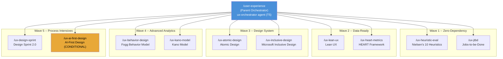
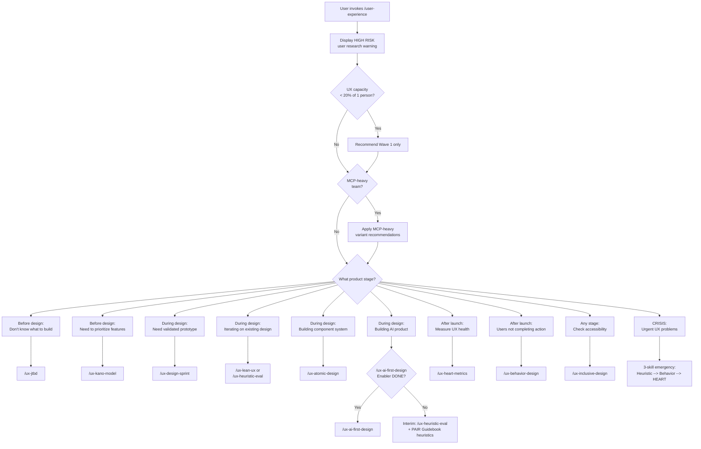
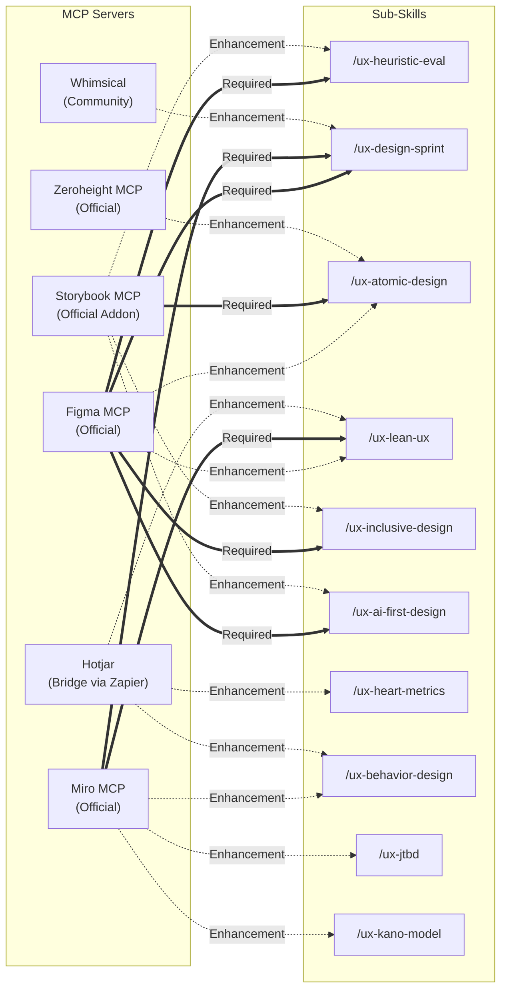
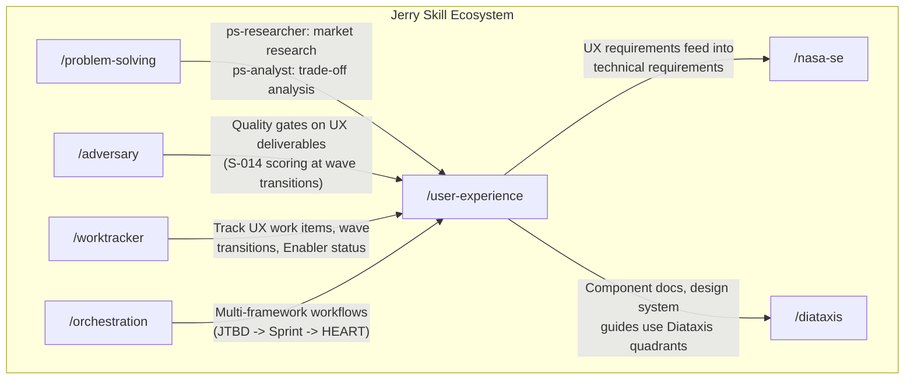

# feat: Add `/user-experience` skill -- AI-augmented UX for Tiny Teams

## Vision

The `/user-experience` skill brings structured UX methodology to any software team -- even those with zero UX specialists. A parent orchestrator routes users to the right framework based on their product stage and specific need, while 10 independently evolvable sub-skills cover the full product lifecycle from discovery through post-launch measurement. This is not a toy. This is the UX department a 2-person team never thought they could afford, delivered through AI-augmented execution of proven frameworks that have been battle-tested across thousands of products over the past three decades.

---

## The Problem

### Tiny Teams Cannot Afford UX -- And It Shows

Gartner's 2026 "Tiny Teams" trend confirms what the industry has been experiencing: teams of 2-5 people augmented by AI are replacing department-scale staffing across software development. Companies like Midjourney (11 people, $200M ARR) and Bolt.new (15 people, $20M in 60 days) demonstrate that AI-augmented tiny teams can deliver results previously requiring 50+ people.

But there is a glaring gap in this trend: **UX capability**.

A 2-person startup can use AI to write code, generate tests, create documentation, and manage infrastructure. What they cannot do is:

- **Discover what to build.** Without structured user research methodology, teams build what they assume users want. Jobs-to-be-Done and Kano Model provide the frameworks for this -- but only if someone on the team knows how to apply them.

- **Evaluate what they have built.** Without heuristic evaluation or usability testing, teams ship designs with preventable usability problems. Nielsen's 10 Heuristics have been the gold standard for 30 years -- but a developer who has never heard of them cannot apply them.

- **Measure whether their UX works.** Without structured metrics (HEART, Fogg Behavior Model), teams rely on gut feel to assess UX quality. They know something is wrong but cannot diagnose what or why.

- **Build accessible products.** Without inclusive design methodology, teams build for themselves and miss the 15-20% of users with disabilities, plus the situational impairments that affect everyone.

- **Build consistent products.** Without component architecture (Atomic Design), teams create one-off UI elements that diverge over time, increasing maintenance cost and degrading user experience.

The result: tiny teams ship fast but ship poorly. They iterate on code but not on experience. They optimize for features but not for usability. The products work -- technically -- but they do not work well for the humans who use them.

### Why Existing Tools Do Not Solve This

- **Design tools** (Figma, Sketch) provide the canvas but not the methodology. Knowing how to use Figma does not mean knowing when to run a heuristic evaluation or how to structure a design sprint.
- **UX books and courses** provide the knowledge but not the execution. A developer who reads "Don't Make Me Think" understands the principles but still cannot run a structured JTBD analysis.
- **AI chatbots** can answer UX questions but lack structured methodology. Asking "how do I improve my UX" produces generic advice, not a systematic evaluation against proven frameworks with actionable findings.

What is missing is the **middle layer**: structured, AI-guided workflows that take proven UX frameworks and make them executable by non-specialists, with appropriate guardrails about what AI can and cannot do.

### Who This Is For: Tiny Teams Population Segments

The 2026 Tiny Teams trend encompasses distinct population segments with different needs:

| Segment | Team Size | Characteristics | Portfolio Fit |
|---------|----------|-----------------|---------------|
| **Solo practitioner** | 1 | No collaboration overhead; all roles in one person; time is the binding constraint | HIGH -- all 10 sub-skills are usable by one person; Design Sprint adapts to 1-2 day solo sprint |
| **Dev+Designer pair** | 2 | Minimal coordination; complementary skills; one person typically drives UX | HIGH -- portfolio's "pair review" patterns (Nielsen's, Lean UX hypothesis validation) map directly |
| **Small cross-functional team** | 3-5 | Enough for role separation; can run a full Design Sprint; manageable coordination | HIGH -- primary optimization target; all sub-skills operate at full design intent |
| **Part-time UX** | 2-5 (one part-time) | UX is a part-time responsibility; depth is limited; frameworks must be low-ceremony | MEDIUM -- Kano and HEART may exceed part-time capacity; prioritize Wave 1-2 only |

Teams in the "part-time UX" segment should treat wave progression beyond Wave 2 as aspirational and focus on the zero-MCP-cost sub-skills (HEART, JTBD, Kano, Behavior Design).

---

## The Solution

### A Parent Orchestrator with 10 Pluggable Sub-Skills

The `/user-experience` skill uses a **hybrid parent orchestrator + pluggable sub-skills** architecture. Each UX framework is a self-contained Jerry skill that can be independently registered, versioned, and evolved.



### The 10 Sub-Skills

Each sub-skill implements a single, proven UX framework. Together they cover the full product lifecycle. Below is a summary table followed by detailed descriptions of each sub-skill.

#### Summary Table

| # | Sub-Skill | Framework | Lifecycle Stage | Cognitive Mode | Tool Tier | Wave | Score |
|---|-----------|-----------|----------------|----------------|-----------|------|-------|
| 1 | `/ux-heuristic-eval` | Nielsen's 10 Heuristics | During Design | Systematic | T3 | 1 | 9.25 |
| 2 | `/ux-jtbd` | Jobs-to-be-Done | Before Design | Divergent | T3 | 1 | 8.05 |
| 3 | `/ux-lean-ux` | Lean UX | During Design | Systematic | T3 | 2 | 8.25 |
| 4 | `/ux-heart-metrics` | HEART Framework | After Launch | Systematic | T2 | 2 | 8.30 |
| 5 | `/ux-atomic-design` | Atomic Design | While Building | Systematic | T3 | 3 | 8.55 |
| 6 | `/ux-inclusive-design` | Microsoft Inclusive Design | While Building | Systematic | T3 | 3 | 8.00 |
| 7 | `/ux-behavior-design` | Fogg Behavior Model | After Launch | Convergent | T2 | 4 | 7.45 |
| 8 | `/ux-kano-model` | Kano Model | Before Design | Convergent | T2 | 4 | 7.50 |
| 9 | `/ux-design-sprint` | Design Sprint 2.0 | During Design | Systematic | T3 | 5 | 8.65 |
| 10 | `/ux-ai-first-design` | AI-First Design | AI Products | Divergent | T3 | 5 (COND) | 7.80 (P) |

#### Detailed Sub-Skill Descriptions

---

#### 1. `/ux-heuristic-eval` -- Nielsen's 10 Usability Heuristics

**Rank #1 | Score: 9.25 | Wave 1**

The most universally applicable UX evaluation framework in existence. 30+ years of validation across thousands of products. The 10-heuristic checklist maps to a systematic agent that evaluates a design artifact (screenshot, wireframe, prototype URL) against each heuristic and produces a structured findings report with severity ratings.

| Attribute | Value |
|-----------|-------|
| Agent | `ux-heuristic-evaluator` |
| Cognitive Mode | Systematic (10 discrete heuristics, scored findings list) |
| Tool Tier | T3 (external access for Figma) |
| Required MCP | Figma (design file reading, frame extraction) |
| Enhancement MCP | Storybook (component-level heuristic checks) |
| Time to Complete | ~30-35 minutes with AI assistance (design target) |

**What AI does:** Evaluates designs against all 10 Nielsen heuristics; assigns severity ratings (0-4 scale) per violation; generates structured findings report with fix recommendations; cross-references findings against platform conventions.

**What humans do:** Provides platform-specific context (mobile vs. web vs. desktop conventions); triages findings by business priority (not all severity-4 violations are worth fixing immediately); makes the final fix-or-accept decision; reviews contextual heuristics (H4: Consistency, H7: Flexibility) that require domain knowledge.

**Non-MCP fallback:** Screenshot-input mode. User provides design screenshots as image inputs. Reduced automation but full heuristic coverage retained.

---

#### 2. `/ux-jtbd` -- Jobs-to-be-Done

**Rank #6 | Score: 8.05 | Wave 1**

Discovers what problem to solve by analyzing the "jobs" users hire products to do. Based on Clayton Christensen's framework with Intercom's JTBD Playbook adaptations for product teams.

| Attribute | Value |
|-----------|-------|
| Agent | `ux-jtbd-analyst` |
| Cognitive Mode | Divergent (explores broadly to discover user jobs) |
| Tool Tier | T3 |
| Required MCP | None |
| Enhancement MCP | Miro (visual job mapping) |
| Key Output | Job statement synthesis, switch interview guide, competitive job analysis |

**What AI does:** Synthesizes job statements from interview transcripts and secondary research; generates competitive job analysis showing how users currently hire alternative solutions; maps job-to-feature relationships; creates switch interview guides for user research validation.

**What humans do:** Conducts actual user interviews (irreducible -- AI cannot observe real behavior); judges hypothesis validity against their knowledge of the user population; decides which job to pursue (strategic product decision); validates that AI-generated job statements resonate with observed user language.

**Synthesis hypothesis warning:** Job statements generated from secondary research are MEDIUM confidence. They require named validation sources before feeding into Design Sprint challenge statements.

---

#### 3. `/ux-lean-ux` -- Lean UX

**Rank #5 | Score: 8.25 | Wave 2**

Iterates on hypotheses continuously through build-measure-learn cycles. Based on Jeff Gothelf's Lean UX with adaptations for AI-augmented hypothesis generation.

| Attribute | Value |
|-----------|-------|
| Agent | `ux-lean-ux-facilitator` |
| Cognitive Mode | Systematic (hypothesis cycle is a repeatable process) |
| Tool Tier | T3 |
| Required MCP | Miro (assumption mapping, hypothesis tracking) |
| Enhancement MCP | Figma (MVP prototyping), Hotjar (experiment analytics via bridge) |
| Key Output | Assumption map, hypothesis backlog, experiment design, validation report |

**What AI does:** Generates assumption maps categorizing team beliefs by risk and uncertainty; creates hypothesis backlogs in structured format ("We believe [assumption]. We will know we are right when [measurable signal]."); builds MVPs from hypothesis specifications; tracks experiment results against hypothesis predictions.

**What humans do:** Identifies which assumptions are riskiest (requires product judgment about what matters); judges whether hypothesis results validate or invalidate the assumption; decides what to learn next; determines when to pivot vs. persevere.

---

#### 4. `/ux-heart-metrics` -- HEART Framework (Google)

**Rank #4 | Score: 8.30 | Wave 2**

Measures whether UX is actually working using Google's Happiness-Engagement-Adoption-Retention-Task Success framework. Translates abstract UX goals into concrete, measurable signals and metrics.

| Attribute | Value |
|-----------|-------|
| Agent | `ux-heart-analyst` |
| Cognitive Mode | Systematic (GSM template population is procedural) |
| Tool Tier | T2 (no external MCP required for core function) |
| Required MCP | None |
| Enhancement MCP | Analytics API (data ingestion), Hotjar (behavioral data via bridge) |
| Key Output | HEART GSM (Goals-Signals-Metrics) populated template, metric dashboard specification, anomaly detection report |

**What AI does:** Populates HEART GSM templates from analytics data; generates metric definitions with measurement methods; creates dashboard specifications; detects metric anomalies and trends; generates comparison reports across time periods.

**What humans do:** Selects which HEART dimensions matter most for their product (not all 5 are equally relevant); interprets metric trends in business context; identifies confounding factors (seasonality, marketing campaigns, etc.); makes product decisions based on metric data.

---

#### 5. `/ux-atomic-design` -- Atomic Design (Brad Frost)

**Rank #3 | Score: 8.55 | Wave 3**

Structures component libraries for reuse using Brad Frost's atoms-molecules-organisms-templates-pages hierarchy. The most AI-automatable design system framework due to its rule-based classification system.

| Attribute | Value |
|-----------|-------|
| Agent | `ux-atomic-architect` |
| Cognitive Mode | Systematic (classification hierarchy is rule-based) |
| Tool Tier | T3 |
| Required MCP | Storybook (component library evaluation, story management) |
| Enhancement MCP | Zeroheight (design system documentation), Figma (visual component extraction) |
| Key Output | Component inventory, atomic classification, composition recommendations, documentation |

**What AI does:** Discovers existing components from Storybook; classifies components into atomic hierarchy levels; composes new Organisms from existing Atoms and Molecules; generates component documentation; detects inconsistencies (duplicate components, naming violations, unused atoms); recommends consolidation opportunities.

**What humans do:** Defines component boundaries (when an Atom becomes a Molecule is a design judgment); validates classifications against brand standards and design language; decides on component API surface (props, variants, composability rules); reviews documentation for accuracy.

---

#### 6. `/ux-inclusive-design` -- Microsoft Inclusive Design

**Rank #7 | Score: 8.00 | Wave 3**

Ensures everyone can use the product by applying Microsoft's Recognize-Learn-Build exclusion methodology and Persona Spectrum approach. Goes beyond WCAG compliance to address situational and temporary impairments.

| Attribute | Value |
|-----------|-------|
| Agent | `ux-inclusive-evaluator` |
| Cognitive Mode | Systematic (checklist evaluation against exclusion categories) |
| Tool Tier | T3 |
| Required MCP | Figma (design evaluation, contrast analysis) |
| Enhancement MCP | Storybook (component-level accessibility), Context7 (WCAG reference docs) |
| Key Output | Persona Spectrum analysis, WCAG 2.2 compliance report, exclusion audit, remediation recommendations |

**What AI does:** Evaluates contrast ratios, text sizing, touch targets against WCAG 2.2 criteria; applies Persona Spectrum analysis to identify permanent, temporary, and situational exclusions; generates compliance reports with specific remediation steps; checks color-blind accessibility; evaluates keyboard navigation paths.

**What humans do:** Provides user population context (which disability types are prevalent in their user base); validates accommodations for non-standard populations (cultural, linguistic, cognitive); prioritizes remediation by impact; reviews Persona Spectrum customizations for accuracy.

---

#### 7. `/ux-behavior-design` -- Fogg Behavior Model

**Rank #10 | Score: 7.45 | Wave 4**

Diagnoses why users are not doing what you expected by analyzing the B=MAP equation: Behavior = Motivation x Ability x Prompt. The only behavioral diagnostic framework in the portfolio.

| Attribute | Value |
|-----------|-------|
| Agent | `ux-behavior-diagnostician` |
| Cognitive Mode | Convergent (narrows from behavioral data to bottleneck diagnosis) |
| Tool Tier | T2 |
| Required MCP | None |
| Enhancement MCP | Miro (behavior mapping), Hotjar (behavioral recording data via bridge) |
| Key Output | B=MAP bottleneck diagnosis, intervention recommendations, motivation-ability profile |

**What AI does:** Diagnoses which component of B=MAP is the bottleneck (motivation too low? ability too hard? prompt missing or mistimed?); generates design intervention recommendations matched to the bottleneck type; maps motivation-ability profiles for key user actions; tracks intervention effectiveness.

**What humans do:** Provides behavioral context (why users might have low motivation -- often requires product/market knowledge); validates bottleneck diagnosis against their observation of user behavior; selects intervention approach (there are multiple valid interventions for each bottleneck type); decides which user actions to analyze.

**Synthesis hypothesis warning:** Design intervention recommendations are LOW confidence. They are reference-only outputs without design recommendation sections.

---

#### 8. `/ux-kano-model` -- Kano Model

**Rank #9 | Score: 7.50 | Wave 4**

Prioritizes which features matter most by classifying them using Noriaki Kano's three-category model: Must-Be (expected), Performance (proportional satisfaction), and Attractive (delighters). Requires user survey data.

| Attribute | Value |
|-----------|-------|
| Agent | `ux-kano-analyst` |
| Cognitive Mode | Convergent (narrows from survey data to priority classification) |
| Tool Tier | T2 |
| Required MCP | None |
| Enhancement MCP | Miro (feature mapping visualization) |
| Key Output | Kano classification matrix, feature priority recommendations, satisfaction coefficients |

**What AI does:** Processes Kano survey responses (functional/dysfunctional question pairs); classifies features into Must-Be, Performance, Attractive, Indifferent, Reverse categories; generates feature priority matrices with satisfaction coefficients; detects classification conflicts within the data; produces visual priority maps.

**What humans do:** Designs the survey questions (feature descriptions must be user-facing, not technical); recruits survey respondents (minimum 30 for statistical reliability); interprets classification results in business context (a "Must-Be" feature that is technically expensive still requires strategic judgment); makes build/defer/cut decisions.

**Synthesis hypothesis warning:** Directional classifications from 5-8 respondents are MEDIUM confidence. Feature priority conflict interpretations are LOW confidence (reference-only).

---

#### 9. `/ux-design-sprint` -- Design Sprint 2.0

**Rank #2 | Score: 8.65 | Wave 5**

Runs intensive 4-day sprints to go from problem statement to validated prototype. Based on AJ&Smart's Design Sprint 2.0 (evolved from the original Google Ventures methodology). The highest-ceremony, highest-impact framework in the portfolio.

| Attribute | Value |
|-----------|-------|
| Agent | `ux-sprint-facilitator` |
| Cognitive Mode | Systematic (4-day structured process with defined daily outputs) |
| Tool Tier | T3 |
| Required MCP | Miro (sprint exercises, voting, mapping), Figma (prototype building) |
| Enhancement MCP | Whimsical (flowchart alternatives) |
| Key Output | Challenge statement, solution sketches, interactive prototype, Day 4 test findings |

**What AI does:** Generates 20+ sketch variants during Day 2 ideation; builds interactive Figma prototypes during Day 3; creates interview guides for Day 4 testing; themes Day 4 interview data into patterns; manages sprint exercise templates (Lightning Demos, How Might We notes, Solution Sketches).

**What humans do:** Sets design direction and challenge statement (Day 1); selects from AI-generated sketch variants (Day 2 decision-making); reviews and refines prototype fidelity (Day 3); conducts user interviews (Day 4 -- irreducible human contact); makes strategic pivot/persevere decisions based on test results.

**Team size adaptation:** Design Sprint 2.0 is designed for 4-5 participants. For 2-person teams, the sprint collapses to 1-2 days with the AI filling the "missing participant" roles (note-taker, sketch generator, prototype builder). The facilitator and decision-maker roles remain human.

---

#### 10. `/ux-ai-first-design` -- AI-First Design (SYNTHESIZED)

**Rank #8 | Score: 7.80 (Projected) | Wave 5 (CONDITIONAL)**

Applies AI-specific interaction patterns for products where AI is the core experience. This is a **synthesized framework** -- it must be created by this project before implementation. No established framework exists that addresses AI-specific UX patterns at the methodology level required for Jerry sub-skill operationalization.

| Attribute | Value |
|-----------|-------|
| Agent | `ux-ai-design-guide` |
| Cognitive Mode | Divergent (explores emerging AI interaction patterns) |
| Tool Tier | T3 |
| Required MCP | Figma (AI interface evaluation) |
| Enhancement MCP | Storybook (AI component patterns), Context7 (AI UX research) |
| Key Output | AI interaction specification, trust calibration report, explanation pattern map |

**What AI does:** Generates AI interaction pattern recommendations (conversational, agentic, augmentative, autonomous modes); evaluates trust calibration (does the UI accurately convey AI confidence and limitations?); maps explanation patterns (when and how to explain AI decisions to users); reviews error handling UX for AI failures.

**What humans do:** Provides product context (what type of AI interactions does the product have?); validates AI interaction pattern appropriateness for their user population; decides on explanation depth (how much should the AI explain itself?); reviews trust calibration against actual AI capability.

**Conditional status:**

- **Blocking prerequisite:** A synthesis Enabler must reach DONE status with a verified WSM score >= 7.80
- **Substitution path:** If the Enabler fails or expires, Service Blueprinting (rank #12, score 7.40) auto-substitutes
- **Interim path:** The parent orchestrator routes AI product UX requests to `/ux-heuristic-eval` with supplemental PAIR Guidebook heuristics until the Enabler completes

**Synthesis hypothesis warning:** All AI interaction pattern recommendations are LOW confidence. This is an emerging domain without the 10+ years of validation that frameworks like Nielsen's Heuristics or JTBD have.

---

## Key Design Decisions

### 1. Each Framework = Its Own Skill

Sub-skills can be registered independently in CLAUDE.md and AGENTS.md. A team using only Nielsen's Heuristics and Lean UX does not load the other 8 sub-skills into context, preserving the Jerry progressive disclosure budget (CB-02).

This means:
- **Independent versioning.** When a better metrics framework than HEART emerges, only `/ux-heart-metrics` is updated.
- **Independent evolution.** New frameworks (V2 additions like Service Blueprinting) are added as new sub-skills without modifying existing ones.
- **Context budget preservation.** Only the parent skill is loaded at session start (Tier 1, ~500 tokens). Sub-skills are loaded on-demand via Task tool (Tier 2).

### 2. Parent Orchestrator Routes via Lifecycle-Stage Triage

Only `/user-experience` is registered in `mandatory-skill-usage.md`. The parent orchestrator:

1. **Onboards with a HIGH RISK warning** about the user research gap (first invocation per session)
2. **Checks team UX capacity** -- if < 20% of one person's time, restricts recommendations to Wave 1 sub-skills
3. **Routes by product stage:**
   - "Before design" requests go to JTBD or Kano
   - "During design" requests go to Design Sprint, Lean UX, or Heuristic Eval
   - "While building" requests go to Atomic Design or Inclusive Design
   - "After launch" requests go to HEART or Behavior Design
   - "AI product" requests go to AI-First Design (if Enabler complete) or interim heuristic path
4. **Handles crisis mode** -- emergency 3-skill sequence (Heuristic Eval -> Behavior Design -> HEART) for products with urgent UX problems

Users who know the specific sub-skill they need can invoke it directly (e.g., `/ux-heuristic-eval`) to bypass the triage.

**Routing triage flowchart:**



**Common intent resolution:**

| User Says | Routes To | Qualification Question |
|-----------|----------|----------------------|
| "Improve my UX" / "Make this more usable" | Heuristic Eval (existing design) or Design Sprint (no design yet) | "Do you have an existing design?" |
| "Fix a specific UX problem" | Behavior Design (behavioral) or Heuristic Eval (design-level) | "Is the problem about user behavior or design quality?" |
| "Decide what to build" | JTBD (strategic) or Kano (prioritize known features) | "Are you defining the problem or prioritizing features?" |
| "Measure whether UX is working" | HEART Metrics | No qualification needed |
| "Make this accessible" | Inclusive Design | Provide user context brief |
| "Set up our design system" | Atomic Design | Provide Storybook reference |
| "We have an AI product" | AI-First Design (if Enabler done) or Heuristic Eval + PAIR | Check Enabler status |
| "CRISIS: urgent UX problems" | Emergency 3-skill sequence | No qualification needed |

### 3. P-003 Compliant Single-Level Nesting

The architecture strictly enforces Jerry's single-level nesting constraint:

```
MAIN CONTEXT (orchestrator)
    |
    +-- ux-orchestrator (T5, has Task tool)
           |
           +-- ux-heuristic-evaluator (T3, NO Task tool)
           +-- ux-jtbd-analyst (T3, NO Task tool)
           +-- ux-lean-ux-facilitator (T3, NO Task tool)
           +-- ...etc
```

- The parent orchestrator (`ux-orchestrator`) is the only T5 agent with Task tool access.
- All sub-skill agents are T2-T3 and cannot spawn further sub-agents.
- Workers return results to the orchestrator, which coordinates cross-framework integration.

### 4. MCP Integration (Figma, Miro, Storybook, Zeroheight + Bridge Tools)

This is the most MCP-dependent skill in the Jerry framework. The following diagram shows the full tool-to-sub-skill integration map:



**Legend:** Solid arrows (==>) = Required MCP (degraded mode + explicit error on failure). Dashed arrows (-.>) = Enhancement MCP (cosmetic limitation on failure).

**MCP Server Classification:**

| MCP Server | Type | Stability | Cost | Notes |
|-----------|------|-----------|------|-------|
| **Figma** | Official (Native) | HIGH -- official Figma product | $15/editor/month (Professional) | Highest dependency risk due to breadth of integration |
| **Miro** | Official (Native) | HIGH -- official Miro product | $8/member/month (Team plan) | Required for collaborative UX workflows |
| **Storybook** | Official (Addon) | HIGH -- maintained by Storybook team | Free | Component development ecosystem integration |
| **Zeroheight** | Official (Native) | HIGH -- official product | $99/month (Team plan) | Design system documentation platform |
| **Hotjar** | Bridge (Zapier/Pipedream) | MEDIUM -- requires paid middleware | Variable ($0-$99+ depending on Zapier plan) | NOT plug-and-play; requires custom workflow config |
| **Whimsical** | Community | MEDIUM-LOW -- third-party maintained | Free (basic) | Verify GitHub activity before implementation |

**Cost tiers:**

| Tier | Monthly Cost | Sub-Skills Available | Best For |
|------|-------------|---------------------|----------|
| **Free** | $0/month | HEART, JTBD, Kano, Behavior Design (4 sub-skills) | Solo practitioners, bootstrapped teams, exploration |
| **Minimal** | ~$46/month | + Heuristic Eval, Design Sprint, Lean UX, Inclusive Design, AI-First Design (9 sub-skills) | 2-person teams with design workflow |
| **Full Enhancement** | ~$145-245/month | All 10 with full enhancement MCPs (Zeroheight + Hotjar) | Teams investing in design systems and analytics |

**Figma dependency risk mitigation:**

Each Figma-dependent sub-skill documents a non-Figma fallback:
- `/ux-heuristic-eval`: Screenshot-input mode (user provides design screenshots as image inputs)
- `/ux-design-sprint`: Miro-only mode (sprint exercises in Miro; manual prototype reference)
- `/ux-inclusive-design`: Screenshot-input mode (manual component screenshots for evaluation)
- `/ux-ai-first-design`: Text-based analysis mode (manual design description input)

Additional mitigations:
- Quarterly MCP audit cadence with named MCP maintenance owner
- Penpot MCP (currently experimental) monitored as an open-source alternative path
- No sub-skill is entirely blocked by MCP unavailability -- all 10 have documented fallbacks

### 5. Wave Deployment (5 Criteria-Gated Waves)

Sub-skills deploy in 5 waves. Progression is **criteria-gated, not time-gated** -- teams advance when readiness criteria are met, not on a calendar schedule.

| Wave | Sub-Skills | Rationale | Key Entry Criteria |
|------|-----------|-----------|-------------------|
| **1: Zero-Dependency** | Heuristic Eval, JTBD | No external user data or MCP required for core function. Highest return-per-hour entry skills. | KICKOFF-SIGNOFF.md completed |
| **2: Data-Ready** | Lean UX, HEART | Requires Miro (Lean UX) or analytics source (HEART). Builds on Wave 1. | Wave 1: at least 1 heuristic eval + 1 JTBD job statement used |
| **3: Design System** | Atomic Design, Inclusive Design | Requires Storybook (Atomic) and Figma (Inclusive). Component infrastructure. | Wave 2: launched product with analytics OR 1 Lean UX hypothesis cycle |
| **4: Advanced Analytics** | Behavior Design, Kano | Both require user data. Post-launch skills. | Wave 3: Storybook with 5+ Atom stories; 1 Persona Spectrum review |
| **5: Process Intensives** | Design Sprint, AI-First Design (COND) | Sprint requires 4-day team commitment. AI-First conditional on Enabler. | Wave 4: 30+ users for Kano OR 1 B=MAP bottleneck diagnosed |

If a wave stalls for 2+ sprint cycles, documented bypass conditions allow teams to proceed with partial capability. All 10 sub-skills have documented non-MCP fallback paths.

```mermaid
gantt
    title Wave Deployment Timeline (Criteria-Gated)
    dateFormat X
    axisFormat %s

    section Wave 1
    /ux-heuristic-eval     :w1a, 0, 1
    /ux-jtbd               :w1b, 0, 1

    section Wave 2
    /ux-lean-ux            :w2a, 1, 2
    /ux-heart-metrics      :w2b, 1, 2

    section Wave 3
    /ux-atomic-design      :w3a, 2, 3
    /ux-inclusive-design    :w3b, 2, 3

    section Wave 4
    /ux-behavior-design    :w4a, 3, 4
    /ux-kano-model         :w4b, 3, 4

    section Wave 5
    /ux-design-sprint      :w5a, 4, 5
    /ux-ai-first-design    :crit, w5b, 4, 5
```



### 6. Synthesis Hypothesis Validation (3-Tier Confidence Gates)

Multiple sub-skills produce "synthesis hypothesis" outputs -- AI-generated abstractions that may reflect training data biases rather than the team's specific users. A 3-tier confidence gate fires at skill invocation time to prevent over-reliance on unvalidated AI outputs.

| Confidence | Gate Behavior | What This Means in Practice |
|------------|--------------|---------------------------|
| **HIGH** | User reviews output and acknowledges specific AI judgment calls via a Synthesis Judgments Summary | The user sees a list of AI judgment calls and must explicitly acknowledge each one before the output advances to design decisions |
| **MEDIUM** | Requires expert review OR validation against 2-3 real user data points | The output includes a "Validation Required" section. The agent does not generate design recommendations until a named validation source is provided |
| **LOW** | Output permanently labeled reference-only; design recommendation section structurally omitted | The agent template physically does not contain a design recommendation section. This cannot be overridden by any user action |

**Why this matters:** Without these gates, teams would treat AI-generated job statements, behavioral diagnoses, and feature priority matrices as validated research findings. They are not. They are hypotheses generated from AI training data, which may or may not reflect the team's actual user population. The confidence gates make this distinction architecturally enforceable rather than relying on user discipline.

**Sub-skills with LOW-confidence outputs (reference-only, no design recommendations):**
- `/ux-kano-model`: Feature priority conflict interpretation
- `/ux-behavior-design`: Design intervention recommendation
- `/ux-heart-metrics`: Metric threshold recommendation
- `/ux-ai-first-design`: AI interaction pattern recommendations

**Onboarding warning (displayed first invocation per session):**

> "IMPORTANT: This skill portfolio does NOT include a dedicated user research framework. AI-generated user insights (personas, job statements, assumption maps) are hypotheses, not validated findings. For consumer products or specialized populations, supplement with direct user contact (interviews, observations, surveys) before making design decisions based on synthesis outputs."

---

## What This Replaces: The Tiny Teams Capability Map

For a 2-3 person team, this skill portfolio provides the equivalent **capability coverage** of the following specialist roles:

| Traditional UX Role | Replaced By | What AI Executes | What Humans Retain |
|---------------------|-------------|-----------------|-------------------|
| **UX Researcher** | `/ux-jtbd` + `/ux-lean-ux` | Synthesizes job statements from transcripts; generates assumption maps; themes interview data | Conducts actual user interviews; judges hypothesis validity; decides what to learn next |
| **UX Designer** | `/ux-design-sprint` + `/ux-lean-ux` | Generates 20+ sketch variants; builds interactive prototypes; creates wireframes | Sets design direction; selects from AI variants; makes aesthetic/strategic judgments |
| **UX Evaluator / Auditor** | `/ux-heuristic-eval` | Evaluates designs against 10 heuristics; generates severity-rated findings reports | Triages findings; provides platform context; decides which to fix |
| **Design Systems Engineer** | `/ux-atomic-design` | Discovers existing components; composes new organisms; maintains docs | Defines component boundaries; validates against brand/accessibility standards |
| **UX Metrics Analyst** | `/ux-heart-metrics` + `/ux-behavior-design` | Populates HEART GSM templates; diagnoses B=MAP bottlenecks; generates measurement reports | Interprets trends; identifies confounders; makes product decisions from data |
| **Accessibility Specialist** | `/ux-inclusive-design` | Evaluates contrast, sizing, touch targets; checks WCAG 2.2; applies Persona Spectrum | Provides user population context; validates for non-standard populations |
| **Product Strategist (UX)** | `/ux-jtbd` + `/ux-kano-model` | Synthesizes competitive job analysis; processes Kano responses; generates priority matrices | Frames the strategic problem; decides which job to pursue; validates classifications |
| **UX Department Manager** | `/user-experience` (orchestrator) | Routes to correct sub-skill; manages cross-framework integration; tracks hypothesis backlogs | Provides product context; makes final design decisions; provides organizational judgment |

**Important clarification:** This portfolio spans the same UX **discipline scope** as a 6-8 person UX team -- it does NOT match the throughput or depth of 6-8 full-time specialists. The gap is in user research depth (the HIGH RISK limitation documented below) and the creative/strategic judgment that only human expertise provides. Each sub-skill replaces a specialist role by combining AI execution of structured/analytical steps with human judgment on strategic decisions.

---

## Known Limitations

### HIGH RISK: User Research Gap

This portfolio does **NOT** include a dedicated user research framework.

AI-generated user insights -- personas, job statements, assumption maps -- are **hypotheses, not validated findings**. The Design Sprint Day 4 testing protocol and Lean UX validation loops are minimum viable research mechanisms, NOT substitutes for a systematic user research program.

**Impact:**
- Teams building consumer products, products for specialized populations, or products in competitive markets SHOULD NOT rely solely on these frameworks for user understanding
- Synthesis hypothesis outputs from JTBD, Lean UX, Design Sprint, and Inclusive Design are particularly affected
- The parent orchestrator's onboarding flow warns every user about this gap at first invocation

**Mitigation:**
- A 3-tier synthesis hypothesis validation protocol (HIGH / MEDIUM / LOW confidence gates) is embedded in the architecture. LOW-confidence outputs structurally omit design recommendations. MEDIUM-confidence outputs require named validation sources before advancing to design decisions.
- V2 planning prioritizes a dedicated `/ux-user-research` sub-skill (Maze/UserZoom integration) as a P1 gap closure.

### AI-First Design: Conditional Status

The `/ux-ai-first-design` sub-skill is ranked #8 in the selection analysis (projected score 7.80) but carries the **CONDITIONAL** designation because the framework must be created by this project before implementation. This is a synthesized framework, not an established one.

- **Blocking prerequisite:** A synthesis Enabler must reach DONE status with a verified WSM score >= 7.80
- **Substitution path:** If the Enabler fails or expires, Service Blueprinting (rank #12, score 7.40) auto-substitutes as an established, immediately adoptable framework
- **Interim path:** Until the Enabler completes, the parent orchestrator routes AI product UX requests to `/ux-heuristic-eval` with supplemental PAIR Guidebook heuristics

### Ethics Framework Gaps

The V1 portfolio has partial coverage of UX ethics:
- No dedicated dark patterns audit framework (Brignull deceptive.design taxonomy is a V2 candidate)
- No dedicated algorithmic bias review framework (PAIR Guidebook + ACM FAccT is a V2 candidate)
- Microsoft Inclusive Design covers accessibility ethics but not broader algorithmic or persuasion ethics

### Figma Single Point of Failure

Figma MCP is required for 4 sub-skills and enhances 2 more (6 of 10 total connections). If Figma changes its MCP server schema, restricts access, or monetizes the integration (Figma has a history of restricting previously free API access -- Dev Mode became paid in 2023), these sub-skills lose their primary MCP integration path.

**Mitigations:**
- Each Figma-dependent sub-skill documents a non-Figma fallback path (see MCP Integration section above)
- Quarterly MCP audit cadence with named maintenance owner
- Penpot MCP (currently experimental) monitored as an open-source alternative
- The 3 highest Figma-dependent sub-skills (Atomic Design, Design Sprint, AI-First Design) must document explicit non-Figma fallback paths in their skill definitions before launch

### Context Window Pressure

With 10+ sub-skill definitions potentially loaded in a session, context window pressure is a risk. The architecture mitigates this through progressive disclosure:

- **Tier 1 (session start):** Only the parent `/user-experience` skill description is loaded (~500 tokens). Sub-skill definitions are NOT loaded.
- **Tier 2 (on-demand):** Sub-skill agents are loaded via Task tool invocation. Only the specific sub-skill being used consumes context.
- **Tier 3 (supplementary):** Output templates, prior work artifacts, and framework reference materials are loaded selectively during agent execution.

This ensures a single sub-skill invocation consumes ~2,000-8,000 tokens for the agent definition, not ~20,000-80,000 for all 10 sub-skills simultaneously.

### Scope Creep Risk

As V2 additions expand the sub-skill count (potentially to 14-16), the routing architecture must evolve:
- At 15+ sub-skills: evaluate Layer 2 rule-based routing per the Jerry scaling roadmap
- At 20+ sub-skills: evaluate LLM-as-Router (Layer 3)
- Sub-skill groupings (Discovery, Design, Build, Measure, Ethics) are pre-designed to serve as Layer 2 routing categories

---

## Acceptance Criteria

### Parent Orchestrator

- [ ] `/user-experience` skill registered in `mandatory-skill-usage.md` with trigger map entry (priority 12, negative keywords preventing collision with `/adversary`, `/red-team`, `/nasa-se`, `/transcript`)
- [ ] `/user-experience` skill registered in `CLAUDE.md` skill table and `AGENTS.md` agent registry
- [ ] `ux-orchestrator` agent definition created with T5 tool tier, integrative cognitive mode, Opus model
- [ ] `ux-orchestrator.governance.yaml` validates against `docs/schemas/agent-governance-v1.schema.json`
- [ ] Lifecycle-stage triage routing implemented in `skills/user-experience/rules/ux-routing-rules.md`
- [ ] Onboarding warning (HIGH RISK user research gap) displays on first invocation per session
- [ ] Capacity check restricts to Wave 1 when UX time < 20% of one person's time
- [ ] Crisis mode 3-skill sequence (Heuristic Eval -> Behavior Design -> HEART) operational
- [ ] Cross-framework integration handoffs tested for at least 2 canonical sequences (JTBD -> Design Sprint, Lean UX -> HEART)

### Wave 1 Sub-Skills (Minimum Viable Launch)

- [ ] `/ux-heuristic-eval` sub-skill created with:
  - Systematic cognitive mode, T3 tool tier
  - Figma required MCP, Storybook enhancement MCP
  - `ux-heuristic-evaluator` agent with all 10 Nielsen heuristics enumerated in methodology
  - Structured findings report template with severity ratings (0-4 scale)
  - Non-MCP fallback: screenshot-input mode documented
- [ ] `/ux-jtbd` sub-skill created with:
  - Divergent cognitive mode, T3 tool tier
  - No required MCP; Miro enhancement MCP
  - `ux-jtbd-analyst` agent with job statement synthesis methodology
  - Switch interview guide template
  - Competitive job analysis output format
  - Non-MCP fallback: text-based analysis mode documented
- [ ] Both sub-skills produce outputs that conform to the synthesis hypothesis validation protocol
- [ ] Both sub-skills have per-sub-skill SKILL.md, agent definition, governance YAML, rules, and templates

### Wave 2-5 Sub-Skills (Incremental Deployment)

- [ ] Each subsequent wave's sub-skills meet the same structural requirements as Wave 1
- [ ] Wave 2: `/ux-lean-ux` assumption map and hypothesis backlog templates operational; `/ux-heart-metrics` GSM template operational
- [ ] Wave 3: `/ux-atomic-design` Storybook integration tested; `/ux-inclusive-design` WCAG 2.2 checklist complete
- [ ] Wave 4: `/ux-behavior-design` B=MAP diagnosis template operational; `/ux-kano-model` survey processing functional
- [ ] Wave 5: `/ux-design-sprint` 4-day process templates (per-day); `/ux-ai-first-design` conditional Enabler tracked

### Synthesis Hypothesis Validation

- [ ] 3-tier confidence gate protocol (HIGH / MEDIUM / LOW) implemented in `skills/user-experience/rules/synthesis-validation.md`
- [ ] LOW-confidence outputs structurally omit design recommendation sections
- [ ] MEDIUM-confidence outputs require named validation source before advancing
- [ ] HIGH-confidence outputs require enumerated acknowledgment of AI judgment calls

### Quality Standards

- [ ] All agent definitions validate against JSON Schema (H-34)
- [ ] All agents include P-003, P-020, P-022 constitutional compliance (H-34b)
- [ ] All agents have >= 3 `forbidden_actions` entries in governance YAML
- [ ] No sub-skill agent has Task tool access (P-003 enforcement)
- [ ] Parent orchestrator quality gate uses S-014 scoring at wave transitions
- [ ] Sub-skill deliverables meet >= 0.92 weighted composite for C2+ outputs (H-13)

### Wave Progression

- [ ] Wave 1 entry criteria documented and enforced (KICKOFF-SIGNOFF.md completion)
- [ ] Wave 2-5 entry criteria documented with bypass conditions for stall recovery
- [ ] Wave transitions tracked via `/worktracker` entities

---

## V2 Roadmap

V2 planning begins when any 2 of these conditions are met in a single month:

1. A team reports a major product decision made incorrectly due to missing user research
2. The MCP-heavy variant is activated for 20%+ of invocations
3. 3+ monthly requests for AI UX pattern guidance while the AI-First Design Enabler is incomplete
4. A concrete dark pattern complaint or algorithmic bias issue occurs

### V2 Candidates (Priority-Ordered)

| Priority | Gap | V2 Sub-Skill | Impact |
|----------|-----|-------------|--------|
| **P1** | No dedicated user research | `/ux-user-research` (Maze/UserZoom integration) | Closes the single largest portfolio gap; unblocks validated research for all synthesis outputs |
| **P1** | No service design coverage | `/ux-service-blueprinting` (rank #12, score 7.40) | Covers end-to-end service process niche; also the auto-substitute if AI-First Design Enabler expires |
| **P1** | No dark patterns audit | `/ux-dark-patterns-audit` (Brignull taxonomy) | Ethics gap: subscription flows, notification patterns, engagement mechanics |
| **P1** | No algorithmic bias review | `/ux-algorithmic-bias-review` (PAIR + ACM FAccT) | Ethics gap: critical for AI-generated UX content |
| **P2** | No cognitive walkthrough | `/ux-cognitive-walkthrough` (rank #17, score 6.70) | Feature discoverability and complex navigation |
| **P2** | No privacy-by-design | `/ux-privacy-design` (Cavoukian 7 principles) | Legal compliance (GDPR/CCPA) |
| **P3** | Process visualization | Double Diamond as alternative process framework | For teams preferring visual diverge-converge model |

### Architecture Evolution Path

- **Phase 2 (V2, 6-12 months):** Add P1 gap-closing sub-skills. Cross-sub-skill integration deepens (user research feeds validated personas into JTBD and Design Sprint).
- **Phase 3 (V3, 12-24 months):** Evaluate Layer 2 rule-based routing at 14-16 sub-skills per Jerry scaling roadmap. Consider sub-skill groupings: Discovery, Design, Build, Measure, Ethics.
- **Phase 4 (V4+, 24+ months):** Evaluate LLM-as-Router (Layer 3) at 20+ sub-skills. Consider embedding-based semantic routing. Evaluate composite workflows (e.g., "JTBD then Sprint") as first-class operations.

---

## Research Backing

This skill design is grounded in a multi-phase research and analysis pipeline:

### Phase 1: Research

| Artifact | Scope | Key Findings |
|----------|-------|-------------|
| UX Frameworks Survey | 40 frameworks across 8 categories via systematic literature review | Identified candidate universe; mapped lifecycle coverage; discovered AI-First Design domain gap |
| Tiny Teams Research | Gartner 2026 trend analysis + industry case studies | Confirmed AI handles execution (50%+ speed-up on structured activities), humans provide judgment (irreducible); validated Tiny Teams population segments |
| MCP Design Tools Survey | 20 MCP tools assessed across 6 categories | Identified Figma, Miro, Storybook, Zeroheight as production-ready; classified bridge vs. community vs. official integrations |

### Phase 2: Selection Analysis

| Attribute | Value |
|-----------|-------|
| **Methodology** | Weighted Sum Method (WSM) with 6 criteria, graduated-priority weighting |
| **Candidate universe** | 40 frameworks scored and ranked |
| **Arithmetic verification** | All 40 framework totals independently verified; 5 error correction rounds |
| **Sensitivity analysis** | C3=25% adversarial perturbation tested; bounding case confirmed |

### Phase 3: Architecture Vision

| Attribute | Value |
|-----------|-------|
| **Architecture** | Hybrid parent orchestrator + 10 pluggable sub-skills |
| **MCP integration** | 6 MCP servers mapped to 10 sub-skills with dependency classification |
| **Deployment model** | 5 criteria-gated waves |

### Adversarial Validation

The selection analysis was validated through a **C4 adversarial tournament**:

| Attribute | Value |
|-----------|-------|
| **Tournament iterations** | 8 |
| **Total revisions** | 13 |
| **Strategies applied** | S-001 Red Team, S-002 Devil's Advocate, S-003 Steelman, S-004 Pre-Mortem, S-007 Constitutional AI, S-010 Self-Refine, S-011 Chain-of-Verification, S-012 FMEA, S-013 Inversion |
| **Error correction rounds** | 5 (arithmetic verification) |
| **Key findings resolved** | 13 P0 Critical findings across all iterations |

This is the analysis's primary trust argument: not that it is perfect, but that it has been systematically attacked from multiple angles and survived. The selection is not simply "10 highest-scoring frameworks" -- it is a deliberately non-redundant portfolio where each framework fills a unique lifecycle niche, validated through three independent non-redundancy properties (cadence orthogonality, output differentiability, C5 portfolio-composition test).

---

## Relationship to Existing Jerry Skills

The `/user-experience` skill integrates with the existing Jerry skill ecosystem:



| Jerry Skill | Integration | Direction |
|-------------|-------------|-----------|
| `/problem-solving` | `ps-researcher` provides market research for JTBD competitive analysis; `ps-analyst` supports Kano survey data interpretation | Upstream to `/user-experience` |
| `/adversary` | Quality gates on UX deliverables at wave transitions; S-014 scoring for C2+ UX artifacts | Applied to `/user-experience` outputs |
| `/worktracker` | Tracks all UX work items: sub-skill stories, wave transition tasks, Enabler status for AI-First Design | Operational infrastructure |
| `/orchestration` | Coordinates multi-framework workflows: canonical sequence JTBD -> Design Sprint -> Lean UX -> HEART | Coordinates sub-skills |
| `/nasa-se` | UX requirements (from JTBD job statements, Nielsen's findings) feed into technical requirements and V&V criteria | Downstream |
| `/diataxis` | UX documentation (component docs, design system guides) use Diataxis quadrant methodology | Complementary |

---

## Framework Selection Scores

The 10 selected frameworks and their validated scores for reference:

| Rank | Framework | Sub-Skill | Score | Wave |
|------|-----------|-----------|-------|------|
| 1 | Nielsen's 10 Usability Heuristics | `/ux-heuristic-eval` | 9.25 | 1 |
| 2 | Design Sprint (AJ&Smart 2.0) | `/ux-design-sprint` | 8.65 | 5 |
| 3 | Atomic Design (Brad Frost) | `/ux-atomic-design` | 8.55 | 3 |
| 4 | HEART Framework (Google) | `/ux-heart-metrics` | 8.30 | 2 |
| 5 | Lean UX | `/ux-lean-ux` | 8.25 | 2 |
| 6 | Jobs-to-be-Done | `/ux-jtbd` | 8.05 | 1 |
| 7 | Microsoft Inclusive Design | `/ux-inclusive-design` | 8.00 | 3 |
| 8 | AI-First Design (SYNTHESIZED) | `/ux-ai-first-design` | 7.80 (P) | 5 (COND) |
| 9 | Kano Model | `/ux-kano-model` | 7.50 | 4 |
| 10 | Fogg Behavior Model | `/ux-behavior-design` | 7.45 | 4 |

**(P) = Projected score; (COND) = Conditional on synthesis Enabler reaching DONE status.**

---

## Directory Structure

The implementation creates the following directory structure:

```
skills/
  user-experience/                    # Parent skill
    SKILL.md                          # Parent orchestrator registration
    agents/
      ux-orchestrator.md              # T5 orchestrator agent definition
      ux-orchestrator.governance.yaml # Governance metadata
    rules/
      ux-routing-rules.md             # Lifecycle-stage triage logic
      synthesis-validation.md         # Synthesis hypothesis confidence gates
  ux-heuristic-eval/                  # Wave 1 sub-skill
    SKILL.md
    agents/
      ux-heuristic-evaluator.md
      ux-heuristic-evaluator.governance.yaml
    rules/
      heuristic-evaluation-rules.md
    templates/
      heuristic-report-template.md
  ux-jtbd/                            # Wave 1 sub-skill
    SKILL.md
    agents/
      ux-jtbd-analyst.md
      ux-jtbd-analyst.governance.yaml
    rules/
      jtbd-methodology-rules.md
    templates/
      job-statement-template.md
      switch-interview-guide.md
  ux-lean-ux/                         # Wave 2 sub-skill
    SKILL.md
    agents/
      ux-lean-ux-facilitator.md
      ux-lean-ux-facilitator.governance.yaml
    rules/
      lean-ux-methodology-rules.md
    templates/
      hypothesis-backlog-template.md
      assumption-map-template.md
  ux-heart-metrics/                   # Wave 2 sub-skill
    SKILL.md
    agents/
      ux-heart-analyst.md
      ux-heart-analyst.governance.yaml
    rules/
      heart-methodology-rules.md
    templates/
      heart-gsm-template.md
  ux-atomic-design/                   # Wave 3 sub-skill
    SKILL.md
    agents/
      ux-atomic-architect.md
      ux-atomic-architect.governance.yaml
    rules/
      atomic-design-rules.md
    templates/
      component-inventory-template.md
  ux-inclusive-design/                 # Wave 3 sub-skill
    SKILL.md
    agents/
      ux-inclusive-evaluator.md
      ux-inclusive-evaluator.governance.yaml
    rules/
      inclusive-design-rules.md
    templates/
      persona-spectrum-template.md
      accessibility-report-template.md
  ux-behavior-design/                 # Wave 4 sub-skill
    SKILL.md
    agents/
      ux-behavior-diagnostician.md
      ux-behavior-diagnostician.governance.yaml
    rules/
      fogg-behavior-rules.md
    templates/
      bmap-diagnosis-template.md
  ux-kano-model/                      # Wave 4 sub-skill
    SKILL.md
    agents/
      ux-kano-analyst.md
      ux-kano-analyst.governance.yaml
    rules/
      kano-methodology-rules.md
    templates/
      kano-survey-template.md
      feature-priority-template.md
  ux-design-sprint/                   # Wave 5 sub-skill
    SKILL.md
    agents/
      ux-sprint-facilitator.md
      ux-sprint-facilitator.governance.yaml
    rules/
      design-sprint-rules.md
    templates/
      sprint-day-templates/           # Per-day templates (Day 1-4)
  ux-ai-first-design/                 # Wave 5 sub-skill (CONDITIONAL)
    SKILL.md
    agents/
      ux-ai-design-guide.md
      ux-ai-design-guide.governance.yaml
    rules/
      ai-first-design-rules.md
    templates/
      ai-interaction-spec-template.md
```

**Total: 11 skill directories (1 parent + 10 sub-skills), ~67 artifacts.**

---

## Labels

`enhancement`, `skill`, `ux`, `tiny-teams`, `P1`

## Estimated Scope

- **Parent orchestrator + routing:** ~2-3 days
- **Wave 1 sub-skills (Heuristic Eval, JTBD):** ~3-5 days per sub-skill
- **Subsequent waves:** ~2-4 days per sub-skill
- **MCP integration testing:** ~1-2 days per MCP server
- **Total estimated effort for full V1 (10 sub-skills):** ~30-50 days, phased across waves

---

## References

| Artifact | Location |
|----------|----------|
| Architecture Vision | `projects/PROJ-020-feature-enhancements/work/analysis/ux-skill-architecture-vision.md` |
| Framework Selection Analysis | `projects/PROJ-020-feature-enhancements/work/analysis/ux-framework-selection.md` |
| UX Frameworks Survey | `projects/PROJ-020-feature-enhancements/work/research/ux-frameworks-survey.md` |
| Tiny Teams Research | `projects/PROJ-020-feature-enhancements/work/research/tiny-teams-research.md` |
| MCP Design Tools Survey | `projects/PROJ-020-feature-enhancements/work/research/mcp-design-tools-survey.md` |
